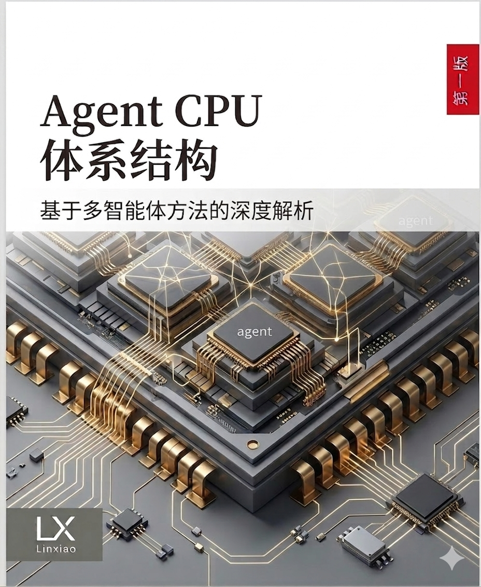

# 九天 APU

九天 APU 是一个开源的 Agent 原生处理器架构项目。

它探索一种后冯·诺依曼时代的软件执行模型：把人类编写的软件与
Agent 生成的代码视为两类不同的执行域，并在硬件层面分别优化。

- 8 个超大核负责运行操作系统、兼容层、运行时、调度、安全监管和
  面向人类的软件。
- 128 个 Agent 核负责运行高吞吐的 Agent 生成逻辑流，采用显式内存
  放置、显式同步和弱一致性模型。
- 256 个 Agent 硬件线程面向碎片化、动态、短生命周期的工作负载，
  填补传统 CPU 控制流与 GPU 张量吞吐之间的空白。

这个项目的目标不是替代 CPU、GPU 或 NPU，而是定义并原型化 Agentic
工作负载缺失的执行层：这类代码分支复杂、按需生成、数据局部性强、
高度并发，并且过于不规则，难以被传统加速器栈充分利用。


## 九天 vs. Vera：旧软件栈的极限，与 Agent 原生计算的起点

英伟达 Grace/Vera 代表传统通用 CPU 架构在 AI 基础设施中的顶峰：强大的
OoO 核心、成熟的软件生态、硬件缓存一致性和 CPU-GPU 协同能力。但它仍然
服务于人类软件时代的基本假设：复杂 ABI、操作系统分层、动态分支预测、
硬件 Cache 一致性和通用兼容性。

九天 APU 选择另一条路：保留 8 个超大核作为 Linux、I/O、调度和安全监管的
入口，把主要硅片资源交给 128 个 Agent 原生核。Agent 生成的代码不必伪装成
传统软件，它可以通过 APU-IR、显式 SPM、显式 DMA、弱一致性和 Honeycomb
NoC 直接表达数据流和执行意图。

| 维度 | Nvidia Grace/Vera | 九天 APU |
| :--- | :--- | :--- |
| 核心目标 | 通用 CPU 与 AI 系统调度顶峰 | Agent 生成代码的原生执行层 |
| 软件假设 | 人类编写、ABI 稳定、系统分层深 | Agent 生成、短生命周期、可显式调度 |
| 核心组织 | 大量高性能通用 OoO 核 | 8 个 Clawd-Super + 128 个 Clawd-Agent |
| 内存模型 | 层次化 Cache + 硬件一致性 | SPM + Cluster SRAM + 显式软一致性 |
| 主要开销 | 分支预测、ROB、TLB、Snoop、一致性协议 | 把控制开销压缩，把面积让给执行与数据搬运 |
| 擅长场景 | 传统软件、系统调度、CPU-GPU 协同 | Agentic 逻辑、短 JIT 片段、碎片化并发任务 |
| 开放路线 | 封闭商业生态 | 开源规格、模拟器、APU-IR 与未来 RTL |

九天的对标重点不是传统 SPEC 跑分，而是 Agentic workload：指令执行密度、
单位能耗吞吐量、非规则访存延迟、任务调度开销和显式数据搬运效率。

深入阅读：[`docs/whitepaper.md`](docs/whitepaper.md)

## 教材：Agent CPU 体系结构



《Agent CPU 体系结构：基于多智能体方法的深度解析》是九天项目同步维护的第一版讲义草案，面向计算机体系结构、芯片设计、Agent 系统、编译器、操作系统和 AI 基础设施方向的研究者与工程师。

这本教材把 Agent 生成代码视为新的体系结构研究对象：它不再只讨论传统程序如何在 CPU 上执行，而是讨论任务目标、证据链、工具调用、长期记忆、上下文投影、恢复点和副作用控制如何成为硬件、运行时与编译器共同管理的执行状态。

教材正文分为五篇：

- 学科基础：定义 Agentic workload，以及 Agent CPU 与 CPU、GPU、NPU 的边界。
- 机器定义：讨论 Super Domain、Agent Domain、任务模型、APU-IR、Memory/NoC。
- 运行时闭环：讨论任务型 Agent、工具调用、长期记忆、安全和恢复。
- 架构映射：从 ISA、Cache、ROB、Branch Prediction 和 benchmark 方法映射到 Agent CPU。
- 方法与实践：定义 benchmark、验证、课程实验和九天 APU v0.1 最小闭环。

网页导读：[`docs/textbook-agent-cpu-architecture.html`](docs/textbook-agent-cpu-architecture.html)

完整正文：[`docs/textbook-agent-cpu-architecture.md`](docs/textbook-agent-cpu-architecture.md)

## 当前可运行路径

```powershell
python simulator\jiutian_sim.py simulator\examples\copy_add.json
python -m unittest discover simulator
```

当前仓库优先保证 v0.1 功能模型可运行、规格可讨论、trace 可解释。v0.1 第一版不是完整芯片实现，而是一个可执行的参考语义闭环：APU-IR JSON 输入、运行时准入、capability 检查、任务调度、Agent ISA 执行、SPM/Cluster SRAM/host memory 数据搬运、barrier 同步、trap/trace 和结果导出。完整硬件实现将在语义稳定后推进。

长期任务记忆是 v0.1 的一等工作负载方向，但在当前阶段按“规格先行、模拟器逐步覆盖”推进。规格层已经定义 ledger view、artifact preview、ledger delta、context projection 和 recovery anchor 的边界；当前模拟器先覆盖无外部副作用的最小执行闭环，后续再把长期记忆投影任务纳入结构化 trace 与 benchmark。

## 文档导航

- 快速开始：[`docs/quick-start.md`](docs/quick-start.md)
- 产品简介：[`docs/product-brief.md`](docs/product-brief.md)
- 技术博客：[`docs/blog-agent-long-term-memory.md`](docs/blog-agent-long-term-memory.md)
- 教材网页：[`docs/textbook-agent-cpu-architecture.html`](docs/textbook-agent-cpu-architecture.html)
- 教材草案：[`docs/textbook-agent-cpu-architecture.md`](docs/textbook-agent-cpu-architecture.md)
- 数据手册：[`docs/datasheet.md`](docs/datasheet.md)
- 文档地图：[`docs/documentation-map.md`](docs/documentation-map.md)
- 环境要求：[`docs/environment.md`](docs/environment.md)
- 架构概览：[`docs/architecture.md`](docs/architecture.md)
- 执行模型：[`docs/execution-model.md`](docs/execution-model.md)
- 规格入口：[`specs/jiutian-apu-v0.1.md`](specs/jiutian-apu-v0.1.md)
- 地址空间：[`specs/memory-map-v0.1.md`](specs/memory-map-v0.1.md)
- 调试与 Trace：[`specs/debug-trace-v0.1.md`](specs/debug-trace-v0.1.md)
- 最小外设模型：[`specs/peripheral-model-v0.1.md`](specs/peripheral-model-v0.1.md)
- 模拟器指南：[`docs/simulator-guide.md`](docs/simulator-guide.md)
- 实现覆盖矩阵：[`specs/v0.1/implementation-coverage.md`](specs/v0.1/implementation-coverage.md)
- 发布说明与 v0.1 检查清单：[`docs/release-notes.md`](docs/release-notes.md)
- 测试组织：[`docs/testcase-organization.md`](docs/testcase-organization.md)
- Trace 与波形：[`docs/waveform-and-trace.md`](docs/waveform-and-trace.md)
- 故障排查：[`docs/troubleshooting.md`](docs/troubleshooting.md)
- RISC-V 开放规范参考：[`docs/references/riscv/`](docs/references/riscv/)

## 定位

九天是产品名，Honeycomb 是架构代号。

```text
人类软件
    |
8x 九天超大核
Linux / 运行时 / 安全 / 调度
    |
APU-IR 编译器与 Agent 运行时
    |
128x 九天 Agent 核
SPM / 显式 DMA / 弱一致性 / Mesh NoC
    |
分布式 SRAM / HBM / 主机内存
```

## 仓库结构

- `docs/` - 架构说明与设计依据。
- `docs/product-brief.md` - 产品简介。
- `docs/blog-agent-long-term-memory.md` - Agent 长期任务记忆技术博客。
- `docs/textbook-agent-cpu-architecture.md` - 《Agent CPU 体系结构：基于多智能体方法的深度解析》教材草案。
- `docs/datasheet.md` - v0.1 数据手册。
- `docs/documentation-map.md` - 文档地图。
- `docs/whitepaper.md` - 九天 APU 中文白皮书。
- `docs/glossary.md` - 项目术语表。
- `docs/execution-model.md` - v0.1 执行模型。
- `docs/benchmark-methodology.md` - benchmark 方法。
- `docs/development-sequence.md` - 文档、规格、模拟器与 RTL 的推进顺序。
- `docs/quick-start.md` - 最小运行路径。
- `docs/environment.md` - 环境要求。
- `docs/configuration-flow.md` - 配置与生成流程。
- `docs/simulator-guide.md` - 模拟器使用说明。
- `docs/testcase-organization.md` - 测试用例组织。
- `docs/release-notes.md` - 发布说明与 v0.1 发布检查清单。
- `specs/` - 版本化架构规格。
- `specs/isa-v0.1.md` - Agent ISA v0.1 参考语义。
- `specs/apu-ir-v0.1.md` - APU-IR v0.1 任务图格式。
- `specs/task-model-v0.1.md` - 任务、capability、预算与异常模型。
- `specs/memory-map-v0.1.md` - 地址空间。
- `specs/debug-trace-v0.1.md` - 调试与 Trace。
- `specs/peripheral-model-v0.1.md` - 最小外设模型。
- `specs/v0.1/implementation-coverage.md` - v0.1 实现覆盖矩阵。
- `rtl/` - RTL 设计入口与未来硬件模块。
- `simulator/` - ISA 与架构模拟器入口。
- `simulator/jiutian_sim.py` - v0.1 功能模拟器。
- `simulator/examples/` - APU-IR 示例程序。
- `runtime/` - Agent 运行时、编译器 IR 与调度说明。
- `benchmarks/` - 工作负载定义与 benchmark 方法。
- `tools/` - 项目脚本与工具。
- `docs/references/riscv/` - RISC-V 开放规范 PDF 镜像。

## 初始设计目标

- 面向研究与实现的开放架构。
- 兼容 RISC-V 的控制面。
- 采用显式 Scratchpad Memory 的 Agent 原生执行面。
- 128 核集群化拓扑与分布式 SRAM 切片。
- Agent 域内的软件控制一致性。
- 硬件强制的沙箱、任务预算和 DMA 边界检查。
- 以 APU-IR 作为 Agent 与硅片之间的稳定契约。

## 非目标

- 让所有核心运行任意传统软件。
- 复刻 CUDA、POSIX 或完整缓存一致 SMP 语义。
- 只优化合成峰值 FLOPS。
- 宣称可以普遍替代现有加速器。

## 当前状态

本仓库处于架构种子阶段。第一个里程碑是一个可模拟、可测试、可解释的 v0.1 最小架构，而不是一次性完成全规模硬件。第一版目标分为两层：

- 已可运行的模拟器最小闭环：APU-IR 示例、任务调度、SPM/Cluster SRAM/host memory、同步 DMA、barrier、capability 检查、trap、字符串 trace、结果导出和单元测试。
- 规格层锁定的 v0.1 架构目标：1-2 个超大核、8-16 个 Agent 核、每核 Scratchpad Memory、共享 Cluster SRAM、显式 DMA 与 Barrier、APU-IR 契约、长期记忆投影语义和面向 Agentic 逻辑工作负载的 benchmark 框架。

长期记忆闭环的第一版目标是：Super Domain 维护已提交 ledger、artifact 正文和最终权限；Agent Domain 只读取授权视图，生成候选 ledger delta、context projection、artifact preview 引用和 recovery anchor；提交、写文件、写 transcript 等真实副作用仍由 Super Domain 审核执行。

## 项目信息

- GitHub：<https://github.com/openclawdchip/jiutian>
- 联系方式：<dspwatch@gmail.com>

## 许可证

除非子目录另有说明，软件、文档和示例默认采用 Apache-2.0 许可证。
当 RTL 引入后，硬件相关授权方式可能进一步细化。
