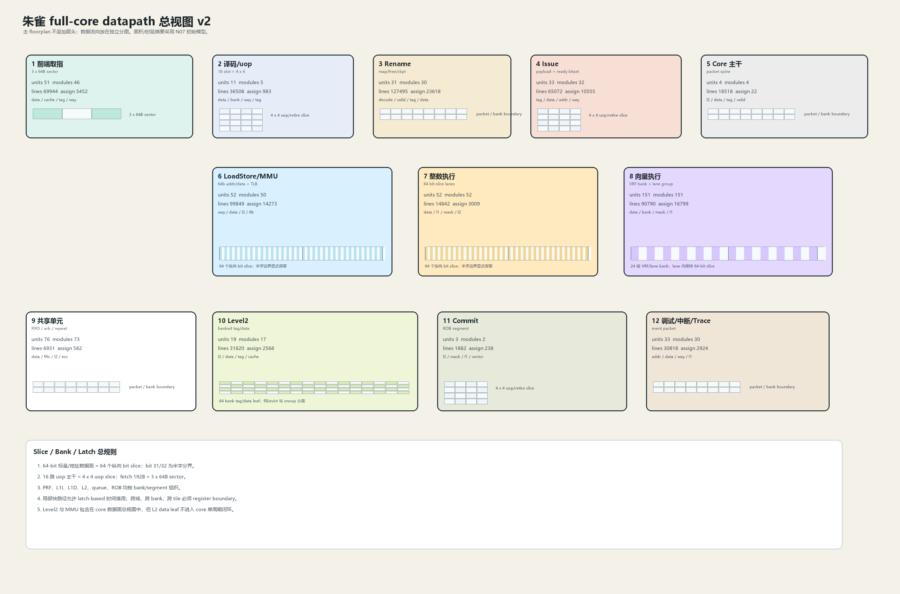
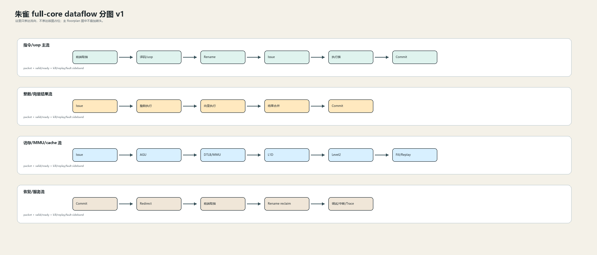

# 朱雀 Full-Core Data Path

本文汇总各域数据通路。域内文档负责定义 packet、slice、bank、latch/register boundary、N07 PPA 初始模型和行为模型接口。

## 1. 总视图



数据流向分图：



机器可读总视图：

- `docs/assets/floorplan/zhuque_full_core_datapath_view_v2.json`

## 2. 覆盖范围

| 域 | 入口 | 单元 | 模块 | 行数 | assign | always |
| --- | --- | --- | --- | --- | --- | --- |
| Frontend IFetch | [data_path](../../domains/frontend_ifetch/data_path/README.md) | `51` | `46` | `69944` | `5452` | `4859` |
| Decode And Uop | [data_path](../../domains/decode_and_uop/data_path/README.md) | `11` | `5` | `36508` | `983` | `88` |
| Rename | [data_path](../../domains/rename/data_path/README.md) | `31` | `30` | `127495` | `23618` | `2428` |
| Issue | [data_path](../../domains/issue/data_path/README.md) | `33` | `32` | `65072` | `10555` | `1231` |
| Integer Execute | [data_path](../../domains/integer_execute/data_path/README.md) | `52` | `52` | `14842` | `3009` | `495` |
| Vector Execute | [data_path](../../domains/vector_execute/data_path/README.md) | `151` | `151` | `90790` | `16799` | `1511` |
| LoadStore And MMU | [data_path](../../domains/loadstore_and_mmu/data_path/README.md) | `52` | `50` | `99849` | `14273` | `3058` |
| Commit And Retire | [data_path](../../domains/commit_and_retire/data_path/README.md) | `3` | `2` | `1882` | `238` | `42` |
| Level2 Cache | [data_path](../../domains/level2_cache/data_path/README.md) | `19` | `17` | `31820` | `2568` | `1503` |
| Platform Control Debug | [data_path](../../domains/platform_control_debug/data_path/README.md) | `33` | `30` | `30818` | `2924` | `1424` |
| Top Integration Datapath | [data_path](../../domains/top_integration/data_path/README.md) | `4` | `4` | `18518` | `22` | `0` |
| Shared Cells And Models | [data_path](../../domains/shared_cells_and_models/data_path/README.md) | `76` | `73` | `6931` | `582` | `123` |

## 3. 总数据流

```text
frontend_ifetch
  -> decode_and_uop
  -> rename
  -> issue
  -> integer_execute / vector_execute / loadstore_and_mmu
  -> writeback / commit_and_retire
  -> frontend_ifetch redirect
```

缓存和内存管理数据面：

```text
loadstore_and_mmu
  -> level2_cache
  -> loadstore_and_mmu fill/replay
```

调试、中断和 trace 数据面：

```text
platform_control_debug
  -> commit_and_retire / top_integration
```

## 4. 固定原则

- 每个 `64-bit` 标量或地址数据面必须能拆成 `64` 个 bit slice。
- 每个 `16` 路 uop 数据面必须能拆成 `4 x 4` uop slice。
- PRF、queue、ROB、L1、L2 必须 bank/segment 化。
- 单周期路径必须局部化；macro-centered 路径要单独切拍。
- Level2、MMU、debug/interrupt/trace 都是 full-core data path 的组成部分。

