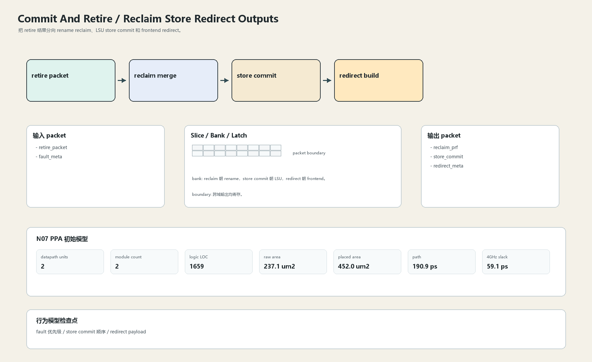

# Reclaim Store Redirect Outputs

## 1. 职责

把 retire 结果分向 rename reclaim、LSU store commit 和 frontend redirect。

本文定义朱雀目标结构中的数据面边界、slice/bank 组织、时序边界和行为模型接口。

## 2. 结构规模摘要

| 项 | 数值 |
|---|---:|
| datapath units | `2` |
| module count | `2` |
| logic LOC | `1659` |
| assign count | `238` |
| always count | `42` |
| port declarations | `292` |

高频数据面 token：`l2`=247, `mask`=133, `l1`=106, `way`=42, `commit`=3。

## 3. 数据结构




## 4. 输入接口

| 输入 | 说明 |
| --- | --- |
| `retire_packet` | 进入本分区的数据 packet 或局部字段 |
| `fault_meta` | 进入本分区的数据 packet 或局部字段 |

## 5. 输出接口

| 输出 | 说明 |
| --- | --- |
| `reclaim_prf` | 离开本分区的数据 packet 或局部字段 |
| `store_commit` | 离开本分区的数据 packet 或局部字段 |
| `redirect_meta` | 离开本分区的数据 packet 或局部字段 |

## 6. Slice / Bank / Latch

| 类别 | 规则 |
|---|---|
| width | `按域内 packet / slice 参数化` |
| slice | 三条输出方向物理分开，不复用一条大 payload 总线。 |
| bank | reclaim 朝 rename，store commit 朝 LSU，redirect 朝 frontend。 |
| latch / register | 跨域输出均寄存。 |

## 7. N07 PPA 初始模型

| 项 | 数值 |
|---|---:|
| raw area estimate | `237.110 um2` |
| placed area estimate | `451.990 um2` |
| logic depth | `12 FO4` |
| mux penalty | `22.000 ps` |
| wire budget | `16.000 ps` |
| margin | `40.000 ps` |
| estimated path | `190.894 ps` |
| 4GHz slack | `59.106 ps` |

估算公式：

```text
path_ps = DFF_CP_Q + FO4 * logic_depth + mux_penalty + wire_budget + margin
area_um2 = code_metric_units * INV_D1_area * mix_factor + macro_area
```

## 8. 行为模型契约

行为模型必须覆盖：

- old PRF 回收
- store commit
- trap redirect
- younger kill

最小接口：

```python
class CommitAndRetireReclaimStoreRedirect:
    def reset(self, config): ...
    def accept(self, packet, cycle): ...
    def step(self, cycle): ...
    def flush(self, token): ...
    def peek_outputs(self): ...
    def area_estimate(self): ...
    def delay_estimate(self): ...
```

## 9. RTL 落点

RTL 第一版只实现 payload、slice、bank、register/latch boundary 和 minimal ready/valid。控制状态机后续覆盖在这些接口之上。

建议 RTL 单元：

- `commit_and_retire_reclaim_store_redirect_packet`
- `commit_and_retire_reclaim_store_redirect_slice`
- `commit_and_retire_reclaim_store_redirect_pipe`
- `commit_and_retire_reclaim_store_redirect_top`

## 10. 检查点

- fault 优先级
- store commit 顺序
- redirect payload

