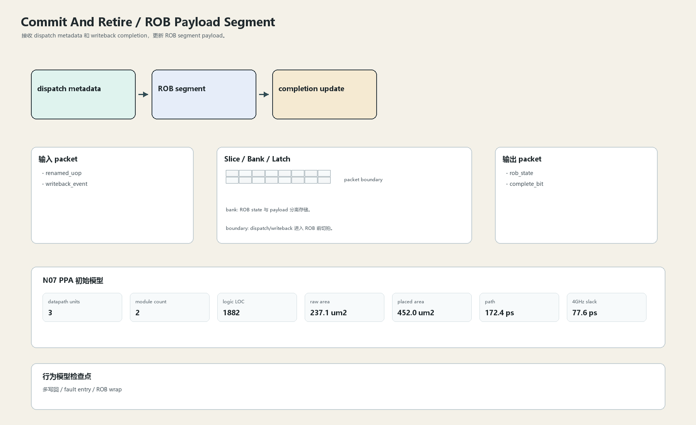

# ROB Payload Segment

## 1. 职责

接收 dispatch metadata 和 writeback completion，更新 ROB segment payload。

本文定义朱雀目标结构中的数据面边界、slice/bank 组织、时序边界和行为模型接口。

## 2. 结构规模摘要

| 项 | 数值 |
|---|---:|
| datapath units | `3` |
| module count | `2` |
| logic LOC | `1882` |
| assign count | `238` |
| always count | `42` |
| port declarations | `292` |

高频数据面 token：`l2`=253, `mask`=133, `l1`=112, `vector`=48, `way`=42, `commit`=3。

## 3. 数据结构




## 4. 输入接口

| 输入 | 说明 |
| --- | --- |
| `renamed_uop` | 进入本分区的数据 packet 或局部字段 |
| `writeback_event` | 进入本分区的数据 packet 或局部字段 |

## 5. 输出接口

| 输出 | 说明 |
| --- | --- |
| `rob_state` | 离开本分区的数据 packet 或局部字段 |
| `complete_bit` | 离开本分区的数据 packet 或局部字段 |

## 6. Slice / Bank / Latch

| 类别 | 规则 |
|---|---|
| width | `按域内 packet / slice 参数化` |
| slice | 1024 entry ROB 分 segment，不做全表单体扫描。 |
| bank | ROB state 与 payload 分离存储。 |
| latch / register | dispatch/writeback 进入 ROB 前切拍。 |

## 7. N07 PPA 初始模型

| 项 | 数值 |
|---|---:|
| raw area estimate | `237.110 um2` |
| placed area estimate | `451.990 um2` |
| logic depth | `10 FO4` |
| mux penalty | `18.000 ps` |
| wire budget | `16.000 ps` |
| margin | `40.000 ps` |
| estimated path | `172.390 ps` |
| 4GHz slack | `77.610 ps` |

估算公式：

```text
path_ps = DFF_CP_Q + FO4 * logic_depth + mux_penalty + wire_budget + margin
area_um2 = code_metric_units * INV_D1_area * mix_factor + macro_area
```

## 8. 行为模型契约

行为模型必须覆盖：

- ROB 写入
- completion 更新
- fault payload
- valid tracking

最小接口：

```python
class CommitAndRetireRobPayload:
    def reset(self, config): ...
    def accept(self, packet, cycle): ...
    def step(self, cycle): ...
    def flush(self, token): ...
    def peek_outputs(self): ...
    def area_estimate(self): ...
    def delay_estimate(self): ...
```

## 9. RTL 落点

RTL 第一版只实现 payload、slice、bank、register/latch boundary 和 minimal ready/valid。控制状态机后续覆盖在这些接口之上。

建议 RTL 单元：

- `commit_and_retire_rob_payload_packet`
- `commit_and_retire_rob_payload_slice`
- `commit_and_retire_rob_payload_pipe`
- `commit_and_retire_rob_payload_top`

## 10. 检查点

- 多写回
- fault entry
- ROB wrap

