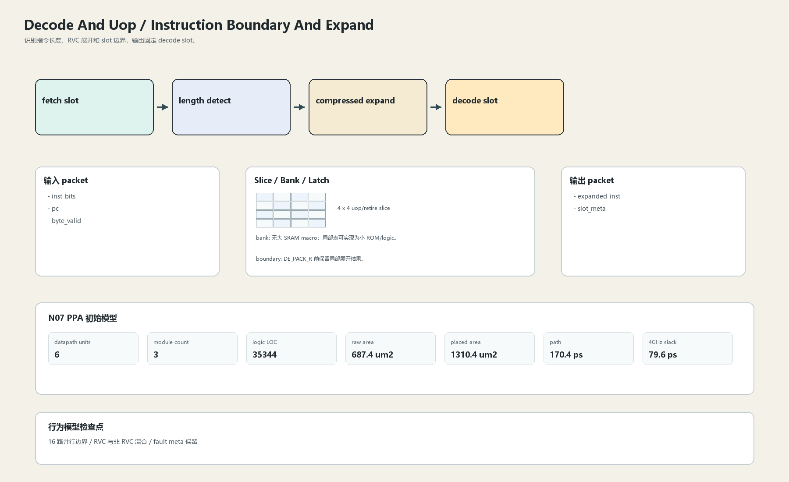

# Instruction Boundary And Expand

## 1. 职责

识别指令长度、RVC 展开和 slot 边界，输出固定 decode slot。

本文定义朱雀目标结构中的数据面边界、slice/bank 组织、时序边界和行为模型接口。

## 2. 结构规模摘要

| 项 | 数值 |
|---|---:|
| datapath units | `6` |
| module count | `3` |
| logic LOC | `35344` |
| assign count | `902` |
| always count | `88` |
| port declarations | `698` |

高频数据面 token：`data`=2315, `bank`=126, `way`=88, `tag`=73, `replay`=37, `valid`=29, `fault`=18, `l2`=12。

## 3. 数据结构




## 4. 输入接口

| 输入 | 说明 |
| --- | --- |
| `inst_bits` | 进入本分区的数据 packet 或局部字段 |
| `pc` | 进入本分区的数据 packet 或局部字段 |
| `byte_valid` | 进入本分区的数据 packet 或局部字段 |

## 5. 输出接口

| 输出 | 说明 |
| --- | --- |
| `expanded_inst` | 离开本分区的数据 packet 或局部字段 |
| `slot_meta` | 离开本分区的数据 packet 或局部字段 |

## 6. Slice / Bank / Latch

| 类别 | 规则 |
|---|---|
| width | `按域内 packet / slice 参数化` |
| slice | 16 路输入按 `4 x 4` uop slice，不共享单点长度判断。 |
| bank | 无大 SRAM macro；局部表可实现为小 ROM/logic。 |
| latch / register | DE_PACK_R 前保留局部展开结果。 |

## 7. N07 PPA 初始模型

| 项 | 数值 |
|---|---:|
| raw area estimate | `687.436 um2` |
| placed area estimate | `1310.426 um2` |
| logic depth | `10 FO4` |
| mux penalty | `16.000 ps` |
| wire budget | `16.000 ps` |
| margin | `40.000 ps` |
| estimated path | `170.390 ps` |
| 4GHz slack | `79.610 ps` |

估算公式：

```text
path_ps = DFF_CP_Q + FO4 * logic_depth + mux_penalty + wire_budget + margin
area_um2 = code_metric_units * INV_D1_area * mix_factor + macro_area
```

## 8. 行为模型契约

行为模型必须覆盖：

- RVC 展开
- 非法长度
- slot valid
- pc 对齐

最小接口：

```python
class DecodeAndUopBoundaryExpand:
    def reset(self, config): ...
    def accept(self, packet, cycle): ...
    def step(self, cycle): ...
    def flush(self, token): ...
    def peek_outputs(self): ...
    def area_estimate(self): ...
    def delay_estimate(self): ...
```

## 9. RTL 落点

RTL 第一版只实现 payload、slice、bank、register/latch boundary 和 minimal ready/valid。控制状态机后续覆盖在这些接口之上。

建议 RTL 单元：

- `decode_and_uop_boundary_expand_packet`
- `decode_and_uop_boundary_expand_slice`
- `decode_and_uop_boundary_expand_pipe`
- `decode_and_uop_boundary_expand_top`

## 10. 检查点

- 16 路并行边界
- RVC 与非 RVC 混合
- fault meta 保留

