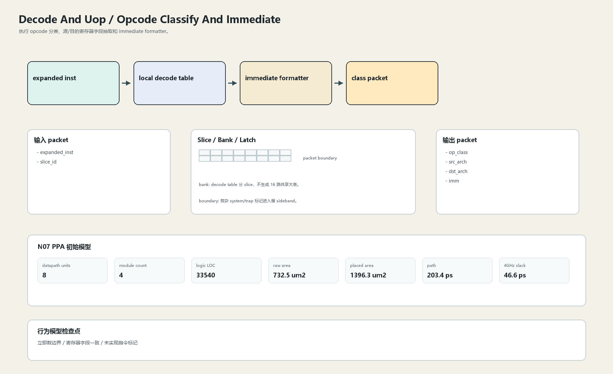

# Opcode Classify And Immediate

## 1. 职责

执行 opcode 分类、源/目的寄存器字段抽取和 immediate formatter。

本文定义朱雀目标结构中的数据面边界、slice/bank 组织、时序边界和行为模型接口。

## 2. 结构规模摘要

| 项 | 数值 |
|---|---:|
| datapath units | `8` |
| module count | `4` |
| logic LOC | `33540` |
| assign count | `982` |
| always count | `88` |
| port declarations | `718` |

高频数据面 token：`data`=2315, `bank`=126, `way`=88, `tag`=73, `replay`=37, `valid`=29, `l2`=22, `prf`=19。

## 3. 数据结构




## 4. 输入接口

| 输入 | 说明 |
| --- | --- |
| `expanded_inst` | 进入本分区的数据 packet 或局部字段 |
| `slice_id` | 进入本分区的数据 packet 或局部字段 |

## 5. 输出接口

| 输出 | 说明 |
| --- | --- |
| `op_class` | 离开本分区的数据 packet 或局部字段 |
| `src_arch` | 离开本分区的数据 packet 或局部字段 |
| `dst_arch` | 离开本分区的数据 packet 或局部字段 |
| `imm` | 离开本分区的数据 packet 或局部字段 |

## 6. Slice / Bank / Latch

| 类别 | 规则 |
|---|---|
| width | `按域内 packet / slice 参数化` |
| slice | 字段抽取按 slot 本地进行，立即数位拼接保持 slice 内局部。 |
| bank | decode table 分 slice，不生成 16 路共享大表。 |
| latch / register | 复杂 system/trap 标记进入慢 sideband。 |

## 7. N07 PPA 初始模型

| 项 | 数值 |
|---|---:|
| raw area estimate | `732.484 um2` |
| placed area estimate | `1396.298 um2` |
| logic depth | `14 FO4` |
| mux penalty | `20.000 ps` |
| wire budget | `16.000 ps` |
| margin | `40.000 ps` |
| estimated path | `203.398 ps` |
| 4GHz slack | `46.602 ps` |

估算公式：

```text
path_ps = DFF_CP_Q + FO4 * logic_depth + mux_penalty + wire_budget + margin
area_um2 = code_metric_units * INV_D1_area * mix_factor + macro_area
```

## 8. 行为模型契约

行为模型必须覆盖：

- 整数/分支/访存/向量分类
- 立即数生成
- CSR/system 标记

最小接口：

```python
class DecodeAndUopOpcodeImmediate:
    def reset(self, config): ...
    def accept(self, packet, cycle): ...
    def step(self, cycle): ...
    def flush(self, token): ...
    def peek_outputs(self): ...
    def area_estimate(self): ...
    def delay_estimate(self): ...
```

## 9. RTL 落点

RTL 第一版只实现 payload、slice、bank、register/latch boundary 和 minimal ready/valid。控制状态机后续覆盖在这些接口之上。

建议 RTL 单元：

- `decode_and_uop_opcode_immediate_packet`
- `decode_and_uop_opcode_immediate_slice`
- `decode_and_uop_opcode_immediate_pipe`
- `decode_and_uop_opcode_immediate_top`

## 10. 检查点

- 立即数边界
- 寄存器字段一致
- 未实现指令标记

