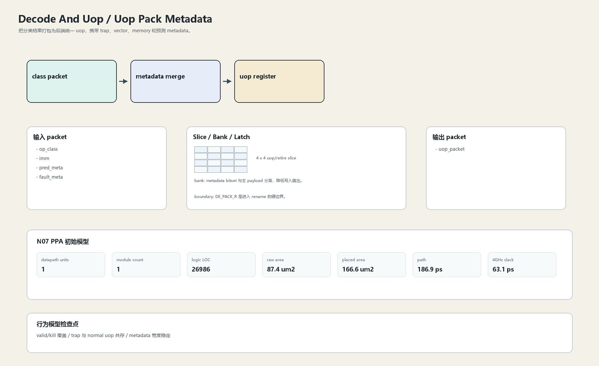

# Uop Pack Metadata

## 1. 职责

把分类结果打包为后端统一 uop，携带 trap、vector、memory 和预测 metadata。

本文定义朱雀目标结构中的数据面边界、slice/bank 组织、时序边界和行为模型接口。

## 2. 结构规模摘要

| 项 | 数值 |
|---|---:|
| datapath units | `1` |
| module count | `1` |
| logic LOC | `26986` |
| assign count | `140` |
| always count | `0` |
| port declarations | `136` |

高频数据面 token：`l2`=12, `decode`=12, `tag`=11, `l1`=10, `prf`=2, `valid`=1, `tlb`=1。

## 3. 数据结构




## 4. 输入接口

| 输入 | 说明 |
| --- | --- |
| `op_class` | 进入本分区的数据 packet 或局部字段 |
| `imm` | 进入本分区的数据 packet 或局部字段 |
| `pred_meta` | 进入本分区的数据 packet 或局部字段 |
| `fault_meta` | 进入本分区的数据 packet 或局部字段 |

## 5. 输出接口

| 输出 | 说明 |
| --- | --- |
| `uop_packet` | 离开本分区的数据 packet 或局部字段 |

## 6. Slice / Bank / Latch

| 类别 | 规则 |
|---|---|
| width | `按域内 packet / slice 参数化` |
| slice | uop packet 按 `4 x 4` 输出，对齐 rename slice。 |
| bank | metadata bitset 与主 payload 分离，降低写入扇出。 |
| latch / register | DE_PACK_R 是进入 rename 的硬边界。 |

## 7. N07 PPA 初始模型

| 项 | 数值 |
|---|---:|
| raw area estimate | `87.417 um2` |
| placed area estimate | `166.639 um2` |
| logic depth | `12 FO4` |
| mux penalty | `18.000 ps` |
| wire budget | `16.000 ps` |
| margin | `40.000 ps` |
| estimated path | `186.894 ps` |
| 4GHz slack | `63.106 ps` |

估算公式：

```text
path_ps = DFF_CP_Q + FO4 * logic_depth + mux_penalty + wire_budget + margin
area_um2 = code_metric_units * INV_D1_area * mix_factor + macro_area
```

## 8. 行为模型契约

行为模型必须覆盖：

- uop valid
- trap payload
- vector/memory attributes
- 预测透传

最小接口：

```python
class DecodeAndUopUopPack:
    def reset(self, config): ...
    def accept(self, packet, cycle): ...
    def step(self, cycle): ...
    def flush(self, token): ...
    def peek_outputs(self): ...
    def area_estimate(self): ...
    def delay_estimate(self): ...
```

## 9. RTL 落点

RTL 第一版只实现 payload、slice、bank、register/latch boundary 和 minimal ready/valid。控制状态机后续覆盖在这些接口之上。

建议 RTL 单元：

- `decode_and_uop_uop_pack_packet`
- `decode_and_uop_uop_pack_slice`
- `decode_and_uop_uop_pack_pipe`
- `decode_and_uop_uop_pack_top`

## 10. 检查点

- valid/kill 覆盖
- trap 与 normal uop 共存
- metadata 宽度稳定

