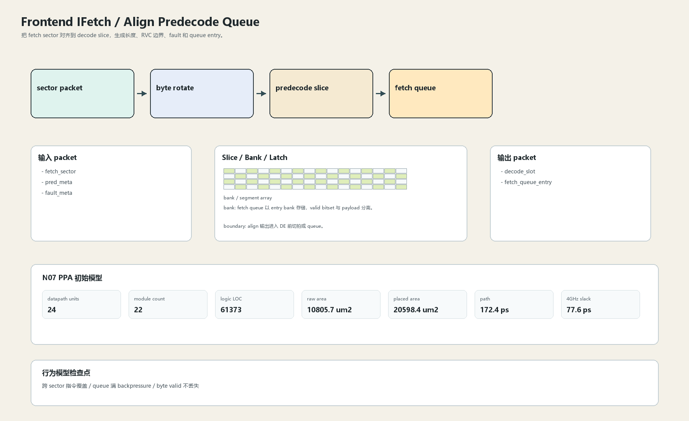

# Align Predecode Queue

## 1. 职责

把 fetch sector 对齐到 decode slice，生成长度、RVC 边界、fault 和 queue entry。

本文定义朱雀目标结构中的数据面边界、slice/bank 组织、时序边界和行为模型接口。

## 2. 结构规模摘要

| 项 | 数值 |
|---|---:|
| datapath units | `24` |
| module count | `22` |
| logic LOC | `61373` |
| assign count | `5060` |
| always count | `4846` |
| port declarations | `2276` |

高频数据面 token：`data`=31688, `cache`=13203, `tag`=10521, `way`=6313, `valid`=2502, `l1`=1061, `addr`=943, `bank`=587。

## 3. 数据结构




## 4. 输入接口

| 输入 | 说明 |
| --- | --- |
| `fetch_sector` | 进入本分区的数据 packet 或局部字段 |
| `pred_meta` | 进入本分区的数据 packet 或局部字段 |
| `fault_meta` | 进入本分区的数据 packet 或局部字段 |

## 5. 输出接口

| 输出 | 说明 |
| --- | --- |
| `decode_slot` | 离开本分区的数据 packet 或局部字段 |
| `fetch_queue_entry` | 离开本分区的数据 packet 或局部字段 |

## 6. Slice / Bank / Latch

| 类别 | 规则 |
|---|---|
| width | `按域内 packet / slice 参数化` |
| slice | 192B 窗口切成 4 个 predecode slice，跨 sector rotate 必须切拍。 |
| bank | fetch queue 以 entry bank 存储，valid bitset 与 payload 分离。 |
| latch / register | align 输出进入 DE 前切拍或 queue。 |

## 7. N07 PPA 初始模型

| 项 | 数值 |
|---|---:|
| raw area estimate | `10805.730 um2` |
| placed area estimate | `20598.424 um2` |
| logic depth | `10 FO4` |
| mux penalty | `18.000 ps` |
| wire budget | `16.000 ps` |
| margin | `40.000 ps` |
| estimated path | `172.390 ps` |
| 4GHz slack | `77.610 ps` |

估算公式：

```text
path_ps = DFF_CP_Q + FO4 * logic_depth + mux_penalty + wire_budget + margin
area_um2 = code_metric_units * INV_D1_area * mix_factor + macro_area
```

## 8. 行为模型契约

行为模型必须覆盖：

- RVC 2B/4B 边界
- queue push/pop
- fault 透传
- replay 重取

最小接口：

```python
class FrontendIfetchAlignPredecode:
    def reset(self, config): ...
    def accept(self, packet, cycle): ...
    def step(self, cycle): ...
    def flush(self, token): ...
    def peek_outputs(self): ...
    def area_estimate(self): ...
    def delay_estimate(self): ...
```

## 9. RTL 落点

RTL 第一版只实现 payload、slice、bank、register/latch boundary 和 minimal ready/valid。控制状态机后续覆盖在这些接口之上。

建议 RTL 单元：

- `frontend_ifetch_align_predecode_packet`
- `frontend_ifetch_align_predecode_slice`
- `frontend_ifetch_align_predecode_pipe`
- `frontend_ifetch_align_predecode_top`

## 10. 检查点

- 跨 sector 指令覆盖
- queue 满 backpressure
- byte valid 不丢失

