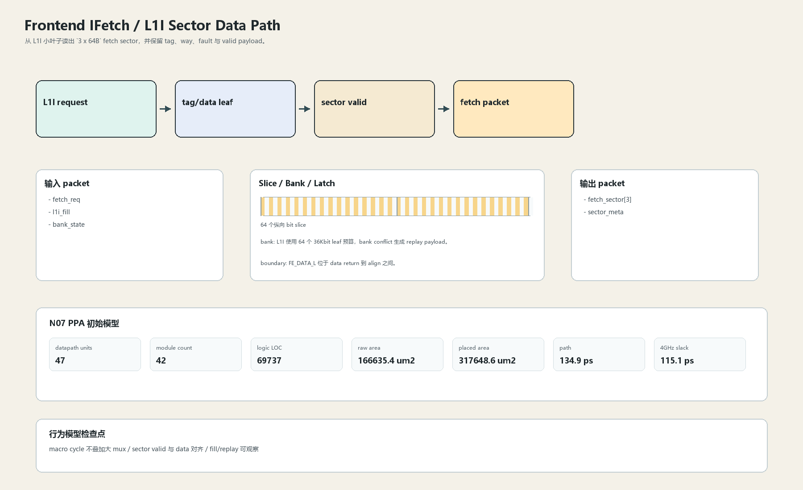
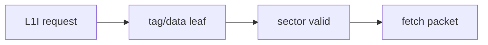

# L1I Sector Data Path

## 1. 职责

从 L1I 小叶子读出 `3 x 64B` fetch sector，并保留 tag、way、fault 与 valid payload。

本文定义朱雀目标结构中的数据面边界、slice/bank 组织、时序边界和行为模型接口。

## 2. 结构规模摘要

| 项 | 数值 |
|---|---:|
| datapath units | `47` |
| module count | `42` |
| logic LOC | `69737` |
| assign count | `5436` |
| always count | `4859` |
| port declarations | `2549` |

高频数据面 token：`data`=32172, `cache`=13245, `tag`=10658, `way`=6366, `valid`=2502, `l1`=1071, `addr`=1059, `bank`=616。

## 3. 数据结构





## 4. 输入接口

| 输入 | 说明 |
| --- | --- |
| `fetch_req` | 进入本分区的数据 packet 或局部字段 |
| `l1i_fill` | 进入本分区的数据 packet 或局部字段 |
| `bank_state` | 进入本分区的数据 packet 或局部字段 |

## 5. 输出接口

| 输出 | 说明 |
| --- | --- |
| `fetch_sector[3]` | 离开本分区的数据 packet 或局部字段 |
| `sector_meta` | 离开本分区的数据 packet 或局部字段 |

## 6. Slice / Bank / Latch

| 类别 | 规则 |
|---|---|
| width | `按域内 packet / slice 参数化` |
| slice | 每个 64B sector 由 byte slice 组成，不拼成单体 192B 大 mux。 |
| bank | L1I 使用 64 个 36Kbit leaf 预算，bank conflict 生成 replay payload。 |
| latch / register | FE_DATA_L 位于 data return 到 align 之间。 |

## 7. N07 PPA 初始模型

| 项 | 数值 |
|---|---:|
| raw area estimate | `166635.353 um2` |
| placed area estimate | `317648.643 um2` |
| logic depth | `6 FO4` |
| mux penalty | `10.000 ps` |
| wire budget | `15.500 ps` |
| margin | `40.000 ps` |
| estimated path | `134.882 ps` |
| 4GHz slack | `115.118 ps` |

估算公式：

```text
path_ps = DFF_CP_Q + FO4 * logic_depth + mux_penalty + wire_budget + margin
area_um2 = code_metric_units * INV_D1_area * mix_factor + macro_area
```

## 8. 行为模型契约

行为模型必须覆盖：

- L1I 命中返回
- bank conflict
- fill 后重取
- fault metadata

最小接口：

```python
class FrontendIfetchL1ISector:
    def reset(self, config): ...
    def accept(self, packet, cycle): ...
    def step(self, cycle): ...
    def flush(self, token): ...
    def peek_outputs(self): ...
    def area_estimate(self): ...
    def delay_estimate(self): ...
```

## 9. RTL 落点

RTL 第一版只实现 payload、slice、bank、register/latch boundary 和 minimal ready/valid。控制状态机后续覆盖在这些接口之上。

建议 RTL 单元：

- `frontend_ifetch_l1i_sector_packet`
- `frontend_ifetch_l1i_sector_slice`
- `frontend_ifetch_l1i_sector_pipe`
- `frontend_ifetch_l1i_sector_top`

## 10. 检查点

- macro cycle 不叠加大 mux
- sector valid 与 data 对齐
- fill/replay 可观察

