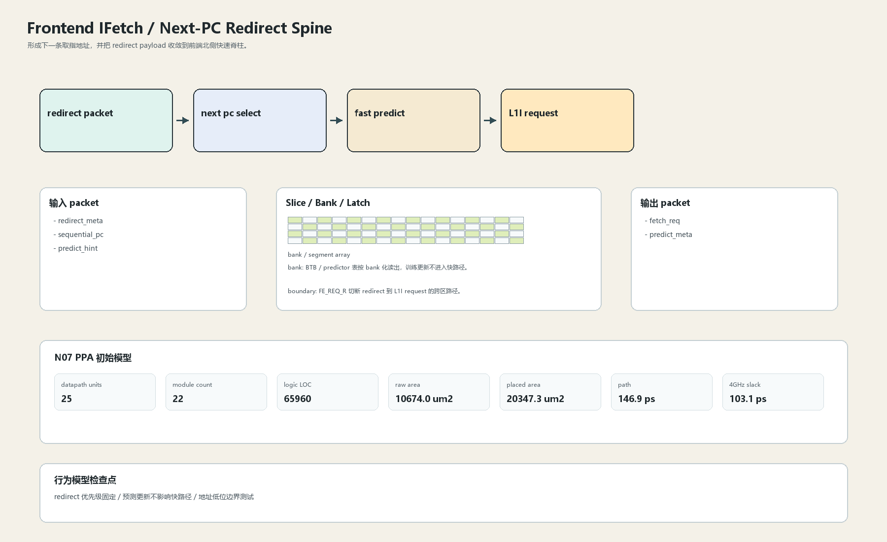

# Next-PC Redirect Spine

## 1. 职责

形成下一条取指地址，并把 redirect payload 收敛到前端北侧快速脊柱。

本文定义朱雀目标结构中的数据面边界、slice/bank 组织、时序边界和行为模型接口。

## 2. 结构规模摘要

| 项 | 数值 |
|---|---:|
| datapath units | `25` |
| module count | `22` |
| logic LOC | `65960` |
| assign count | `4977` |
| always count | `4812` |
| port declarations | `2069` |

高频数据面 token：`data`=29440, `cache`=13186, `tag`=10356, `way`=6180, `valid`=2436, `l1`=1135, `addr`=914, `l2`=520。

## 3. 数据结构




## 4. 输入接口

| 输入 | 说明 |
| --- | --- |
| `redirect_meta` | 进入本分区的数据 packet 或局部字段 |
| `sequential_pc` | 进入本分区的数据 packet 或局部字段 |
| `predict_hint` | 进入本分区的数据 packet 或局部字段 |

## 5. 输出接口

| 输出 | 说明 |
| --- | --- |
| `fetch_req` | 离开本分区的数据 packet 或局部字段 |
| `predict_meta` | 离开本分区的数据 packet 或局部字段 |

## 6. Slice / Bank / Latch

| 类别 | 规则 |
|---|---|
| width | `按域内 packet / slice 参数化` |
| slice | PC 数据面按地址 bit slice 组织，低位用于 sector/byte 选择，高位进入 tag。 |
| bank | BTB / predictor 表按 bank 化读出，训练更新不进入快路径。 |
| latch / register | FE_REQ_R 切断 redirect 到 L1I request 的跨区路径。 |

## 7. N07 PPA 初始模型

| 项 | 数值 |
|---|---:|
| raw area estimate | `10674.009 um2` |
| placed area estimate | `20347.331 um2` |
| logic depth | `8 FO4` |
| mux penalty | `14.000 ps` |
| wire budget | `9.000 ps` |
| margin | `40.000 ps` |
| estimated path | `146.886 ps` |
| 4GHz slack | `103.114 ps` |

估算公式：

```text
path_ps = DFF_CP_Q + FO4 * logic_depth + mux_penalty + wire_budget + margin
area_um2 = code_metric_units * INV_D1_area * mix_factor + macro_area
```

## 8. 行为模型契约

行为模型必须覆盖：

- 顺序 PC 推进
- redirect 优先级
- 预测 metadata 透传
- fetch request 形成

最小接口：

```python
class FrontendIfetchNextPcRedirect:
    def reset(self, config): ...
    def accept(self, packet, cycle): ...
    def step(self, cycle): ...
    def flush(self, token): ...
    def peek_outputs(self): ...
    def area_estimate(self): ...
    def delay_estimate(self): ...
```

## 9. RTL 落点

RTL 第一版只实现 payload、slice、bank、register/latch boundary 和 minimal ready/valid。控制状态机后续覆盖在这些接口之上。

建议 RTL 单元：

- `frontend_ifetch_next_pc_redirect_packet`
- `frontend_ifetch_next_pc_redirect_slice`
- `frontend_ifetch_next_pc_redirect_pipe`
- `frontend_ifetch_next_pc_redirect_top`

## 10. 检查点

- redirect 优先级固定
- 预测更新不影响快路径
- 地址低位边界测试

