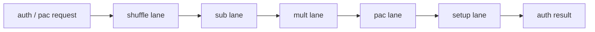

# Auth Shift Pac

## 1. 角色

这个模块负责认证相关的数据变换、PAC 生成和地址 tag 处理。它把 nibble 重排、代换、线性混合、PAC 掩码和 setup 组织成统一路径。

## 2. 职责边界

它不做普通算术，只处理 key、mask、shuffle、PAC、TBI 和字段边界。

## 3. 核心对象

- `shuffle_lane`
- `sub_lane`
- `mult_lane`
- `pac_lane`
- `setup_lane`

## 4. 数据结构

`auth_bundle` 至少应包含：

- `ptr`
- `key`
- `bottom_bit`
- `selbitpos`
- `tbi`

## 5. 结构框图

## 6. 处理流程

1. 先做 nibble 重排和逆重排。
2. 再做代换和线性混合。
3. 然后计算 PAC 掩码、底部边界和 origin pointer。
4. 最终输出认证结果和地址视图。

## 7. 不变量

- 认证路径不能改变普通数值的语义。
- PAC 字段边界必须由 setup 结果统一裁定。
- TBI、TBID 和 key 选择必须保持一致。

## 8. 时序约束

- 认证路径可以多拍，但接口必须稳定。
- 各子路径不能形成环依赖。

## 9. L3 对应

- `auth_shift_pac/shuffle_lane.md`
- `auth_shift_pac/sub_lane.md`
- `auth_shift_pac/mult_lane.md`
- `auth_shift_pac/pac_lane.md`
- `auth_shift_pac/setup_lane.md`
