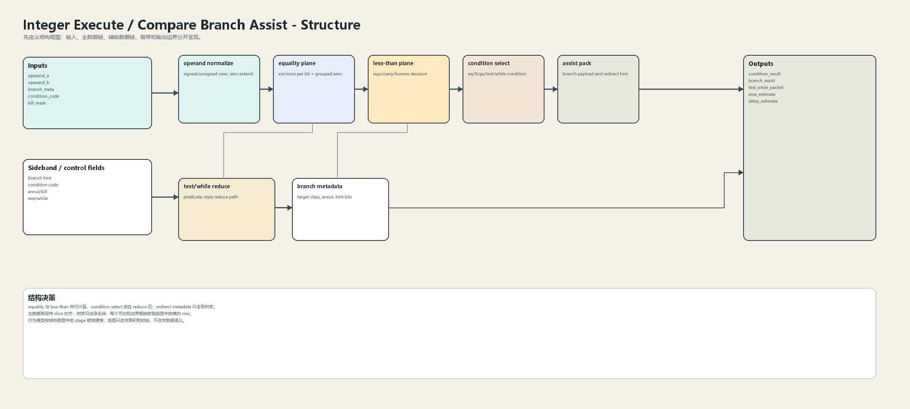
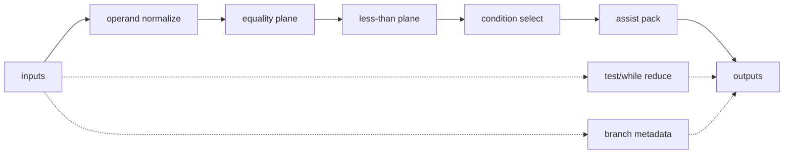
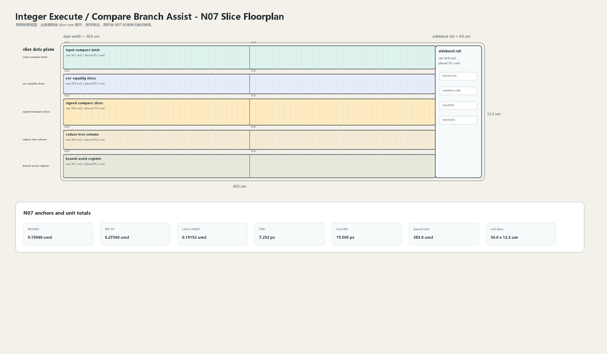

# Compare Branch Assist

## 1. 职责

本单元生成 fused compare、condition result、branch assist payload 和轻量 redirect metadata，为整数 fast path 提供低延迟条件判断。

本模块按结构框图先确定数据语义，再按 N07 slice 版图确定面积和时延约束。结构图不表达物理尺寸；版图图只表达物理组织，不改变数据语义。

## 2. 结构规模摘要

| 项 | 数值 |
|---|---:|
| datapath units | `8` |
| module count | `8` |
| logic LOC | `4286` |
| assign count | `777` |
| always count | `151` |
| estimated path | `162.638 ps` |

## 3. 结构框图





## 4. Slice 版图



版图采用 `slice row + sideband rail` 组织。主数据面宽度为 `30.0 um`，侧带 rail 宽度为 `4.0 um`，估算放置面积为 `383.0 um2`，初始边界框为 `36.0 x 12.3 um`。

## 5. 主数据面

| 项 | 说明 |
|---|---|
| operand normalize | signed/unsigned view; zero extend |
| equality plane | xor/xnor per bit + grouped zero |
| less-than plane | sign/carry/borrow decision |
| condition select | eq/lt/ge/test/while condition |
| assist pack | branch payload and redirect hint |

## 6. 辅助数据面

| 项 | 说明 |
|---|---|
| test/while reduce | predicate-style reduce path |
| branch metadata | target class, annul, hint bits |

## 7. Floorplan 分解

| row | lanes | 宽度 | raw area | placed area | 说明 |
|---|---:|---:|---:|---:|---|
| input compare latch | `64` | `32.0 um` | `34.1 um2` | `65.1 um2` | A/B/condition boundary |
| xor equality slices | `64` | `32.0 um` | `28.9 um2` | `55.1 um2` | 64 local xor cells + zero tree taps |
| signed compare slices | `64` | `32.0 um` | `38.5 um2` | `73.4 um2` | sign/borrow select split at bit31 |
| reduce tree column | `64` | `32.0 um` | `28.5 um2` | `54.2 um2` | eq/lt/test reduce |
| branch assist register | `64` | `32.0 um` | `34.1 um2` | `65.1 um2` | condition + metadata packet |

## 8. N07 初始模型

| 项 | 数值 |
|---|---:|
| MUX2D1 面积锚点 | `0.15048 um2` |
| DFF D1 面积锚点 | `0.27360 um2` |
| Latch LHQD1 面积锚点 | `0.19152 um2` |
| FO4 时延锚点 | `7.252 ps` |
| DFF clk->q 锚点 | `25.870 ps` |
| 局部 M5 线延时预算 | `15.500 ps` |
| 放置利用率 | `0.64` |
| 布线膨胀系数 | `1.22` |

```text
raw_area = mux2_count * MUX2D1_area
         + dff_count * DFF_D1_area
         + latch_count * Latch_LHQD1_area
         + custom_array_area

placed_area = raw_area / utilization * route_overhead
bbox_height = sum(row_placed_area / row_width) + channel_budget
```

## 9. 行为模型契约

行为模型必须覆盖：

- equal and not-equal。
- signed/unsigned less-than。
- test/while condition。
- branch payload pack。
- flush priority。

建议行为模型接口：

```python
class IntegerExecuteCompareBranchAssist:
    def reset(self, config): ...
    def accept(self, packet, cycle): ...
    def step(self, cycle): ...
    def flush(self, token): ...
    def peek_outputs(self): ...
    def area_estimate(self): ...
    def delay_estimate(self): ...
```

## 10. 实现单元落点

| 单元 | 职责 |
|---|---|
| `integer_execute_compare_packet` | 定义 compare 输入、condition 与 assist packet。 |
| `integer_execute_compare_slice` | 实现 equality 和 less-than bit-slice。 |
| `integer_execute_compare_reduce` | 实现 grouped reduce 和 condition select。 |
| `integer_execute_branch_assist_top` | 组合 compare result 与 branch metadata。 |

## 11. 检查点

- signed 与 unsigned 边界。
- bit31/bit63 sign 选择。
- condition 选择优先级。
- flush 下不产生 redirect。
