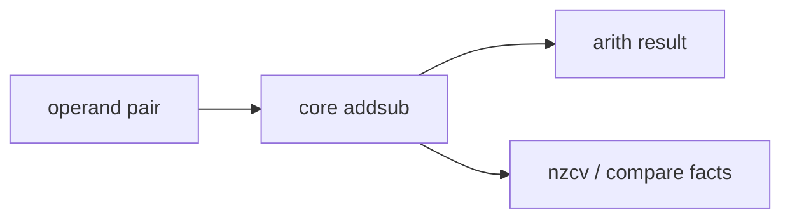

# Core Addsub

## 1. 角色

这个模块负责整数执行里的基础加减和最常见的逻辑前半段，是朱雀整数快路径的主算术核。

## 2. 职责边界

它只处理加减和基础比较事实，不承担位流重排、乘除、认证或标签处理。

## 3. 核心对象

- `sum_core`
- `diff_core`
- `carry_chain`
- `compare_fact`

## 4. 结构框图

## 5. 处理流程

1. 采样两个源操作数和进位控制。
2. 生成和或差。
3. 输出结果和标志。

## 6. 不变量

- 结果必须与宽度裁剪一致。
- 标志必须和结果同步。

## 7. 时序约束

- 该模块必须保持快路径属性。

## 8. L3 对应

- `core_addsub/add_path.md`
- `core_addsub/sub_path.md`
- `core_addsub/flags_path.md`

