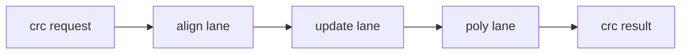

# Crc Pack

## 1. 角色

这个模块负责 CRC32 / CRC32C 更新和对齐网络。

## 2. 职责边界

它只处理 CRC 语义，不负责其他特殊变换。

## 3. 核心对象

- `align_lane`
- `update_lane`
- `poly_lane`

## 4. 数据结构

`crc_bundle` 至少应包含：

- `accumulator`
- `data`
- `size`
- `mode`
- `poly`

## 5. 结构框图

## 6. 处理流程

1. 先按字节宽度对齐输入。
2. 再按 reflected 或 raw 模式更新 CRC。
3. 最后输出 32-bit CRC 结果。

## 7. 不变量

- CRC32 和 CRC32C 只在多项式上不同。
- 对齐和更新必须使用同一输入视图。

## 8. 时序约束

- CRC 网络应保持独立快路径属性。

## 9. L3 对应

- `crc_pack/align_lane.md`
- `crc_pack/update_lane.md`
- `crc_pack/poly_lane.md`
