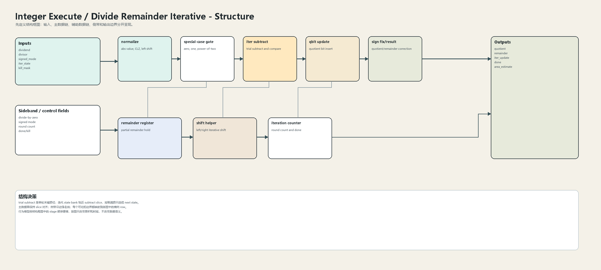
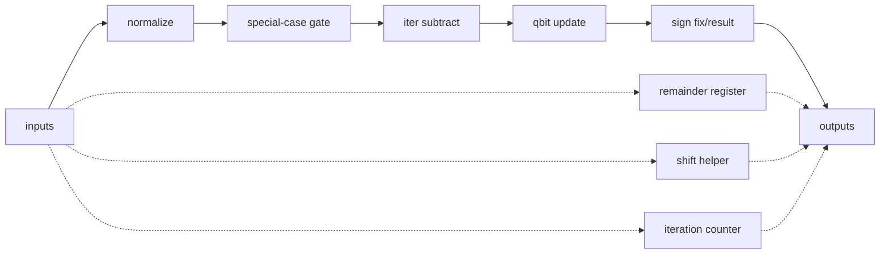
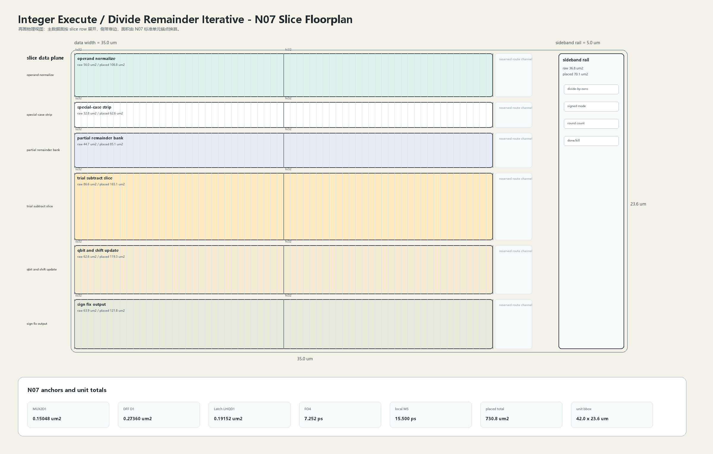

# Divide Remainder Iterative

## 1. 职责

本单元实现除法、余数、CLZ、power-of-two special case、quotient bit 生成和迭代状态更新，采用多周期复用 datapath。

本模块按结构框图先确定数据语义，再按 N07 slice 版图确定面积和时延约束。结构图不表达物理尺寸；版图图只表达物理组织，不改变数据语义。

## 2. 结构规模摘要

| 项 | 数值 |
|---|---:|
| datapath units | `13` |
| module count | `13` |
| logic LOC | `6009` |
| assign count | `1051` |
| always count | `262` |
| estimated path | `193.894 ps` |

## 3. 结构框图





## 4. Slice 版图



版图采用 `slice row + sideband rail` 组织。主数据面宽度为 `35.0 um`，侧带 rail 宽度为 `5.0 um`，估算放置面积为 `730.8 um2`，初始边界框为 `42.0 x 23.6 um`。

## 5. 主数据面

| 项 | 说明 |
|---|---|
| normalize | abs value, CLZ, left shift |
| special-case gate | zero, one, power-of-two |
| iter subtract | trial subtract and compare |
| qbit update | quotient bit insert |
| sign fix/result | quotient/remainder correction |

## 6. 辅助数据面

| 项 | 说明 |
|---|---|
| remainder register | partial remainder hold |
| shift helper | left/right iterative shift |
| iteration counter | round count and done |

## 7. Floorplan 分解

| row | lanes | 宽度 | raw area | placed area | 说明 |
|---|---:|---:|---:|---:|---|
| operand normalize | `64` | `32.0 um` | `56.0 um2` | `106.8 um2` | CLZ + abs + align |
| special-case strip | `64` | `32.0 um` | `32.8 um2` | `62.6 um2` | zero/pow2 early result |
| partial remainder bank | `64` | `32.0 um` | `44.7 um2` | `85.1 um2` | multi-cycle state storage |
| trial subtract slice | `64` | `32.0 um` | `86.6 um2` | `165.1 um2` | 64-bit subtract/comparison |
| qbit and shift update | `64` | `32.0 um` | `62.6 um2` | `119.3 um2` | quotient insert + left/right shift |
| sign fix output | `64` | `32.0 um` | `63.9 um2` | `121.8 um2` | quotient/remainder correction |

## 8. N07 初始模型

| 项 | 数值 |
|---|---:|
| MUX2D1 面积锚点 | `0.15048 um2` |
| DFF D1 面积锚点 | `0.27360 um2` |
| Latch LHQD1 面积锚点 | `0.19152 um2` |
| FO4 时延锚点 | `7.252 ps` |
| DFF clk->q 锚点 | `25.870 ps` |
| 局部 M5 线延时预算 | `15.500 ps` |
| 放置利用率 | `0.64` |
| 布线膨胀系数 | `1.22` |

```text
raw_area = mux2_count * MUX2D1_area
         + dff_count * DFF_D1_area
         + latch_count * Latch_LHQD1_area
         + custom_array_area

placed_area = raw_area / utilization * route_overhead
bbox_height = sum(row_placed_area / row_width) + channel_budget
```

## 9. 行为模型契约

行为模型必须覆盖：

- divide。
- remainder。
- normalization。
- qbit update。
- sign correction。
- early done。

建议行为模型接口：

```python
class IntegerExecuteDivideIterativeMath:
    def reset(self, config): ...
    def accept(self, packet, cycle): ...
    def step(self, cycle): ...
    def flush(self, token): ...
    def peek_outputs(self): ...
    def area_estimate(self): ...
    def delay_estimate(self): ...
```

## 10. 实现单元落点

| 单元 | 职责 |
|---|---|
| `integer_execute_div_packet` | 定义 divide operand、iter_state 和 result packet。 |
| `integer_execute_div_normalize` | 实现 CLZ、abs、shift helper。 |
| `integer_execute_div_iter_slice` | 实现 trial subtract、qbit 和 remainder update。 |
| `integer_execute_div_result_fix` | 实现 sign correction 与 done output。 |

## 11. 检查点

- 除零。
- 最小负数除以 -1。
- power-of-two divisor。
- 迭代结束。
- kill 后 state 清除。
