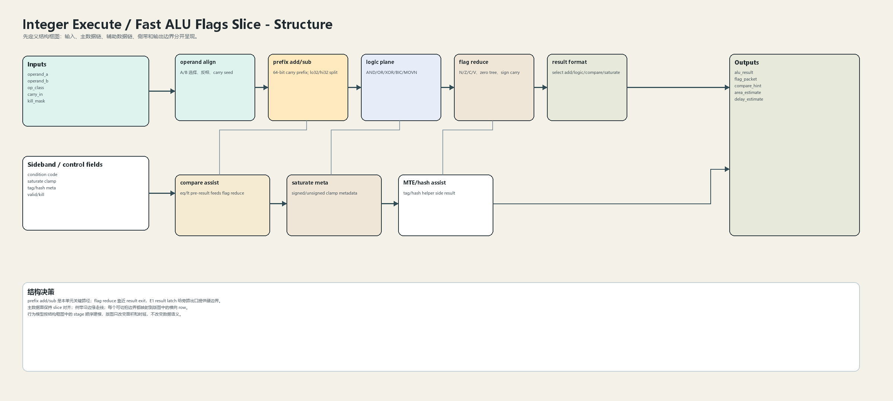
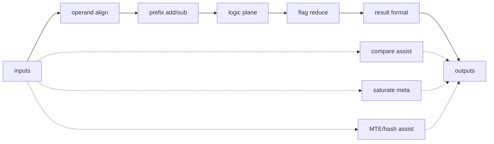
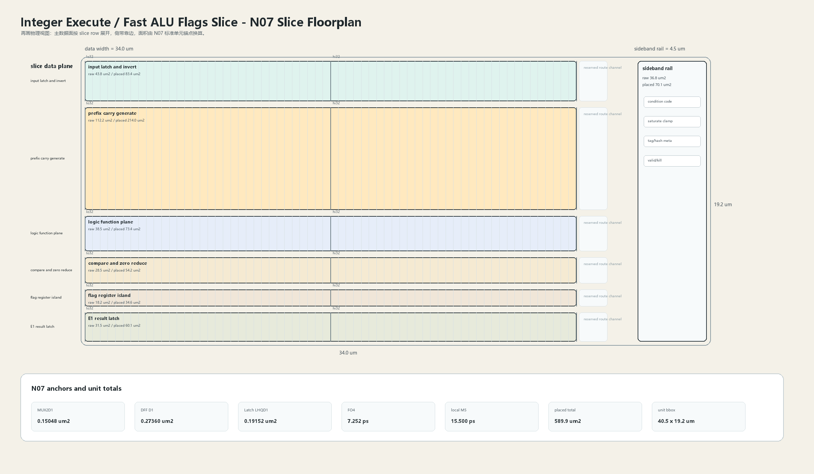

# Fast ALU Flags Slice

## 1. 职责

本单元实现整数 fast path 中的加减、逻辑、轻量比较、饱和元数据与 flag 归约，输出可直接进入 E1 result bypass 或后级 result merge。

本模块按结构框图先确定数据语义，再按 N07 slice 版图确定面积和时延约束。结构图不表达物理尺寸；版图图只表达物理组织，不改变数据语义。

## 2. 结构规模摘要

| 项 | 数值 |
|---|---:|
| datapath units | `40` |
| module count | `40` |
| logic LOC | `11999` |
| assign count | `2344` |
| always count | `393` |
| estimated path | `167.890 ps` |

## 3. 结构框图





## 4. Slice 版图



版图采用 `slice row + sideband rail` 组织。主数据面宽度为 `34.0 um`，侧带 rail 宽度为 `4.5 um`，估算放置面积为 `589.9 um2`，初始边界框为 `40.5 x 19.2 um`。

## 5. 主数据面

| 项 | 说明 |
|---|---|
| operand align | A/B 选择、反相、carry seed |
| prefix add/sub | 64-bit carry prefix; lo32/hi32 split |
| logic plane | AND/OR/XOR/BIC/MOVN |
| flag reduce | N/Z/C/V、zero tree、sign carry |
| result format | select add/logic/compare/saturate |

## 6. 辅助数据面

| 项 | 说明 |
|---|---|
| compare assist | eq/lt pre-result feeds flag reduce |
| saturate meta | signed/unsigned clamp metadata |
| MTE/hash assist | tag/hash helper side result |

## 7. Floorplan 分解

| row | lanes | 宽度 | raw area | placed area | 说明 |
|---|---:|---:|---:|---:|---|
| input latch and invert | `64` | `32.0 um` | `43.8 um2` | `83.4 um2` | slice-local operand latch |
| prefix carry generate | `64` | `32.0 um` | `112.2 um2` | `214.0 um2` | generate/propagate + grouped prefix |
| logic function plane | `64` | `32.0 um` | `38.5 um2` | `73.4 um2` | parallel boolean result |
| compare and zero reduce | `64` | `32.0 um` | `28.5 um2` | `54.2 um2` | tree placed near result exit |
| flag register island | `64` | `32.0 um` | `18.2 um2` | `34.6 um2` | N/Z/C/V and condition packet |
| E1 result latch | `64` | `32.0 um` | `31.5 um2` | `60.1 um2` | result packet boundary |

## 8. N07 初始模型

| 项 | 数值 |
|---|---:|
| MUX2D1 面积锚点 | `0.15048 um2` |
| DFF D1 面积锚点 | `0.27360 um2` |
| Latch LHQD1 面积锚点 | `0.19152 um2` |
| FO4 时延锚点 | `7.252 ps` |
| DFF clk->q 锚点 | `25.870 ps` |
| 局部 M5 线延时预算 | `15.500 ps` |
| 放置利用率 | `0.64` |
| 布线膨胀系数 | `1.22` |

```text
raw_area = mux2_count * MUX2D1_area
         + dff_count * DFF_D1_area
         + latch_count * Latch_LHQD1_area
         + custom_array_area

placed_area = raw_area / utilization * route_overhead
bbox_height = sum(row_placed_area / row_width) + channel_budget
```

## 9. 行为模型契约

行为模型必须覆盖：

- add/sub with carry。
- logic op select。
- signed/unsigned flag generation。
- compare hint。
- saturate metadata。
- kill masking。

建议行为模型接口：

```python
class IntegerExecuteFastAluFlags:
    def reset(self, config): ...
    def accept(self, packet, cycle): ...
    def step(self, cycle): ...
    def flush(self, token): ...
    def peek_outputs(self): ...
    def area_estimate(self): ...
    def delay_estimate(self): ...
```

## 10. 实现单元落点

| 单元 | 职责 |
|---|---|
| `integer_execute_fast_alu_packet` | 定义 operand、op_class、flag 与 result packet。 |
| `integer_execute_fast_alu_slice` | 实现 64 个 bit slice 的加减与逻辑选择。 |
| `integer_execute_fast_flag_reduce` | 实现 N/Z/C/V、condition 与 compare hint。 |
| `integer_execute_fast_alu_top` | 组合 slice、flag、format 和 E1 boundary。 |

## 11. 检查点

- carry between bit31/bit32。
- zero flag tree。
- overflow flag。
- logic result select。
- kill 后 flag 不更新。
