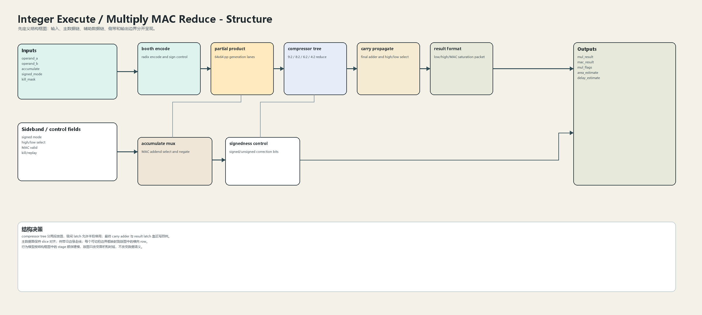
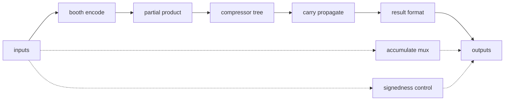
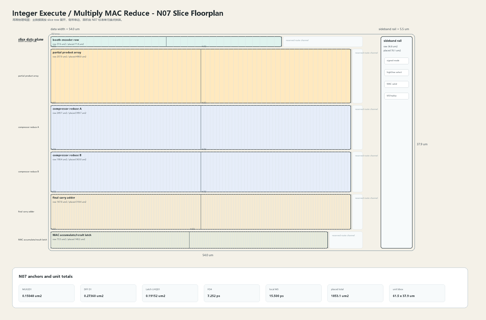

# Multiply MAC Reduce

## 1. 职责

本单元实现 booth encode、partial product、compressor tree、MAC accumulate 和乘法结果格式化，是整数簇中面积最高的数据阵列之一。

本模块按结构框图先确定数据语义，再按 N07 slice 版图确定面积和时延约束。结构图不表达物理尺寸；版图图只表达物理组织，不改变数据语义。

## 2. 结构规模摘要

| 项 | 数值 |
|---|---:|
| datapath units | `12` |
| module count | `12` |
| logic LOC | `3504` |
| assign count | `729` |
| always count | `122` |
| estimated path | `207.398 ps` |

## 3. 结构框图





## 4. Slice 版图



版图采用 `slice row + sideband rail` 组织。主数据面宽度为 `54.0 um`，侧带 rail 宽度为 `5.5 um`，估算放置面积为 `1853.1 um2`，初始边界框为 `61.5 x 37.9 um`。

## 5. 主数据面

| 项 | 说明 |
|---|---|
| booth encode | radix encode and sign control |
| partial product | 64x64 pp generation lanes |
| compressor tree | 9:2 / 8:2 / 6:2 / 4:2 reduce |
| carry propagate | final adder and high/low select |
| result format | low/high/MAC saturation packet |

## 6. 辅助数据面

| 项 | 说明 |
|---|---|
| accumulate mux | MAC addend select and negate |
| signedness control | signed/unsigned correction bits |

## 7. Floorplan 分解

| row | lanes | 宽度 | raw area | placed area | 说明 |
|---|---:|---:|---:|---:|---|
| booth encoder row | `32` | `40.0 um` | `37.6 um2` | `71.8 um2` | 32 groups driving pp rows |
| partial product array | `64` | `52.0 um` | `257.0 um2` | `490.0 um2` | regular pp matrix |
| compressor reduce A | `96` | `52.0 um` | `209.7 um2` | `399.7 um2` | 9:2 / 8:2 first half |
| compressor reduce B | `96` | `52.0 um` | `190.4 um2` | `363.0 um2` | 6:2 / 4:2 second half |
| final carry adder | `128` | `52.0 um` | `167.0 um2` | `318.4 um2` | 128-bit carry propagate |
| MAC accumulate/result latch | `128` | `48.0 um` | `73.5 um2` | `140.2 um2` | 128-bit result boundary |

## 8. N07 初始模型

| 项 | 数值 |
|---|---:|
| MUX2D1 面积锚点 | `0.15048 um2` |
| DFF D1 面积锚点 | `0.27360 um2` |
| Latch LHQD1 面积锚点 | `0.19152 um2` |
| FO4 时延锚点 | `7.252 ps` |
| DFF clk->q 锚点 | `25.870 ps` |
| 局部 M5 线延时预算 | `15.500 ps` |
| 放置利用率 | `0.64` |
| 布线膨胀系数 | `1.22` |

```text
raw_area = mux2_count * MUX2D1_area
         + dff_count * DFF_D1_area
         + latch_count * Latch_LHQD1_area
         + custom_array_area

placed_area = raw_area / utilization * route_overhead
bbox_height = sum(row_placed_area / row_width) + channel_budget
```

## 9. 行为模型契约

行为模型必须覆盖：

- multiply low/high。
- signed/unsigned correction。
- MAC accumulate。
- compressor pipeline。
- multi-cycle valid。

建议行为模型接口：

```python
class IntegerExecuteMultiplyMacReduce:
    def reset(self, config): ...
    def accept(self, packet, cycle): ...
    def step(self, cycle): ...
    def flush(self, token): ...
    def peek_outputs(self): ...
    def area_estimate(self): ...
    def delay_estimate(self): ...
```

## 10. 实现单元落点

| 单元 | 职责 |
|---|---|
| `integer_execute_mul_packet` | 定义 multiply/MAC operand 和 result packet。 |
| `integer_execute_mul_booth_encode` | 实现 booth encode 与 signedness control。 |
| `integer_execute_mul_compressor_array` | 实现 pp array 与 compressor tree。 |
| `integer_execute_mul_result_format` | 实现 carry-propagate、MAC addend 和 result boundary。 |

## 11. 检查点

- signed correction。
- zero operand。
- high/low half select。
- accumulate bypass。
- kill 后 multi-cycle 输出屏蔽。
