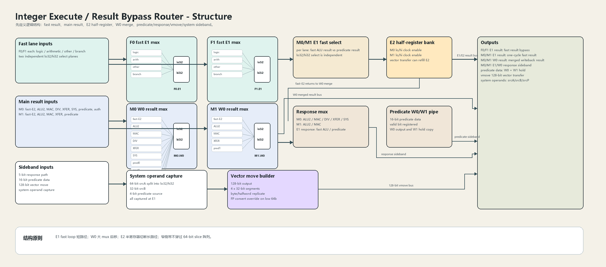
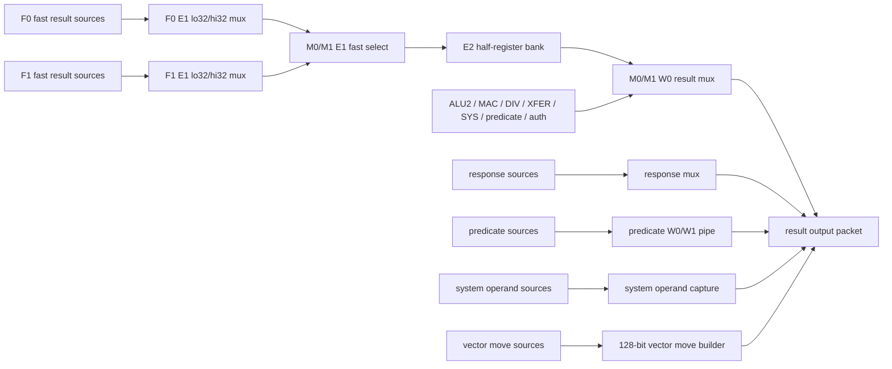
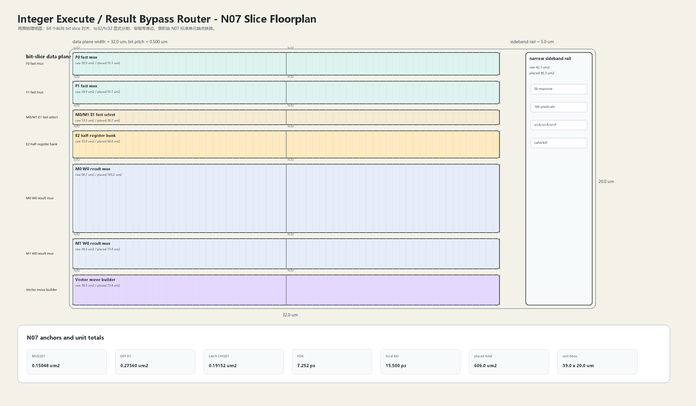

# Result Bypass Router

## 1. 职责

本单元负责整数执行簇内的结果汇合与本地旁路，把 fast lane、main lane、predicate、response、system operand 和 vector move 数据分层合并，形成 E1、E2、W0、W1 多个时序边界上的输出 packet。

设计目标不是把所有结果压成一个大 mux，而是把高速 E1 fast bypass、E2 半寄存器暂存、W0 writeback 合并、窄侧带输出分开布置。这样可以把最快的单周期旁路环缩短，同时把大扇入选择放到较宽松的 W0 路径里。

## 2. 结构规模摘要

| 项 | 数值 |
|---|---:|
| 组合选择块 | `23` |
| 时序块 | `13` |
| 64-bit 输入 | `34` |
| 64-bit 输出 | `7` |
| 主要数据宽度 | `64-bit result / 128-bit vector move` |
| 窄侧带宽度 | `5-bit response / 16-bit predicate / 4-bit predicate source` |

## 3. 结构框图





## 4. Slice 版图



结构框图确定逻辑连接后，版图按 64 个纵向 bit slice 落地。主数据面固定为 `32.0 um` 宽，形成 `0.500 um/bit` 的初始 slice pitch；窄侧带 rail 固定在右侧 `5.0 um` 区域，避免 response、predicate、system 控制线穿过 64-bit result 阵列。

## 5. 主数据面

| 子结构 | 数据组织 | 说明 |
|---|---|---|
| F0 fast E1 mux | `logic / arithmetic / other / branch` 四路输入，`lo32` 与 `hi32` 分开选择 | 形成 F0 fast result bypass，选择逻辑本地化，避免跨半字传播。 |
| F1 fast E1 mux | 与 F0 对称，独立选择 | 形成 F1 fast result bypass，允许两条 fast lane 同周期给出不同输入。 |
| M0/M1 E1 fast select | 每 lane 在 fast ALU result 与 predicate result 之间选择，`lo32` 与 `hi32` 独立 | 把 predicate 快速结果接入一拍内旁路，不进入 W0 大 mux。 |
| E2 half-register bank | M0 lo、M0 hi、M1 lo、M1 hi 四组半寄存器，带独立 clock enable | 切断 E1 fast select 到 W0 result mux 的长路径，并允许 vector transfer refill。 |
| M0 W0 result mux | `fast-E2 / ALU2 / MAC / DIV / XFER / SYS / pred0 / pred1 / auth / auth2c` | M0 是宽输入结果合并点，适合放在 E2 之后，避免污染 fast bypass 环。 |
| M1 W0 result mux | `fast-E2 / ALU2 / MAC / XFER / pred1` | M1 输入较少，仍保持 `lo32` 与 `hi32` 双平面结构，便于 slice 对齐。 |

## 6. 侧带数据面

| 子结构 | 数据组织 | 说明 |
|---|---|---|
| response mux | `5-bit` response，覆盖 M0、M1 与 E1 response | response 是窄路径，沿结果数据面的边缘布置，不穿过 64-bit slice 阵列。 |
| predicate W0/W1 pipe | `16-bit` predicate data，valid bit 进入 W0，并保留 W1 hold copy | predicate 数据既可随 W0 输出，也可在 W1 保持，用于后续状态一致性检查。 |
| system operand capture | `srcA 64-bit` 拆成 `lo32/hi32`，`srcB 32-bit`，`srcP 4-bit` | system operand 在 E1 捕获，避免系统类操作在后级重新读取源操作数。 |
| vector move builder | `128-bit` 输出，由 `4 x 32-bit` segment 组成 | 支持 byte/halfword replicate，并允许 FP convert 覆盖低 64-bit 输出。 |

## 7. Slice / Floorplan 规则

| 类别 | 规则 |
|---|---|
| bit slice | 64-bit result 面按 64 个纵向 bit slice 排列，同一 bit 的 mux、半寄存器和输出驱动尽量纵向贴近。 |
| half split | 所有 result mux 都显式拆成 `lo32` 与 `hi32` 两个平面，半字选择和半字 clock enable 独立。 |
| fast loop | F0/F1 fast E1 mux 与 M0/M1 E1 fast select 靠近执行单元出口，形成短旁路环。 |
| staging | E2 half-register bank 放在 fast select 与 W0 result mux 之间，给大扇入 W0 合并提供时序缓冲。 |
| sideband | response、predicate、system predicate source 作为窄线束沿阵列边缘走线，不占用 64-bit 主 slice 通道。 |
| latch option | E1 到 E2 边界可实现为 latch-based half-cycle borrow，W0/W1 可实现为 register 或 latch boundary。 |

## 8. N07 初始模型

| 项 | 数值 |
|---|---:|
| MUX2D1 面积锚点 | `0.15048 um2` |
| DFF D1 面积锚点 | `0.27360 um2` |
| Latch LHQD1 面积锚点 | `0.19152 um2` |
| FO4 时延锚点 | `7.252 ps` |
| DFF clk->q 锚点 | `25.870 ps` |
| 局部 M5 线延时预算 | `15.500 ps` |
| 版图总面积 | `606.0 um2` |
| 版图边界框 | `39.0 x 20.0 um` |

初始等效面积按 mux2 与状态单元分开估计：

```text
fast_mux_equiv = 2 lanes * 64 bits * 3 mux2
e1_fast_select_equiv = 2 lanes * 64 bits * 1 mux2
w0_mux_equiv = 64 bits * (9 mux2 + 4 mux2)
mux_raw_area = (fast_mux_equiv + e1_fast_select_equiv + w0_mux_equiv) * MUX2D1_area

state_bits = 4 half_register_banks * 32 bits + predicate_pipe + system_operand_capture
state_raw_area = state_bits * DFF_D1_area
placed_area = (mux_raw_area + state_raw_area) / utilization * route_overhead
```

当前 floorplan 约束采用 `utilization = 0.64`、`route_overhead = 1.22`。本单元的第一版重点不是压缩面积，而是保证 fast E1 环路、本地 lo32/hi32 选择、E2 分段暂存的物理位置可控。

## 9. 行为模型契约

行为模型必须覆盖：

- F0/F1 fast source select。
- M0/M1 fast ALU result 与 predicate result 的 E1 选择。
- E2 half-register clock enable、保持与 vector transfer refill。
- M0/M1 W0 result 输入优先级。
- response mux 与 predicate W0/W1 hold。
- system operand capture 与 vector move builder。
- kill/flush 对 E1、E2、W0、W1 可见输出的屏蔽。

建议行为模型接口：

```python
class IntegerExecuteResultBypassRouter:
    def reset(self, config): ...
    def accept_fast_sources(self, packet, cycle): ...
    def accept_main_sources(self, packet, cycle): ...
    def accept_sideband_sources(self, packet, cycle): ...
    def step_e1(self, cycle): ...
    def step_e2(self, cycle): ...
    def step_w0(self, cycle): ...
    def step_w1(self, cycle): ...
    def flush(self, token): ...
    def peek_outputs(self): ...
    def area_estimate(self): ...
    def delay_estimate(self): ...
```

## 10. RTL 单元落点

| 单元 | 职责 |
|---|---|
| `integer_execute_result_bypass_packet` | 定义 result、response、predicate、system operand、vmove packet。 |
| `integer_execute_result_fast_mux_slice` | 实现 F0/F1 fast E1 `lo32/hi32` 选择 slice。 |
| `integer_execute_result_e2_half_bank` | 实现 M0/M1 E2 half-register bank 与 clock enable。 |
| `integer_execute_result_w0_merge_slice` | 实现 M0/M1 W0 result mux，并保持 `lo32/hi32` 分平面。 |
| `integer_execute_result_sideband_pipe` | 实现 response、predicate W0/W1、system operand capture。 |
| `integer_execute_result_vmove_builder` | 实现 128-bit vector move builder。 |
| `integer_execute_result_bypass_router_top` | 组合上述 slice/bank/sideband，导出本单元顶层接口。 |

## 11. 检查点

- F0/F1 fast mux 的 `lo32` 与 `hi32` 选择互不串扰。
- M0/M1 E1 fast select 不经过 W0 大 mux。
- E2 half-register 在 clock enable 关闭时保持原值。
- vector transfer refill 只覆盖允许更新的半寄存器。
- M0 与 M1 W0 输入优先级固定且可测试。
- predicate W1 hold 不被无效 W0 覆盖。
- response 与 result 的 valid/kill 对齐。
