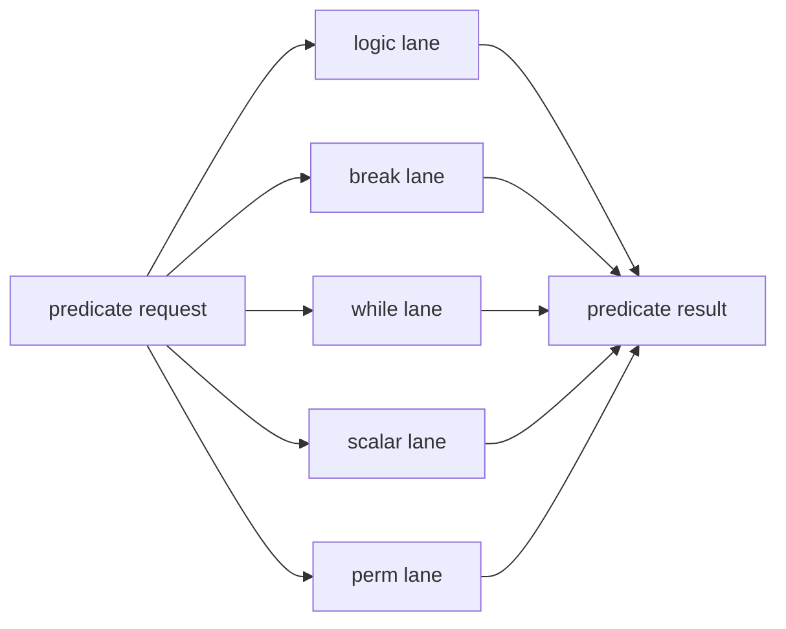

# Predicate Pack

## 1. 角色

这个模块负责谓词逻辑、break、while 和标量 predicate 操作。它把 governing predicate、条件比较和元素级重排组合成统一的谓词语义。

## 2. 职责边界

它只处理 predicate 语义，不负责整数主算术或结果总线选择。

## 3. 核心对象

- `logic_lane`
- `break_lane`
- `while_lane`
- `scalar_lane`
- `perm_lane`

## 4. 数据结构

`predicate_bundle` 至少应包含：

- `pg`
- `ps1`
- `ps2`
- `esize`
- `flags`

## 5. 结构框图

## 6. 处理流程

1. 先清理 predicate 粒度。
2. 再分派到逻辑、break、while、标量或 permute 路径。
3. 合并结果和 flags。
4. 输出给下游消费。

## 7. 不变量

- 每个路径都必须保持 element 粒度语义。
- break 和 while 不能跨越已确认的边界。
- flags 和 predicate 结果必须一致。

## 8. 时序约束

- predicate 路径应尽量保持单拍可见。
- permute 和 scalar 不能拖慢逻辑主路径。

## 9. L3 对应

- `predicate_pack/logic_lane.md`
- `predicate_pack/break_lane.md`
- `predicate_pack/while_lane.md`
- `predicate_pack/scalar_lane.md`
- `predicate_pack/perm_lane.md`
