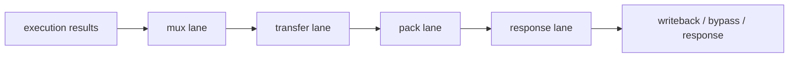

# Result Fuse

## 1. 角色

这个模块负责结果合并、旁路发布和写回打包。它把不同延迟、不同功能类的完成结果汇成同一种对外接口。

## 2. 职责边界

它不计算新结果，只做结果汇流、格式统一和优先级裁决。

## 3. 核心对象

- `mux_lane`
- `transfer_lane`
- `pack_lane`
- `response_lane`

## 4. 数据结构

`result_bundle` 至少应包含：

- `value`
- `valid`
- `source`
- `dst_tag`
- `flags`

## 5. 结构框图

## 6. 处理流程

1. 接收各执行子块的完成结果。
2. 根据优先级选择本地或 transfer 结果。
3. 打包写回值、旁路值和 response。
4. 输出完成通知。

## 7. 不变量

- 合并不能改变结果语义。
- 旁路和写回必须保持一致。
- 不同延迟类结果必须共享同一标签生命周期。

## 8. 时序约束

- 该模块必须支持高并发汇流。
- 完成通知不能先于结果稳定。

## 9. L3 对应

- `result_fuse/mux_lane.md`
- `result_fuse/transfer_lane.md`
- `result_fuse/pack_lane.md`
- `result_fuse/response_lane.md`
