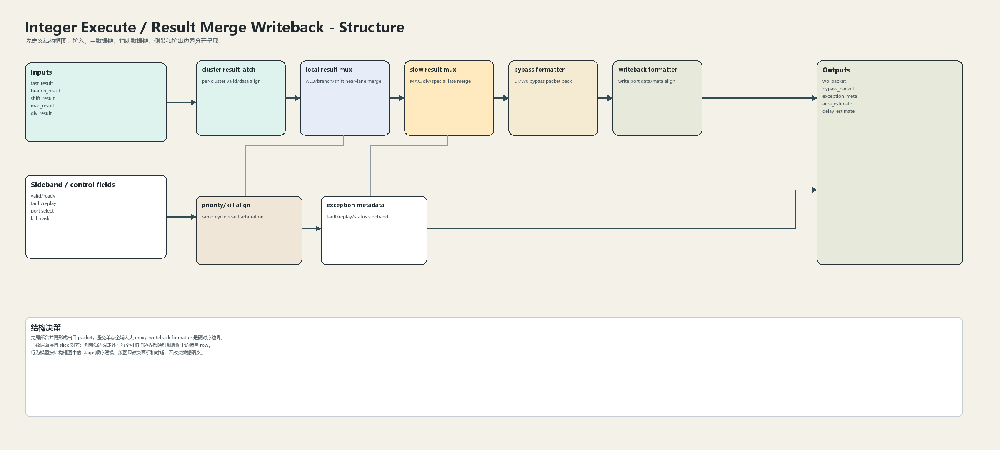
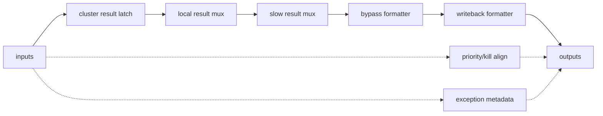
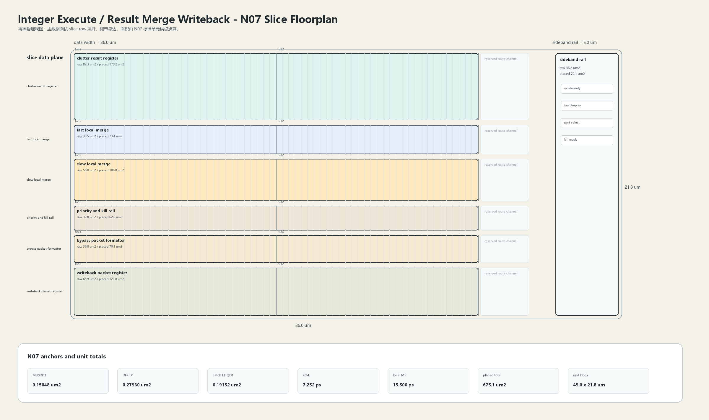

# Result Merge Writeback

## 1. 职责

本单元分层合并 fast ALU、branch assist、shift、MAC、divide、special result，形成 bypass packet、writeback packet 和 exception metadata。

本模块按结构框图先确定数据语义，再按 N07 slice 版图确定面积和时延约束。结构图不表达物理尺寸；版图图只表达物理组织，不改变数据语义。

## 2. 结构规模摘要

| 项 | 数值 |
|---|---:|
| datapath units | `16` |
| module count | `16` |
| logic LOC | `7787` |
| assign count | `1644` |
| always count | `289` |
| estimated path | `174.390 ps` |

## 3. 结构框图





## 4. Slice 版图



版图采用 `slice row + sideband rail` 组织。主数据面宽度为 `36.0 um`，侧带 rail 宽度为 `5.0 um`，估算放置面积为 `675.1 um2`，初始边界框为 `43.0 x 21.8 um`。

## 5. 主数据面

| 项 | 说明 |
|---|---|
| cluster result latch | per-cluster valid/data align |
| local result mux | ALU/branch/shift near-lane merge |
| slow result mux | MAC/div/special late merge |
| bypass formatter | E1/W0 bypass packet pack |
| writeback formatter | write port data/meta align |

## 6. 辅助数据面

| 项 | 说明 |
|---|---|
| priority/kill align | same-cycle result arbitration |
| exception metadata | fault/replay/status sideband |

## 7. Floorplan 分解

| row | lanes | 宽度 | raw area | placed area | 说明 |
|---|---:|---:|---:|---:|---|
| cluster result register | `64` | `32.0 um` | `89.3 um2` | `170.2 um2` | fast/branch/shift/MAC/div/special |
| fast local merge | `64` | `32.0 um` | `38.5 um2` | `73.4 um2` | ALU/branch/shift result slice |
| slow local merge | `64` | `32.0 um` | `56.0 um2` | `106.8 um2` | MAC/div/special result slice |
| priority and kill rail | `64` | `32.0 um` | `32.8 um2` | `62.6 um2` | valid/kill/replay align |
| bypass packet formatter | `64` | `32.0 um` | `36.8 um2` | `70.1 um2` | bypass result and meta |
| writeback packet register | `64` | `32.0 um` | `63.9 um2` | `121.8 um2` | WB data/meta hard boundary |

## 8. N07 初始模型

| 项 | 数值 |
|---|---:|
| MUX2D1 面积锚点 | `0.15048 um2` |
| DFF D1 面积锚点 | `0.27360 um2` |
| Latch LHQD1 面积锚点 | `0.19152 um2` |
| FO4 时延锚点 | `7.252 ps` |
| DFF clk->q 锚点 | `25.870 ps` |
| 局部 M5 线延时预算 | `15.500 ps` |
| 放置利用率 | `0.64` |
| 布线膨胀系数 | `1.22` |

```text
raw_area = mux2_count * MUX2D1_area
         + dff_count * DFF_D1_area
         + latch_count * Latch_LHQD1_area
         + custom_array_area

placed_area = raw_area / utilization * route_overhead
bbox_height = sum(row_placed_area / row_width) + channel_budget
```

## 9. 行为模型契约

行为模型必须覆盖：

- result arbitration。
- bypass generation。
- writeback formatting。
- fault metadata。
- kill/flush alignment。

建议行为模型接口：

```python
class IntegerExecuteResultMergeWriteback:
    def reset(self, config): ...
    def accept(self, packet, cycle): ...
    def step(self, cycle): ...
    def flush(self, token): ...
    def peek_outputs(self): ...
    def area_estimate(self): ...
    def delay_estimate(self): ...
```

## 10. 实现单元落点

| 单元 | 职责 |
|---|---|
| `integer_execute_result_packet` | 定义 result、bypass、writeback 和 exception packet。 |
| `integer_execute_result_local_mux` | 实现 fast/slow local merge slice。 |
| `integer_execute_result_priority` | 实现 valid、kill、priority 和 replay 对齐。 |
| `integer_execute_writeback_format` | 实现 bypass/writeback formatter。 |

## 11. 检查点

- 同拍多结果优先级。
- slow result valid。
- bypass 与 writeback 一致。
- exception meta 对齐。
- flush 后不写回。
