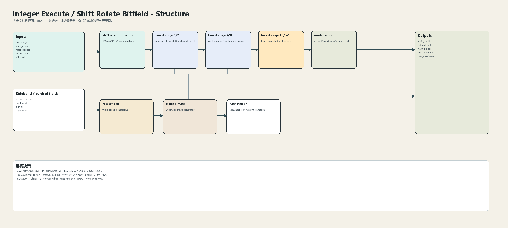
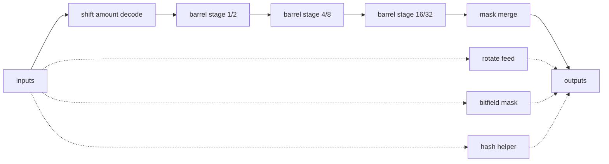
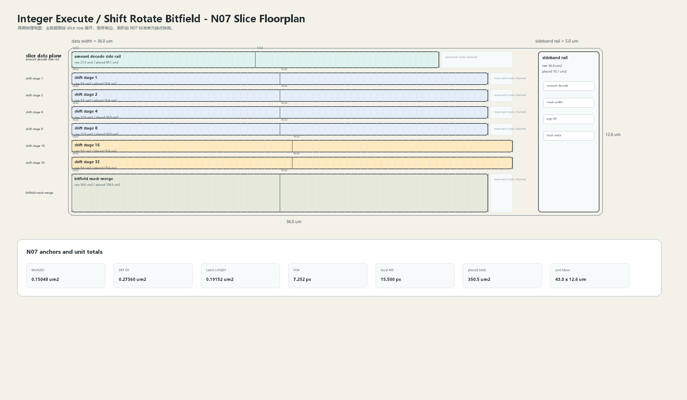

# Shift Rotate Bitfield

## 1. 职责

本单元实现 shift、rotate、bitfield extract/insert、符号扩展、mask merge 与局部 hash/MTE helper，保持 64-bit slice 的规整布局。

本模块按结构框图先确定数据语义，再按 N07 slice 版图确定面积和时延约束。结构图不表达物理尺寸；版图图只表达物理组织，不改变数据语义。

## 2. 结构规模摘要

| 项 | 数值 |
|---|---:|
| datapath units | `19` |
| module count | `19` |
| logic LOC | `8455` |
| assign count | `1616` |
| always count | `300` |
| estimated path | `188.894 ps` |

## 3. 结构框图





## 4. Slice 版图



版图采用 `slice row + sideband rail` 组织。主数据面宽度为 `36.0 um`，侧带 rail 宽度为 `5.0 um`，估算放置面积为 `350.5 um2`，初始边界框为 `43.0 x 12.6 um`。

## 5. 主数据面

| 项 | 说明 |
|---|---|
| shift amount decode | 1/2/4/8/16/32 stage enables |
| barrel stage 1/2 | near-neighbor shift and rotate feed |
| barrel stage 4/8 | mid-span shift with latch option |
| barrel stage 16/32 | long-span shift with sign fill |
| mask merge | extract/insert, zero/sign extend |

## 6. 辅助数据面

| 项 | 说明 |
|---|---|
| rotate feed | wrap-around input bus |
| bitfield mask | width/lsb mask generator |
| hash helper | MTE/hash lightweight transform |

## 7. Floorplan 分解

| row | lanes | 宽度 | raw area | placed area | 说明 |
|---|---:|---:|---:|---:|---|
| amount decode side rail | `64` | `30.0 um` | `21.0 um2` | `40.1 um2` | stage enable fanout |
| shift stage 1 | `64` | `34.0 um` | `9.6 um2` | `18.4 um2` | 1-bit local mux per slice |
| shift stage 2 | `64` | `34.0 um` | `9.6 um2` | `18.4 um2` | 2-bit local mux per slice |
| shift stage 4 | `64` | `34.0 um` | `15.8 um2` | `30.0 um2` | 4-bit cross-slice hop |
| shift stage 8 | `64` | `34.0 um` | `15.8 um2` | `30.0 um2` | 8-bit cross-slice hop |
| shift stage 16 | `64` | `36.0 um` | `9.6 um2` | `18.4 um2` | long hop; route channel reserved |
| shift stage 32 | `64` | `36.0 um` | `9.6 um2` | `18.4 um2` | halfword swap/sign fill |
| bitfield mask merge | `64` | `34.0 um` | `56.0 um2` | `106.8 um2` | insert/extract result select |

## 8. N07 初始模型

| 项 | 数值 |
|---|---:|
| MUX2D1 面积锚点 | `0.15048 um2` |
| DFF D1 面积锚点 | `0.27360 um2` |
| Latch LHQD1 面积锚点 | `0.19152 um2` |
| FO4 时延锚点 | `7.252 ps` |
| DFF clk->q 锚点 | `25.870 ps` |
| 局部 M5 线延时预算 | `15.500 ps` |
| 放置利用率 | `0.64` |
| 布线膨胀系数 | `1.22` |

```text
raw_area = mux2_count * MUX2D1_area
         + dff_count * DFF_D1_area
         + latch_count * Latch_LHQD1_area
         + custom_array_area

placed_area = raw_area / utilization * route_overhead
bbox_height = sum(row_placed_area / row_width) + channel_budget
```

## 9. 行为模型契约

行为模型必须覆盖：

- logical/arithmetic shift。
- rotate。
- bitfield extract。
- bitfield insert。
- mask merge。
- hash helper。

建议行为模型接口：

```python
class IntegerExecuteShiftBitfield:
    def reset(self, config): ...
    def accept(self, packet, cycle): ...
    def step(self, cycle): ...
    def flush(self, token): ...
    def peek_outputs(self): ...
    def area_estimate(self): ...
    def delay_estimate(self): ...
```

## 10. 实现单元落点

| 单元 | 职责 |
|---|---|
| `integer_execute_shift_packet` | 定义 shift amount、mask 和 result packet。 |
| `integer_execute_shift_stage_slice` | 实现 1/2/4/8/16/32 分级 barrel slice。 |
| `integer_execute_bitfield_merge` | 实现 extract/insert mask merge。 |
| `integer_execute_shift_bitfield_top` | 组合 barrel、mask 和 result boundary。 |

## 11. 检查点

- shift amount 0/63。
- rotate wrap。
- sign fill。
- mask 全零/全一。
- insert 与 extract 选择。
