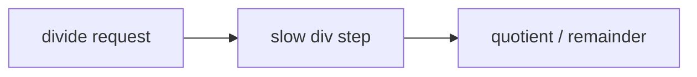

# Slow Div Step

## 1. 角色

这个模块负责整数除法和求余的慢路径，包括前导零、幂次优化和迭代商位选择。

## 2. 职责边界

它只处理除法语义，不承担普通算术或结果总线裁决。

## 3. 核心对象

- `norm_stage`
- `qbit_stage`
- `pow2_stage`
- `trace_state`

## 4. 结构框图

## 5. L3 对应

- `slow_div_step/clz_lane.md`
- `slow_div_step/pow2_lane.md`
- `slow_div_step/qbit_lane.md`
- `slow_div_step/trace_lane.md`

