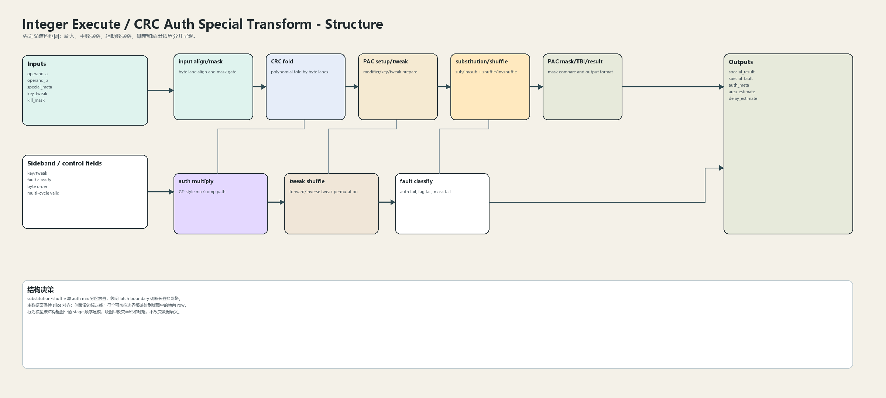
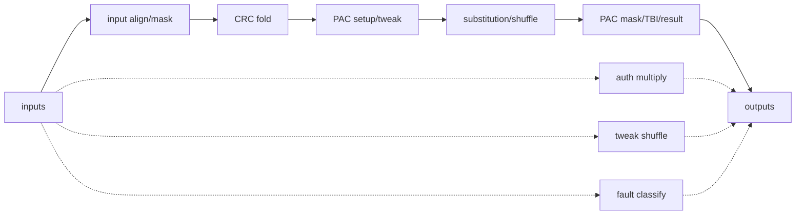
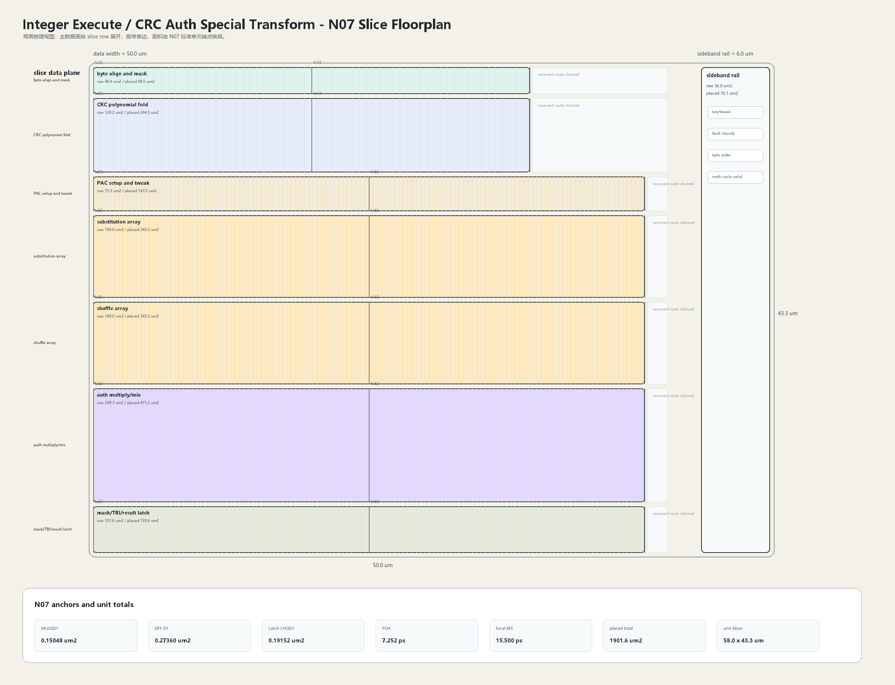

# CRC Auth Special Transform

## 1. 职责

本单元实现 CRC、pointer authentication、substitution、shuffle、mask/tweak、TBI 和特殊整数变换，独立于 fast ALU 旁路环。

本模块按结构框图先确定数据语义，再按 N07 slice 版图确定面积和时延约束。结构图不表达物理尺寸；版图图只表达物理组织，不改变数据语义。

## 2. 结构规模摘要

| 项 | 数值 |
|---|---:|
| datapath units | `32` |
| module count | `32` |
| logic LOC | `11247` |
| assign count | `2015` |
| always count | `433` |
| estimated path | `203.146 ps` |

## 3. 结构框图





## 4. Slice 版图



版图采用 `slice row + sideband rail` 组织。主数据面宽度为 `50.0 um`，侧带 rail 宽度为 `6.0 um`，估算放置面积为 `1901.6 um2`，初始边界框为 `58.0 x 43.3 um`。

## 5. 主数据面

| 项 | 说明 |
|---|---|
| input align/mask | byte lane align and mask gate |
| CRC fold | polynomial fold by byte lanes |
| PAC setup/tweak | modifier/key/tweak prepare |
| substitution/shuffle | sub/invsub + shuffle/invshuffle |
| PAC mask/TBI/result | mask compare and output format |

## 6. 辅助数据面

| 项 | 说明 |
|---|---|
| auth multiply | GF-style mix/comp path |
| tweak shuffle | forward/inverse tweak permutation |
| fault classify | auth fail, tag fail, mask fail |

## 7. Floorplan 分解

| row | lanes | 宽度 | raw area | placed area | 说明 |
|---|---:|---:|---:|---:|---|
| byte align and mask | `64` | `38.0 um` | `46.4 um2` | `88.5 um2` | 8 byte lanes + 64 bit masks |
| CRC polynomial fold | `64` | `38.0 um` | `128.2 um2` | `244.3 um2` | byte-lane fold network |
| PAC setup and tweak | `128` | `48.0 um` | `75.3 um2` | `143.5 um2` | key/modifier prepare |
| substitution array | `128` | `48.0 um` | `180.0 um2` | `343.2 um2` | sub/invsub transform |
| shuffle array | `128` | `48.0 um` | `180.0 um2` | `343.2 um2` | cell shuffle and tweak shuffle |
| auth multiply/mix | `128` | `48.0 um` | `249.3 um2` | `475.2 um2` | authentication mix path |
| mask/TBI/result latch | `128` | `48.0 um` | `101.6 um2` | `193.6 um2` | result and fault boundary |

## 8. N07 初始模型

| 项 | 数值 |
|---|---:|
| MUX2D1 面积锚点 | `0.15048 um2` |
| DFF D1 面积锚点 | `0.27360 um2` |
| Latch LHQD1 面积锚点 | `0.19152 um2` |
| FO4 时延锚点 | `7.252 ps` |
| DFF clk->q 锚点 | `25.870 ps` |
| 局部 M5 线延时预算 | `15.500 ps` |
| 放置利用率 | `0.64` |
| 布线膨胀系数 | `1.22` |

```text
raw_area = mux2_count * MUX2D1_area
         + dff_count * DFF_D1_area
         + latch_count * Latch_LHQD1_area
         + custom_array_area

placed_area = raw_area / utilization * route_overhead
bbox_height = sum(row_placed_area / row_width) + channel_budget
```

## 9. 行为模型契约

行为模型必须覆盖：

- CRC fold。
- authentication transform。
- substitution。
- shuffle/inverse shuffle。
- mask/TBI。
- fault metadata。

建议行为模型接口：

```python
class IntegerExecuteSpecialCrcAuth:
    def reset(self, config): ...
    def accept(self, packet, cycle): ...
    def step(self, cycle): ...
    def flush(self, token): ...
    def peek_outputs(self): ...
    def area_estimate(self): ...
    def delay_estimate(self): ...
```

## 10. 实现单元落点

| 单元 | 职责 |
|---|---|
| `integer_execute_special_packet` | 定义 special operand、meta 和 result packet。 |
| `integer_execute_crc_fold` | 实现 CRC polynomial fold。 |
| `integer_execute_auth_transform` | 实现 PAC setup、shuffle、substitution 和 mix。 |
| `integer_execute_special_result` | 实现 mask/TBI、fault 和 result boundary。 |

## 11. 检查点

- byte order。
- mask 全零/全一。
- tweak inverse。
- auth fail flag。
- multi-cycle valid/kill。
