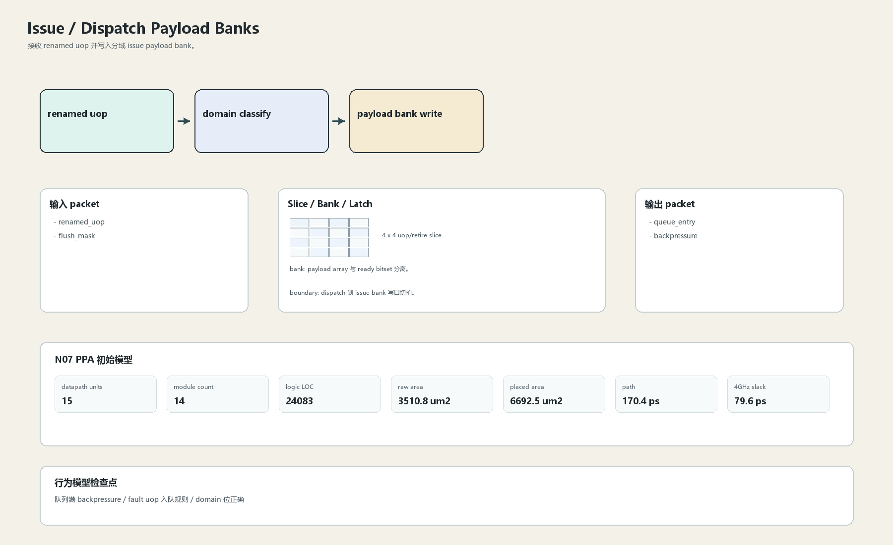

# Dispatch Payload Banks

## 1. 职责

接收 renamed uop 并写入分域 issue payload bank。

本文定义朱雀目标结构中的数据面边界、slice/bank 组织、时序边界和行为模型接口。

## 2. 结构规模摘要

| 项 | 数值 |
|---|---:|
| datapath units | `15` |
| module count | `14` |
| logic LOC | `24083` |
| assign count | `4518` |
| always count | `547` |
| port declarations | `2670` |

高频数据面 token：`tag`=4056, `data`=3911, `addr`=2239, `way`=547, `issue`=227, `valid`=98, `bank`=60, `l1`=59。

## 3. 数据结构




## 4. 输入接口

| 输入 | 说明 |
| --- | --- |
| `renamed_uop` | 进入本分区的数据 packet 或局部字段 |
| `flush_mask` | 进入本分区的数据 packet 或局部字段 |

## 5. 输出接口

| 输出 | 说明 |
| --- | --- |
| `queue_entry` | 离开本分区的数据 packet 或局部字段 |
| `backpressure` | 离开本分区的数据 packet 或局部字段 |

## 6. Slice / Bank / Latch

| 类别 | 规则 |
|---|---|
| width | `按域内 packet / slice 参数化` |
| slice | 16 路 dispatch 拆到 integer/memory/vector/special 分域。 |
| bank | payload array 与 ready bitset 分离。 |
| latch / register | dispatch 到 issue bank 写口切拍。 |

## 7. N07 PPA 初始模型

| 项 | 数值 |
|---|---:|
| raw area estimate | `3510.823 um2` |
| placed area estimate | `6692.507 um2` |
| logic depth | `10 FO4` |
| mux penalty | `16.000 ps` |
| wire budget | `16.000 ps` |
| margin | `40.000 ps` |
| estimated path | `170.390 ps` |
| 4GHz slack | `79.610 ps` |

估算公式：

```text
path_ps = DFF_CP_Q + FO4 * logic_depth + mux_penalty + wire_budget + margin
area_um2 = code_metric_units * INV_D1_area * mix_factor + macro_area
```

## 8. 行为模型契约

行为模型必须覆盖：

- 入队
- 队列满
- domain 分流
- flush 屏蔽

最小接口：

```python
class IssueDispatchPayload:
    def reset(self, config): ...
    def accept(self, packet, cycle): ...
    def step(self, cycle): ...
    def flush(self, token): ...
    def peek_outputs(self): ...
    def area_estimate(self): ...
    def delay_estimate(self): ...
```

## 9. RTL 落点

RTL 第一版只实现 payload、slice、bank、register/latch boundary 和 minimal ready/valid。控制状态机后续覆盖在这些接口之上。

建议 RTL 单元：

- `issue_dispatch_payload_packet`
- `issue_dispatch_payload_slice`
- `issue_dispatch_payload_pipe`
- `issue_dispatch_payload_top`

## 10. 检查点

- 队列满 backpressure
- fault uop 入队规则
- domain 位正确

