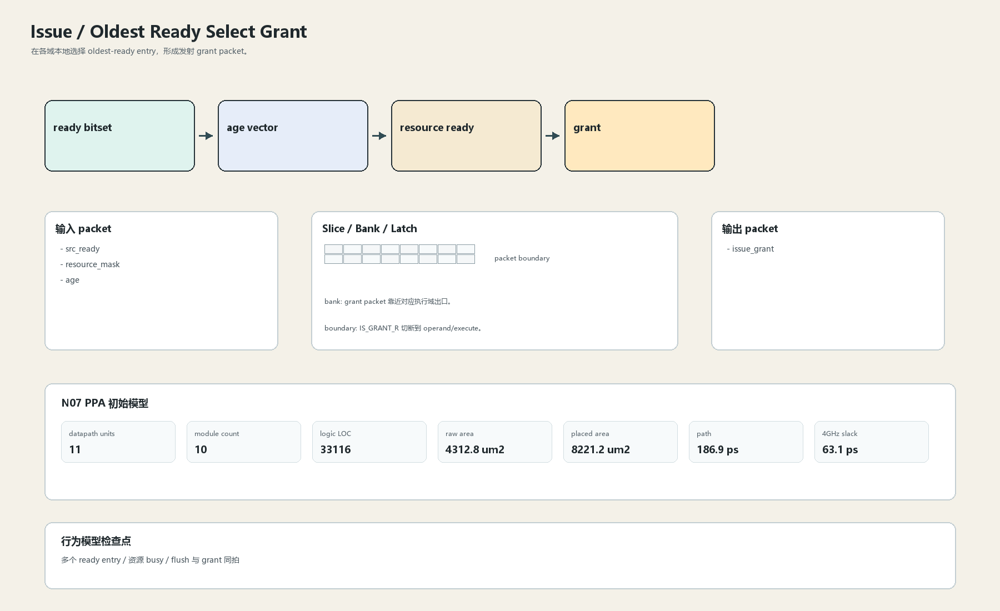

# Oldest Ready Select Grant

## 1. 职责

在各域本地选择 oldest-ready entry，形成发射 grant packet。

本文定义朱雀目标结构中的数据面边界、slice/bank 组织、时序边界和行为模型接口。

## 2. 结构规模摘要

| 项 | 数值 |
|---|---:|
| datapath units | `11` |
| module count | `10` |
| logic LOC | `33116` |
| assign count | `5679` |
| always count | `433` |
| port declarations | `4525` |

高频数据面 token：`tag`=5661, `addr`=2730, `data`=2525, `issue`=737, `valid`=434, `way`=433, `bank`=106, `l1`=97。

## 3. 数据结构




## 4. 输入接口

| 输入 | 说明 |
| --- | --- |
| `src_ready` | 进入本分区的数据 packet 或局部字段 |
| `resource_mask` | 进入本分区的数据 packet 或局部字段 |
| `age` | 进入本分区的数据 packet 或局部字段 |

## 5. 输出接口

| 输出 | 说明 |
| --- | --- |
| `issue_grant` | 离开本分区的数据 packet 或局部字段 |

## 6. Slice / Bank / Latch

| 类别 | 规则 |
|---|---|
| width | `按域内 packet / slice 参数化` |
| slice | 先本地 pick，再少量全局 merge；不做全队列单拍矩阵。 |
| bank | grant packet 靠近对应执行域出口。 |
| latch / register | IS_GRANT_R 切断到 operand/execute。 |

## 7. N07 PPA 初始模型

| 项 | 数值 |
|---|---:|
| raw area estimate | `4312.783 um2` |
| placed area estimate | `8221.242 um2` |
| logic depth | `12 FO4` |
| mux penalty | `18.000 ps` |
| wire budget | `16.000 ps` |
| margin | `40.000 ps` |
| estimated path | `186.894 ps` |
| 4GHz slack | `63.106 ps` |

估算公式：

```text
path_ps = DFF_CP_Q + FO4 * logic_depth + mux_penalty + wire_budget + margin
area_um2 = code_metric_units * INV_D1_area * mix_factor + macro_area
```

## 8. 行为模型契约

行为模型必须覆盖：

- oldest-ready
- 资源阻塞
- grant valid
- age 更新

最小接口：

```python
class IssueSelectGrant:
    def reset(self, config): ...
    def accept(self, packet, cycle): ...
    def step(self, cycle): ...
    def flush(self, token): ...
    def peek_outputs(self): ...
    def area_estimate(self): ...
    def delay_estimate(self): ...
```

## 9. RTL 落点

RTL 第一版只实现 payload、slice、bank、register/latch boundary 和 minimal ready/valid。控制状态机后续覆盖在这些接口之上。

建议 RTL 单元：

- `issue_select_grant_packet`
- `issue_select_grant_slice`
- `issue_select_grant_pipe`
- `issue_select_grant_top`

## 10. 检查点

- 多个 ready entry
- 资源 busy
- flush 与 grant 同拍

