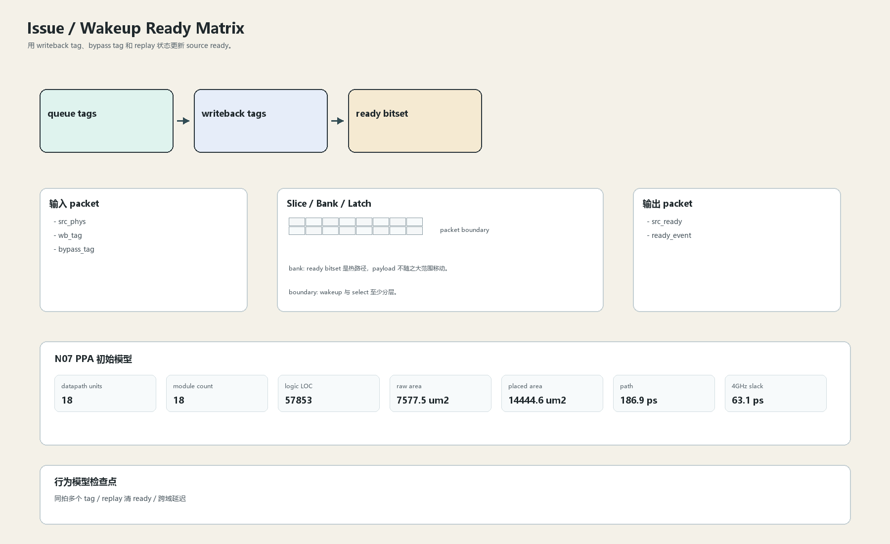

# Wakeup Ready Matrix

## 1. 职责

用 writeback tag、bypass tag 和 replay 状态更新 source ready。

本文定义朱雀目标结构中的数据面边界、slice/bank 组织、时序边界和行为模型接口。

## 2. 结构规模摘要

| 项 | 数值 |
|---|---:|
| datapath units | `18` |
| module count | `18` |
| logic LOC | `57853` |
| assign count | `9986` |
| always count | `1108` |
| port declarations | `5574` |

高频数据面 token：`tag`=16487, `data`=6319, `addr`=3242, `way`=1108, `issue`=732, `valid`=442, `bank`=106, `l1`=97。

## 3. 数据结构




## 4. 输入接口

| 输入 | 说明 |
| --- | --- |
| `src_phys` | 进入本分区的数据 packet 或局部字段 |
| `wb_tag` | 进入本分区的数据 packet 或局部字段 |
| `bypass_tag` | 进入本分区的数据 packet 或局部字段 |

## 5. 输出接口

| 输出 | 说明 |
| --- | --- |
| `src_ready` | 离开本分区的数据 packet 或局部字段 |
| `ready_event` | 离开本分区的数据 packet 或局部字段 |

## 6. Slice / Bank / Latch

| 类别 | 规则 |
|---|---|
| width | `按域内 packet / slice 参数化` |
| slice | ready 比较按 bank/slice 本地完成，跨域 tag 广播切拍。 |
| bank | ready bitset 是热路径，payload 不随之大范围移动。 |
| latch / register | wakeup 与 select 至少分层。 |

## 7. N07 PPA 初始模型

| 项 | 数值 |
|---|---:|
| raw area estimate | `7577.511 um2` |
| placed area estimate | `14444.630 um2` |
| logic depth | `12 FO4` |
| mux penalty | `18.000 ps` |
| wire budget | `16.000 ps` |
| margin | `40.000 ps` |
| estimated path | `186.894 ps` |
| 4GHz slack | `63.106 ps` |

估算公式：

```text
path_ps = DFF_CP_Q + FO4 * logic_depth + mux_penalty + wire_budget + margin
area_um2 = code_metric_units * INV_D1_area * mix_factor + macro_area
```

## 8. 行为模型契约

行为模型必须覆盖：

- tag match
- ready update
- replay ready clear
- bypass hit

最小接口：

```python
class IssueWakeupReady:
    def reset(self, config): ...
    def accept(self, packet, cycle): ...
    def step(self, cycle): ...
    def flush(self, token): ...
    def peek_outputs(self): ...
    def area_estimate(self): ...
    def delay_estimate(self): ...
```

## 9. RTL 落点

RTL 第一版只实现 payload、slice、bank、register/latch boundary 和 minimal ready/valid。控制状态机后续覆盖在这些接口之上。

建议 RTL 单元：

- `issue_wakeup_ready_packet`
- `issue_wakeup_ready_slice`
- `issue_wakeup_ready_pipe`
- `issue_wakeup_ready_top`

## 10. 检查点

- 同拍多个 tag
- replay 清 ready
- 跨域延迟

