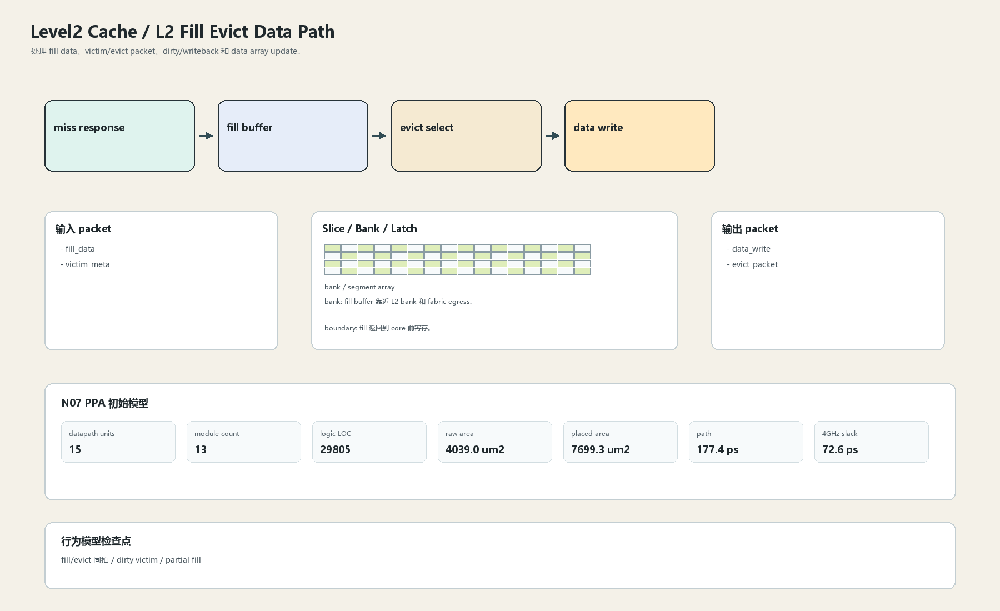

# L2 Fill Evict Data Path

## 1. 职责

处理 fill data、victim/evict packet、dirty/writeback 和 data array update。

本文定义朱雀目标结构中的数据面边界、slice/bank 组织、时序边界和行为模型接口。

## 2. 结构规模摘要

| 项 | 数值 |
|---|---:|
| datapath units | `15` |
| module count | `13` |
| logic LOC | `29805` |
| assign count | `2422` |
| always count | `1400` |
| port declarations | `2773` |

高频数据面 token：`l2`=17112, `data`=6149, `tag`=4785, `cache`=3040, `valid`=2853, `way`=2582, `addr`=1442, `ecc`=1358。

## 3. 数据结构




## 4. 输入接口

| 输入 | 说明 |
| --- | --- |
| `fill_data` | 进入本分区的数据 packet 或局部字段 |
| `victim_meta` | 进入本分区的数据 packet 或局部字段 |

## 5. 输出接口

| 输出 | 说明 |
| --- | --- |
| `data_write` | 离开本分区的数据 packet 或局部字段 |
| `evict_packet` | 离开本分区的数据 packet 或局部字段 |

## 6. Slice / Bank / Latch

| 类别 | 规则 |
|---|---|
| width | `按域内 packet / slice 参数化` |
| slice | fill/evict 数据以 line beat 分 slice。 |
| bank | fill buffer 靠近 L2 bank 和 fabric egress。 |
| latch / register | fill 返回到 core 前寄存。 |

## 7. N07 PPA 初始模型

| 项 | 数值 |
|---|---:|
| raw area estimate | `4038.986 um2` |
| placed area estimate | `7699.318 um2` |
| logic depth | `10 FO4` |
| mux penalty | `18.000 ps` |
| wire budget | `16.000 ps` |
| margin | `45.000 ps` |
| estimated path | `177.390 ps` |
| 4GHz slack | `72.610 ps` |

估算公式：

```text
path_ps = DFF_CP_Q + FO4 * logic_depth + mux_penalty + wire_budget + margin
area_um2 = code_metric_units * INV_D1_area * mix_factor + macro_area
```

## 8. 行为模型契约

行为模型必须覆盖：

- fill allocate
- evict
- dirty writeback
- victim metadata

最小接口：

```python
class Level2CacheL2FillEvict:
    def reset(self, config): ...
    def accept(self, packet, cycle): ...
    def step(self, cycle): ...
    def flush(self, token): ...
    def peek_outputs(self): ...
    def area_estimate(self): ...
    def delay_estimate(self): ...
```

## 9. RTL 落点

RTL 第一版只实现 payload、slice、bank、register/latch boundary 和 minimal ready/valid。控制状态机后续覆盖在这些接口之上。

建议 RTL 单元：

- `level2_cache_l2_fill_evict_packet`
- `level2_cache_l2_fill_evict_slice`
- `level2_cache_l2_fill_evict_pipe`
- `level2_cache_l2_fill_evict_top`

## 10. 检查点

- fill/evict 同拍
- dirty victim
- partial fill

