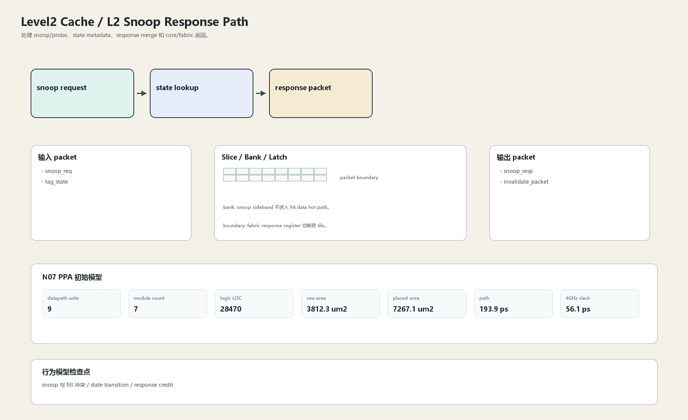

# L2 Snoop Response Path

## 1. 职责

处理 snoop/probe、state metadata、response merge 和 core/fabric 返回。

本文定义朱雀目标结构中的数据面边界、slice/bank 组织、时序边界和行为模型接口。

## 2. 结构规模摘要

| 项 | 数值 |
|---|---:|
| datapath units | `9` |
| module count | `7` |
| logic LOC | `28470` |
| assign count | `2234` |
| always count | `1359` |
| port declarations | `2546` |

高频数据面 token：`l2`=16108, `data`=5538, `tag`=4689, `cache`=3034, `valid`=2790, `way`=2514, `addr`=1373, `ecc`=1358。

## 3. 数据结构




## 4. 输入接口

| 输入 | 说明 |
| --- | --- |
| `snoop_req` | 进入本分区的数据 packet 或局部字段 |
| `tag_state` | 进入本分区的数据 packet 或局部字段 |

## 5. 输出接口

| 输出 | 说明 |
| --- | --- |
| `snoop_resp` | 离开本分区的数据 packet 或局部字段 |
| `invalidate_packet` | 离开本分区的数据 packet 或局部字段 |

## 6. Slice / Bank / Latch

| 类别 | 规则 |
|---|---|
| width | `按域内 packet / slice 参数化` |
| slice | coherence metadata 与 data beat 分离。 |
| bank | snoop sideband 不进入 hit data hot path。 |
| latch / register | fabric response register 切断跨 tile。 |

## 7. N07 PPA 初始模型

| 项 | 数值 |
|---|---:|
| raw area estimate | `3812.261 um2` |
| placed area estimate | `7267.123 um2` |
| logic depth | `12 FO4` |
| mux penalty | `20.000 ps` |
| wire budget | `16.000 ps` |
| margin | `45.000 ps` |
| estimated path | `193.894 ps` |
| 4GHz slack | `56.106 ps` |

估算公式：

```text
path_ps = DFF_CP_Q + FO4 * logic_depth + mux_penalty + wire_budget + margin
area_um2 = code_metric_units * INV_D1_area * mix_factor + macro_area
```

## 8. 行为模型契约

行为模型必须覆盖：

- probe
- invalidate
- response merge
- state update

最小接口：

```python
class Level2CacheL2SnoopResp:
    def reset(self, config): ...
    def accept(self, packet, cycle): ...
    def step(self, cycle): ...
    def flush(self, token): ...
    def peek_outputs(self): ...
    def area_estimate(self): ...
    def delay_estimate(self): ...
```

## 9. RTL 落点

RTL 第一版只实现 payload、slice、bank、register/latch boundary 和 minimal ready/valid。控制状态机后续覆盖在这些接口之上。

建议 RTL 单元：

- `level2_cache_l2_snoop_resp_packet`
- `level2_cache_l2_snoop_resp_slice`
- `level2_cache_l2_snoop_resp_pipe`
- `level2_cache_l2_snoop_resp_top`

## 10. 检查点

- snoop 与 fill 冲突
- state transition
- response credit

