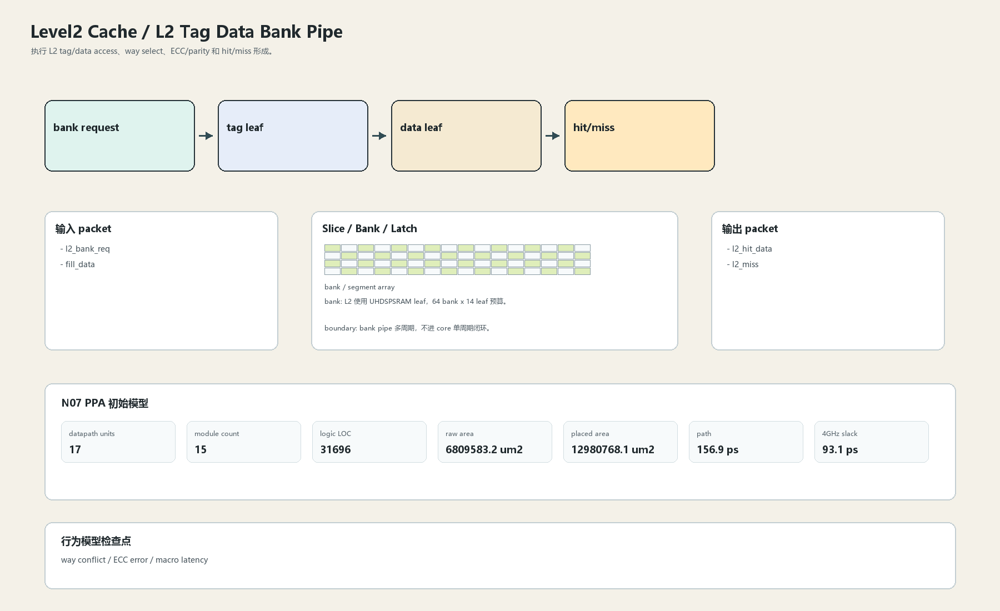

# L2 Tag Data Bank Pipe

## 1. 职责

执行 L2 tag/data access、way select、ECC/parity 和 hit/miss 形成。

本文定义朱雀目标结构中的数据面边界、slice/bank 组织、时序边界和行为模型接口。

## 2. 结构规模摘要

| 项 | 数值 |
|---|---:|
| datapath units | `17` |
| module count | `15` |
| logic LOC | `31696` |
| assign count | `2558` |
| always count | `1503` |
| port declarations | `2833` |

高频数据面 token：`l2`=17371, `data`=6149, `tag`=4792, `cache`=3040, `valid`=2884, `way`=2685, `addr`=1509, `ecc`=1358。

## 3. 数据结构




## 4. 输入接口

| 输入 | 说明 |
| --- | --- |
| `l2_bank_req` | 进入本分区的数据 packet 或局部字段 |
| `fill_data` | 进入本分区的数据 packet 或局部字段 |

## 5. 输出接口

| 输出 | 说明 |
| --- | --- |
| `l2_hit_data` | 离开本分区的数据 packet 或局部字段 |
| `l2_miss` | 离开本分区的数据 packet 或局部字段 |

## 6. Slice / Bank / Latch

| 类别 | 规则 |
|---|---|
| width | `按域内 packet / slice 参数化` |
| slice | data beat 按 cache line slice，tag/data 分 bank。 |
| bank | L2 使用 UHDSPSRAM leaf，64 bank x 14 leaf 预算。 |
| latch / register | bank pipe 多周期，不进 core 单周期闭环。 |

## 7. N07 PPA 初始模型

| 项 | 数值 |
|---|---:|
| raw area estimate | `6809583.240 um2` |
| placed area estimate | `12980768.051 um2` |
| logic depth | `8 FO4` |
| mux penalty | `12.000 ps` |
| wire budget | `16.000 ps` |
| margin | `45.000 ps` |
| estimated path | `156.886 ps` |
| 4GHz slack | `93.114 ps` |

估算公式：

```text
path_ps = DFF_CP_Q + FO4 * logic_depth + mux_penalty + wire_budget + margin
area_um2 = code_metric_units * INV_D1_area * mix_factor + macro_area
```

## 8. 行为模型契约

行为模型必须覆盖：

- tag hit
- data read
- ECC
- way select

最小接口：

```python
class Level2CacheL2TagData:
    def reset(self, config): ...
    def accept(self, packet, cycle): ...
    def step(self, cycle): ...
    def flush(self, token): ...
    def peek_outputs(self): ...
    def area_estimate(self): ...
    def delay_estimate(self): ...
```

## 9. RTL 落点

RTL 第一版只实现 payload、slice、bank、register/latch boundary 和 minimal ready/valid。控制状态机后续覆盖在这些接口之上。

建议 RTL 单元：

- `level2_cache_l2_tag_data_packet`
- `level2_cache_l2_tag_data_slice`
- `level2_cache_l2_tag_data_pipe`
- `level2_cache_l2_tag_data_top`

## 10. 检查点

- way conflict
- ECC error
- macro latency

