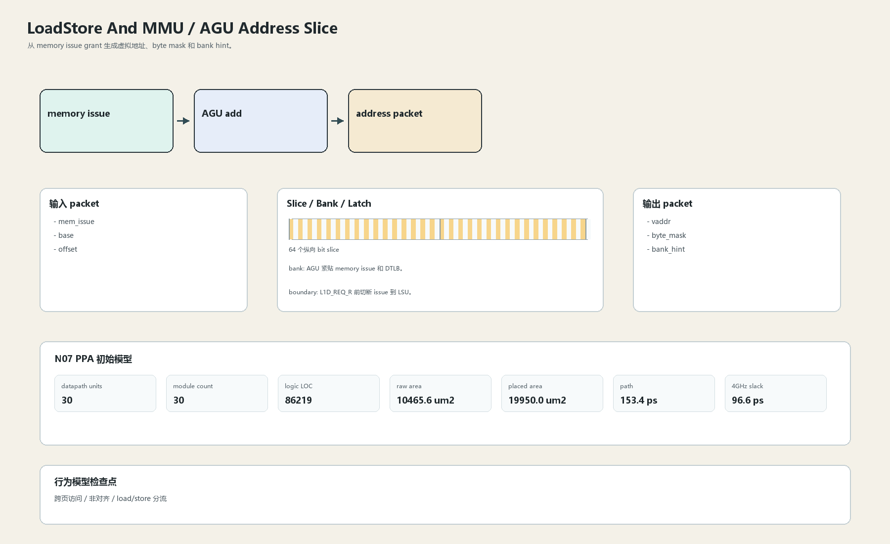

# AGU Address Slice

## 1. 职责

从 memory issue grant 生成虚拟地址、byte mask 和 bank hint。

本文定义朱雀目标结构中的数据面边界、slice/bank 组织、时序边界和行为模型接口。

## 2. 结构规模摘要

| 项 | 数值 |
|---|---:|
| datapath units | `30` |
| module count | `30` |
| logic LOC | `86219` |
| assign count | `12456` |
| always count | `2767` |
| port declarations | `4016` |

高频数据面 token：`way`=10808, `data`=8861, `l2`=6698, `tlb`=4775, `tag`=3718, `cache`=2675, `l1`=2406, `valid`=1466。

## 3. 数据结构




## 4. 输入接口

| 输入 | 说明 |
| --- | --- |
| `mem_issue` | 进入本分区的数据 packet 或局部字段 |
| `base` | 进入本分区的数据 packet 或局部字段 |
| `offset` | 进入本分区的数据 packet 或局部字段 |

## 5. 输出接口

| 输出 | 说明 |
| --- | --- |
| `vaddr` | 离开本分区的数据 packet 或局部字段 |
| `byte_mask` | 离开本分区的数据 packet 或局部字段 |
| `bank_hint` | 离开本分区的数据 packet 或局部字段 |

## 6. Slice / Bank / Latch

| 类别 | 规则 |
|---|---|
| width | `按域内 packet / slice 参数化` |
| slice | 地址是 64-bit address slice，低位用于 bank/byte。 |
| bank | AGU 紧贴 memory issue 和 DTLB。 |
| latch / register | L1D_REQ_R 前切断 issue 到 LSU。 |

## 7. N07 PPA 初始模型

| 项 | 数值 |
|---|---:|
| raw area estimate | `10465.553 um2` |
| placed area estimate | `19949.960 um2` |
| logic depth | `8 FO4` |
| mux penalty | `14.000 ps` |
| wire budget | `15.500 ps` |
| margin | `40.000 ps` |
| estimated path | `153.386 ps` |
| 4GHz slack | `96.614 ps` |

估算公式：

```text
path_ps = DFF_CP_Q + FO4 * logic_depth + mux_penalty + wire_budget + margin
area_um2 = code_metric_units * INV_D1_area * mix_factor + macro_area
```

## 8. 行为模型契约

行为模型必须覆盖：

- load/store 地址
- unaligned 标记
- byte mask
- bank hint

最小接口：

```python
class LoadstoreAndMmuAguAddress:
    def reset(self, config): ...
    def accept(self, packet, cycle): ...
    def step(self, cycle): ...
    def flush(self, token): ...
    def peek_outputs(self): ...
    def area_estimate(self): ...
    def delay_estimate(self): ...
```

## 9. RTL 落点

RTL 第一版只实现 payload、slice、bank、register/latch boundary 和 minimal ready/valid。控制状态机后续覆盖在这些接口之上。

建议 RTL 单元：

- `loadstore_and_mmu_agu_address_packet`
- `loadstore_and_mmu_agu_address_slice`
- `loadstore_and_mmu_agu_address_pipe`
- `loadstore_and_mmu_agu_address_top`

## 10. 检查点

- 跨页访问
- 非对齐
- load/store 分流

