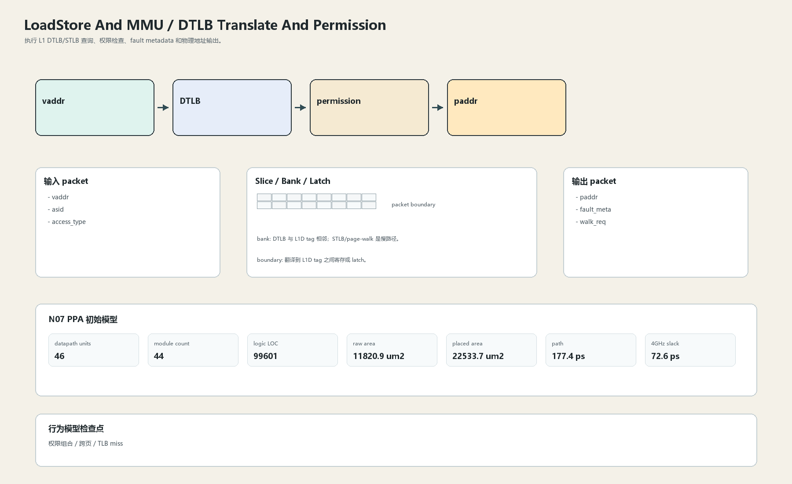

# DTLB Translate And Permission

## 1. 职责

执行 L1 DTLB/STLB 查询、权限检查、fault metadata 和物理地址输出。

本文定义朱雀目标结构中的数据面边界、slice/bank 组织、时序边界和行为模型接口。

## 2. 结构规模摘要

| 项 | 数值 |
|---|---:|
| datapath units | `46` |
| module count | `44` |
| logic LOC | `99601` |
| assign count | `14244` |
| always count | `3058` |
| port declarations | `4590` |

高频数据面 token：`way`=13290, `data`=9198, `l2`=7948, `tlb`=4854, `tag`=4137, `cache`=2839, `l1`=2757, `valid`=2034。

## 3. 数据结构




## 4. 输入接口

| 输入 | 说明 |
| --- | --- |
| `vaddr` | 进入本分区的数据 packet 或局部字段 |
| `asid` | 进入本分区的数据 packet 或局部字段 |
| `access_type` | 进入本分区的数据 packet 或局部字段 |

## 5. 输出接口

| 输出 | 说明 |
| --- | --- |
| `paddr` | 离开本分区的数据 packet 或局部字段 |
| `fault_meta` | 离开本分区的数据 packet 或局部字段 |
| `walk_req` | 离开本分区的数据 packet 或局部字段 |

## 6. Slice / Bank / Latch

| 类别 | 规则 |
|---|---|
| width | `按域内 packet / slice 参数化` |
| slice | VPN/PPN 以 address slice 传递，fault sideband 并行。 |
| bank | DTLB 与 L1D tag 相邻；STLB/page-walk 是慢路径。 |
| latch / register | 翻译到 L1D tag 之间寄存或 latch。 |

## 7. N07 PPA 初始模型

| 项 | 数值 |
|---|---:|
| raw area estimate | `11820.937 um2` |
| placed area estimate | `22533.661 um2` |
| logic depth | `10 FO4` |
| mux penalty | `18.000 ps` |
| wire budget | `16.000 ps` |
| margin | `45.000 ps` |
| estimated path | `177.390 ps` |
| 4GHz slack | `72.610 ps` |

估算公式：

```text
path_ps = DFF_CP_Q + FO4 * logic_depth + mux_penalty + wire_budget + margin
area_um2 = code_metric_units * INV_D1_area * mix_factor + macro_area
```

## 8. 行为模型契约

行为模型必须覆盖：

- TLB hit
- permission fault
- page-walk request
- fault payload

最小接口：

```python
class LoadstoreAndMmuDtlbTranslate:
    def reset(self, config): ...
    def accept(self, packet, cycle): ...
    def step(self, cycle): ...
    def flush(self, token): ...
    def peek_outputs(self): ...
    def area_estimate(self): ...
    def delay_estimate(self): ...
```

## 9. RTL 落点

RTL 第一版只实现 payload、slice、bank、register/latch boundary 和 minimal ready/valid。控制状态机后续覆盖在这些接口之上。

建议 RTL 单元：

- `loadstore_and_mmu_dtlb_translate_packet`
- `loadstore_and_mmu_dtlb_translate_slice`
- `loadstore_and_mmu_dtlb_translate_pipe`
- `loadstore_and_mmu_dtlb_translate_top`

## 10. 检查点

- 权限组合
- 跨页
- TLB miss

