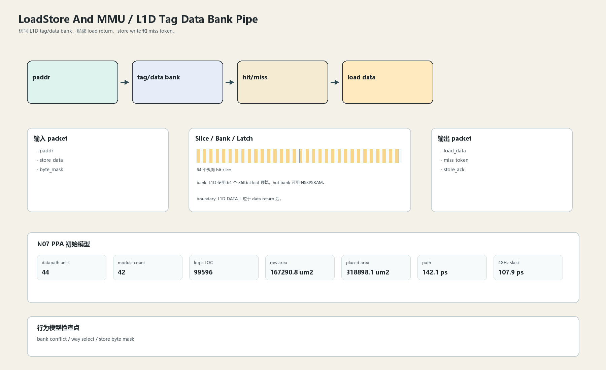

# L1D Tag Data Bank Pipe

## 1. 职责

访问 L1D tag/data bank，形成 load return、store write 和 miss token。

本文定义朱雀目标结构中的数据面边界、slice/bank 组织、时序边界和行为模型接口。

## 2. 结构规模摘要

| 项 | 数值 |
|---|---:|
| datapath units | `44` |
| module count | `42` |
| logic LOC | `99596` |
| assign count | `14245` |
| always count | `3058` |
| port declarations | `4579` |

高频数据面 token：`way`=13290, `data`=9282, `l2`=8032, `tlb`=4854, `tag`=4137, `cache`=2839, `l1`=2774, `valid`=2034。

## 3. 数据结构




## 4. 输入接口

| 输入 | 说明 |
| --- | --- |
| `paddr` | 进入本分区的数据 packet 或局部字段 |
| `store_data` | 进入本分区的数据 packet 或局部字段 |
| `byte_mask` | 进入本分区的数据 packet 或局部字段 |

## 5. 输出接口

| 输出 | 说明 |
| --- | --- |
| `load_data` | 离开本分区的数据 packet 或局部字段 |
| `miss_token` | 离开本分区的数据 packet 或局部字段 |
| `store_ack` | 离开本分区的数据 packet 或局部字段 |

## 6. Slice / Bank / Latch

| 类别 | 规则 |
|---|---|
| width | `按域内 packet / slice 参数化` |
| slice | data beat 以 64-bit slice 组织，bank 内 byte mask 局部合并。 |
| bank | L1D 使用 64 个 36Kbit leaf 预算，hot bank 可用 HSSPSRAM。 |
| latch / register | L1D_DATA_L 位于 data return 后。 |

## 7. N07 PPA 初始模型

| 项 | 数值 |
|---|---:|
| raw area estimate | `167290.804 um2` |
| placed area estimate | `318898.096 um2` |
| logic depth | `7 FO4` |
| mux penalty | `10.000 ps` |
| wire budget | `15.500 ps` |
| margin | `40.000 ps` |
| estimated path | `142.134 ps` |
| 4GHz slack | `107.866 ps` |

估算公式：

```text
path_ps = DFF_CP_Q + FO4 * logic_depth + mux_penalty + wire_budget + margin
area_um2 = code_metric_units * INV_D1_area * mix_factor + macro_area
```

## 8. 行为模型契约

行为模型必须覆盖：

- tag hit
- data return
- store data
- miss

最小接口：

```python
class LoadstoreAndMmuL1DBank:
    def reset(self, config): ...
    def accept(self, packet, cycle): ...
    def step(self, cycle): ...
    def flush(self, token): ...
    def peek_outputs(self): ...
    def area_estimate(self): ...
    def delay_estimate(self): ...
```

## 9. RTL 落点

RTL 第一版只实现 payload、slice、bank、register/latch boundary 和 minimal ready/valid。控制状态机后续覆盖在这些接口之上。

建议 RTL 单元：

- `loadstore_and_mmu_l1d_bank_packet`
- `loadstore_and_mmu_l1d_bank_slice`
- `loadstore_and_mmu_l1d_bank_pipe`
- `loadstore_and_mmu_l1d_bank_top`

## 10. 检查点

- bank conflict
- way select
- store byte mask

