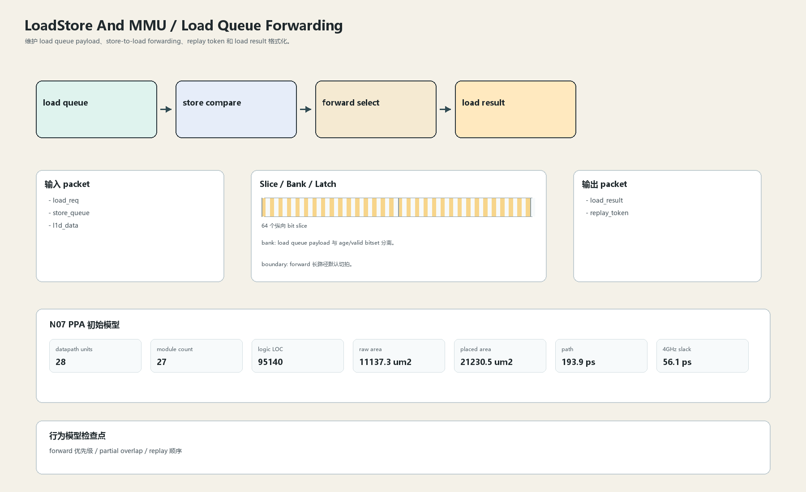
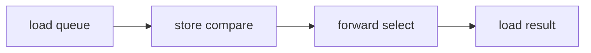

# Load Queue Forwarding

## 1. 职责

维护 load queue payload、store-to-load forwarding、replay token 和 load result 格式化。

本文定义朱雀目标结构中的数据面边界、slice/bank 组织、时序边界和行为模型接口。

## 2. 结构规模摘要

| 项 | 数值 |
|---|---:|
| datapath units | `28` |
| module count | `27` |
| logic LOC | `95140` |
| assign count | `13681` |
| always count | `2895` |
| port declarations | `4116` |

高频数据面 token：`way`=13122, `data`=9282, `l2`=7877, `tlb`=4784, `tag`=4097, `cache`=2788, `l1`=2572, `valid`=1824。

## 3. 数据结构





## 4. 输入接口

| 输入 | 说明 |
| --- | --- |
| `load_req` | 进入本分区的数据 packet 或局部字段 |
| `store_queue` | 进入本分区的数据 packet 或局部字段 |
| `l1d_data` | 进入本分区的数据 packet 或局部字段 |

## 5. 输出接口

| 输出 | 说明 |
| --- | --- |
| `load_result` | 离开本分区的数据 packet 或局部字段 |
| `replay_token` | 离开本分区的数据 packet 或局部字段 |

## 6. Slice / Bank / Latch

| 类别 | 规则 |
|---|---|
| width | `按域内 packet / slice 参数化` |
| slice | forward data 以 64-bit slice，比较网络分 bank。 |
| bank | load queue payload 与 age/valid bitset 分离。 |
| latch / register | forward 长路径默认切拍。 |

## 7. N07 PPA 初始模型

| 项 | 数值 |
|---|---:|
| raw area estimate | `11137.309 um2` |
| placed area estimate | `21230.495 um2` |
| logic depth | `12 FO4` |
| mux penalty | `20.000 ps` |
| wire budget | `16.000 ps` |
| margin | `45.000 ps` |
| estimated path | `193.894 ps` |
| 4GHz slack | `56.106 ps` |

估算公式：

```text
path_ps = DFF_CP_Q + FO4 * logic_depth + mux_penalty + wire_budget + margin
area_um2 = code_metric_units * INV_D1_area * mix_factor + macro_area
```

## 8. 行为模型契约

行为模型必须覆盖：

- load 入队
- store forward
- miss replay
- load writeback

最小接口：

```python
class LoadstoreAndMmuLoadForward:
    def reset(self, config): ...
    def accept(self, packet, cycle): ...
    def step(self, cycle): ...
    def flush(self, token): ...
    def peek_outputs(self): ...
    def area_estimate(self): ...
    def delay_estimate(self): ...
```

## 9. RTL 落点

RTL 第一版只实现 payload、slice、bank、register/latch boundary 和 minimal ready/valid。控制状态机后续覆盖在这些接口之上。

建议 RTL 单元：

- `loadstore_and_mmu_load_forward_packet`
- `loadstore_and_mmu_load_forward_slice`
- `loadstore_and_mmu_load_forward_pipe`
- `loadstore_and_mmu_load_forward_top`

## 10. 检查点

- forward 优先级
- partial overlap
- replay 顺序

