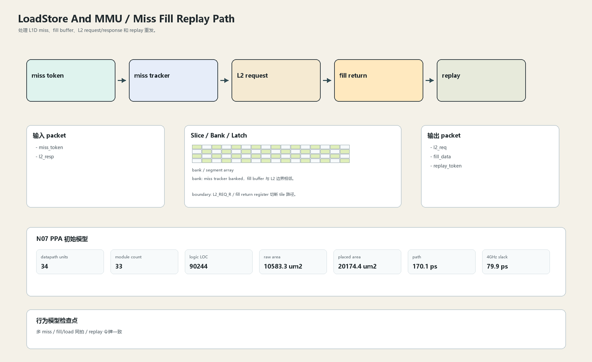

# Miss Fill Replay Path

## 1. 职责

处理 L1D miss、fill buffer、L2 request/response 和 replay 重发。

本文定义朱雀目标结构中的数据面边界、slice/bank 组织、时序边界和行为模型接口。

## 2. 结构规模摘要

| 项 | 数值 |
|---|---:|
| datapath units | `34` |
| module count | `33` |
| logic LOC | `90244` |
| assign count | `13315` |
| always count | `2619` |
| port declarations | `4204` |

高频数据面 token：`way`=12118, `l2`=8027, `data`=6045, `tlb`=4854, `tag`=3441, `l1`=2767, `cache`=2763, `valid`=1985。

## 3. 数据结构




## 4. 输入接口

| 输入 | 说明 |
| --- | --- |
| `miss_token` | 进入本分区的数据 packet 或局部字段 |
| `l2_resp` | 进入本分区的数据 packet 或局部字段 |

## 5. 输出接口

| 输出 | 说明 |
| --- | --- |
| `l2_req` | 离开本分区的数据 packet 或局部字段 |
| `fill_data` | 离开本分区的数据 packet 或局部字段 |
| `replay_token` | 离开本分区的数据 packet 或局部字段 |

## 6. Slice / Bank / Latch

| 类别 | 规则 |
|---|---|
| width | `按域内 packet / slice 参数化` |
| slice | fill data 进入 L1D fill slice 后再驱动 load replay。 |
| bank | miss tracker banked，fill buffer 与 L2 边界相邻。 |
| latch / register | L2_REQ_R / fill return register 切断 tile 路径。 |

## 7. N07 PPA 初始模型

| 项 | 数值 |
|---|---:|
| raw area estimate | `10583.290 um2` |
| placed area estimate | `20174.396 um2` |
| logic depth | `9 FO4` |
| mux penalty | `18.000 ps` |
| wire budget | `16.000 ps` |
| margin | `45.000 ps` |
| estimated path | `170.138 ps` |
| 4GHz slack | `79.862 ps` |

估算公式：

```text
path_ps = DFF_CP_Q + FO4 * logic_depth + mux_penalty + wire_budget + margin
area_um2 = code_metric_units * INV_D1_area * mix_factor + macro_area
```

## 8. 行为模型契约

行为模型必须覆盖：

- miss allocate
- fill return
- replay
- MSHR full

最小接口：

```python
class LoadstoreAndMmuMissFillReplay:
    def reset(self, config): ...
    def accept(self, packet, cycle): ...
    def step(self, cycle): ...
    def flush(self, token): ...
    def peek_outputs(self): ...
    def area_estimate(self): ...
    def delay_estimate(self): ...
```

## 9. RTL 落点

RTL 第一版只实现 payload、slice、bank、register/latch boundary 和 minimal ready/valid。控制状态机后续覆盖在这些接口之上。

建议 RTL 单元：

- `loadstore_and_mmu_miss_fill_replay_packet`
- `loadstore_and_mmu_miss_fill_replay_slice`
- `loadstore_and_mmu_miss_fill_replay_pipe`
- `loadstore_and_mmu_miss_fill_replay_top`

## 10. 检查点

- 多 miss
- fill/load 同拍
- replay 令牌一致

