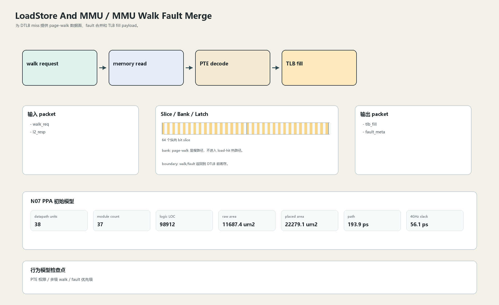

# MMU Walk Fault Merge

## 1. 职责

为 DTLB miss 提供 page-walk 数据面、fault 合并和 TLB fill payload。

本文定义朱雀目标结构中的数据面边界、slice/bank 组织、时序边界和行为模型接口。

## 2. 结构规模摘要

| 项 | 数值 |
|---|---:|
| datapath units | `38` |
| module count | `37` |
| logic LOC | `98912` |
| assign count | `14118` |
| always count | `3043` |
| port declarations | `4496` |

高频数据面 token：`way`=13270, `data`=9282, `l2`=8032, `tlb`=4854, `tag`=4137, `cache`=2839, `l1`=2774, `valid`=2014。

## 3. 数据结构




## 4. 输入接口

| 输入 | 说明 |
| --- | --- |
| `walk_req` | 进入本分区的数据 packet 或局部字段 |
| `l2_resp` | 进入本分区的数据 packet 或局部字段 |

## 5. 输出接口

| 输出 | 说明 |
| --- | --- |
| `tlb_fill` | 离开本分区的数据 packet 或局部字段 |
| `fault_meta` | 离开本分区的数据 packet 或局部字段 |

## 6. Slice / Bank / Latch

| 类别 | 规则 |
|---|---|
| width | `按域内 packet / slice 参数化` |
| slice | PTE 数据按 64-bit slice，fault metadata 并行流动。 |
| bank | page-walk 是慢路径，不进入 load-hit 热路径。 |
| latch / register | walk/fault 返回到 DTLB 前寄存。 |

## 7. N07 PPA 初始模型

| 项 | 数值 |
|---|---:|
| raw area estimate | `11687.371 um2` |
| placed area estimate | `22279.051 um2` |
| logic depth | `12 FO4` |
| mux penalty | `20.000 ps` |
| wire budget | `16.000 ps` |
| margin | `45.000 ps` |
| estimated path | `193.894 ps` |
| 4GHz slack | `56.106 ps` |

估算公式：

```text
path_ps = DFF_CP_Q + FO4 * logic_depth + mux_penalty + wire_budget + margin
area_um2 = code_metric_units * INV_D1_area * mix_factor + macro_area
```

## 8. 行为模型契约

行为模型必须覆盖：

- page walk
- PTE fault
- TLB fill
- access fault

最小接口：

```python
class LoadstoreAndMmuMmuWalkFault:
    def reset(self, config): ...
    def accept(self, packet, cycle): ...
    def step(self, cycle): ...
    def flush(self, token): ...
    def peek_outputs(self): ...
    def area_estimate(self): ...
    def delay_estimate(self): ...
```

## 9. RTL 落点

RTL 第一版只实现 payload、slice、bank、register/latch boundary 和 minimal ready/valid。控制状态机后续覆盖在这些接口之上。

建议 RTL 单元：

- `loadstore_and_mmu_mmu_walk_fault_packet`
- `loadstore_and_mmu_mmu_walk_fault_slice`
- `loadstore_and_mmu_mmu_walk_fault_pipe`
- `loadstore_and_mmu_mmu_walk_fault_top`

## 10. 检查点

- PTE 权限
- 多级 walk
- fault 优先级

