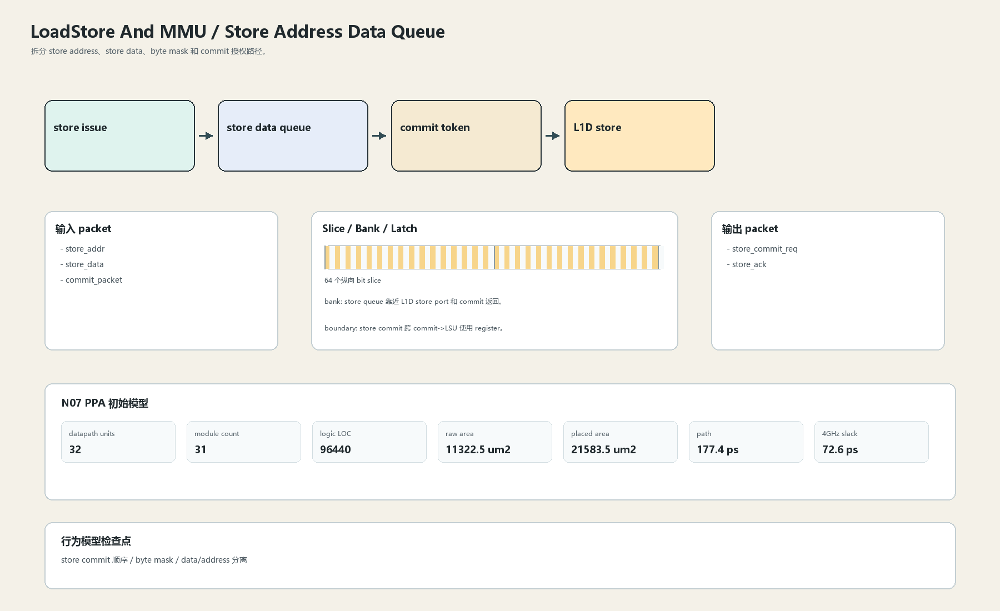

# Store Address Data Queue

## 1. 职责

拆分 store address、store data、byte mask 和 commit 授权路径。

本文定义朱雀目标结构中的数据面边界、slice/bank 组织、时序边界和行为模型接口。

## 2. 结构规模摘要

| 项 | 数值 |
|---|---:|
| datapath units | `32` |
| module count | `31` |
| logic LOC | `96440` |
| assign count | `13887` |
| always count | `2931` |
| port declarations | `4234` |

高频数据面 token：`way`=13158, `data`=9282, `l2`=7972, `tlb`=4784, `tag`=4097, `cache`=2804, `l1`=2586, `valid`=1850。

## 3. 数据结构




## 4. 输入接口

| 输入 | 说明 |
| --- | --- |
| `store_addr` | 进入本分区的数据 packet 或局部字段 |
| `store_data` | 进入本分区的数据 packet 或局部字段 |
| `commit_packet` | 进入本分区的数据 packet 或局部字段 |

## 5. 输出接口

| 输出 | 说明 |
| --- | --- |
| `store_commit_req` | 离开本分区的数据 packet 或局部字段 |
| `store_ack` | 离开本分区的数据 packet 或局部字段 |

## 6. Slice / Bank / Latch

| 类别 | 规则 |
|---|---|
| width | `按域内 packet / slice 参数化` |
| slice | store data path 为 6/cycle，每条 64-bit slice。 |
| bank | store queue 靠近 L1D store port 和 commit 返回。 |
| latch / register | store commit 跨 commit->LSU 使用 register。 |

## 7. N07 PPA 初始模型

| 项 | 数值 |
|---|---:|
| raw area estimate | `11322.468 um2` |
| placed area estimate | `21583.455 um2` |
| logic depth | `10 FO4` |
| mux penalty | `18.000 ps` |
| wire budget | `16.000 ps` |
| margin | `45.000 ps` |
| estimated path | `177.390 ps` |
| 4GHz slack | `72.610 ps` |

估算公式：

```text
path_ps = DFF_CP_Q + FO4 * logic_depth + mux_penalty + wire_budget + margin
area_um2 = code_metric_units * INV_D1_area * mix_factor + macro_area
```

## 8. 行为模型契约

行为模型必须覆盖：

- store 入队
- store data merge
- commit 生效
- store fault

最小接口：

```python
class LoadstoreAndMmuStoreQueue:
    def reset(self, config): ...
    def accept(self, packet, cycle): ...
    def step(self, cycle): ...
    def flush(self, token): ...
    def peek_outputs(self): ...
    def area_estimate(self): ...
    def delay_estimate(self): ...
```

## 9. RTL 落点

RTL 第一版只实现 payload、slice、bank、register/latch boundary 和 minimal ready/valid。控制状态机后续覆盖在这些接口之上。

建议 RTL 单元：

- `loadstore_and_mmu_store_queue_packet`
- `loadstore_and_mmu_store_queue_slice`
- `loadstore_and_mmu_store_queue_pipe`
- `loadstore_and_mmu_store_queue_top`

## 10. 检查点

- store commit 顺序
- byte mask
- data/address 分离

