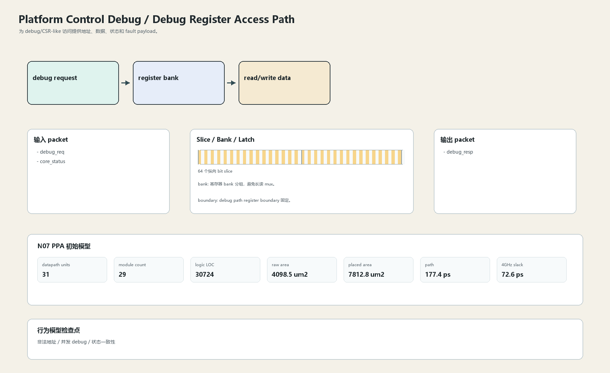

# Debug Register Access Path

## 1. 职责

为 debug/CSR-like 访问提供地址、数据、状态和 fault payload。

本文定义朱雀目标结构中的数据面边界、slice/bank 组织、时序边界和行为模型接口。

## 2. 结构规模摘要

| 项 | 数值 |
|---|---:|
| datapath units | `31` |
| module count | `29` |
| logic LOC | `30724` |
| assign count | `2891` |
| always count | `1424` |
| port declarations | `1830` |

高频数据面 token：`addr`=4744, `data`=1573, `way`=1429, `l1`=1171, `l2`=837, `fifo`=598, `mask`=584, `valid`=573。

## 3. 数据结构




## 4. 输入接口

| 输入 | 说明 |
| --- | --- |
| `debug_req` | 进入本分区的数据 packet 或局部字段 |
| `core_status` | 进入本分区的数据 packet 或局部字段 |

## 5. 输出接口

| 输出 | 说明 |
| --- | --- |
| `debug_resp` | 离开本分区的数据 packet 或局部字段 |

## 6. Slice / Bank / Latch

| 类别 | 规则 |
|---|---|
| width | `按域内 packet / slice 参数化` |
| slice | debug 数据 64-bit slice，但不进入 fast ALU bypass。 |
| bank | 寄存器 bank 分组，避免长读 mux。 |
| latch / register | debug path register boundary 固定。 |

## 7. N07 PPA 初始模型

| 项 | 数值 |
|---|---:|
| raw area estimate | `4098.494 um2` |
| placed area estimate | `7812.755 um2` |
| logic depth | `10 FO4` |
| mux penalty | `18.000 ps` |
| wire budget | `16.000 ps` |
| margin | `45.000 ps` |
| estimated path | `177.390 ps` |
| 4GHz slack | `72.610 ps` |

估算公式：

```text
path_ps = DFF_CP_Q + FO4 * logic_depth + mux_penalty + wire_budget + margin
area_um2 = code_metric_units * INV_D1_area * mix_factor + macro_area
```

## 8. 行为模型契约

行为模型必须覆盖：

- debug read
- debug write
- status sample
- fault report

最小接口：

```python
class PlatformControlDebugDebugRegister:
    def reset(self, config): ...
    def accept(self, packet, cycle): ...
    def step(self, cycle): ...
    def flush(self, token): ...
    def peek_outputs(self): ...
    def area_estimate(self): ...
    def delay_estimate(self): ...
```

## 9. RTL 落点

RTL 第一版只实现 payload、slice、bank、register/latch boundary 和 minimal ready/valid。控制状态机后续覆盖在这些接口之上。

建议 RTL 单元：

- `platform_control_debug_debug_register_packet`
- `platform_control_debug_debug_register_slice`
- `platform_control_debug_debug_register_pipe`
- `platform_control_debug_debug_register_top`

## 10. 检查点

- 非法地址
- 并发 debug
- 状态一致性

