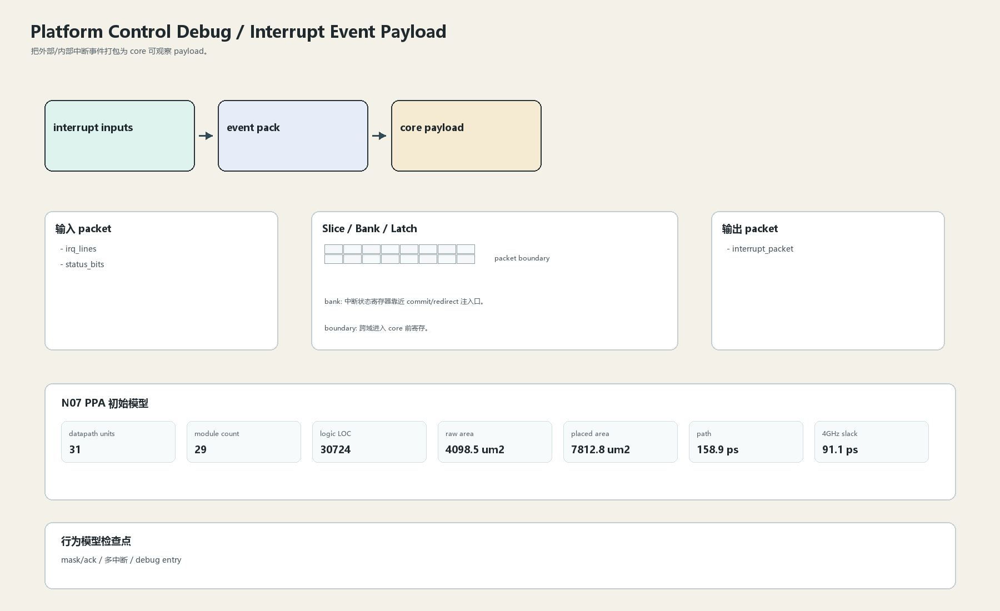

# Interrupt Event Payload

## 1. 职责

把外部/内部中断事件打包为 core 可观察 payload。

本文定义朱雀目标结构中的数据面边界、slice/bank 组织、时序边界和行为模型接口。

## 2. 结构规模摘要

| 项 | 数值 |
|---|---:|
| datapath units | `31` |
| module count | `29` |
| logic LOC | `30724` |
| assign count | `2891` |
| always count | `1424` |
| port declarations | `1830` |

高频数据面 token：`addr`=4744, `data`=1573, `way`=1429, `l1`=1171, `l2`=837, `fifo`=598, `mask`=584, `valid`=573。

## 3. 数据结构




## 4. 输入接口

| 输入 | 说明 |
| --- | --- |
| `irq_lines` | 进入本分区的数据 packet 或局部字段 |
| `status_bits` | 进入本分区的数据 packet 或局部字段 |

## 5. 输出接口

| 输出 | 说明 |
| --- | --- |
| `interrupt_packet` | 离开本分区的数据 packet 或局部字段 |

## 6. Slice / Bank / Latch

| 类别 | 规则 |
|---|---|
| width | `按域内 packet / slice 参数化` |
| slice | 事件 payload 按 bitset 分组，不走执行数据热路径。 |
| bank | 中断状态寄存器靠近 commit/redirect 注入口。 |
| latch / register | 跨域进入 core 前寄存。 |

## 7. N07 PPA 初始模型

| 项 | 数值 |
|---|---:|
| raw area estimate | `4098.494 um2` |
| placed area estimate | `7812.755 um2` |
| logic depth | `8 FO4` |
| mux penalty | `14.000 ps` |
| wire budget | `16.000 ps` |
| margin | `45.000 ps` |
| estimated path | `158.886 ps` |
| 4GHz slack | `91.114 ps` |

估算公式：

```text
path_ps = DFF_CP_Q + FO4 * logic_depth + mux_penalty + wire_budget + margin
area_um2 = code_metric_units * INV_D1_area * mix_factor + macro_area
```

## 8. 行为模型契约

行为模型必须覆盖：

- interrupt pending
- priority payload
- mask
- ack

最小接口：

```python
class PlatformControlDebugInterruptPayload:
    def reset(self, config): ...
    def accept(self, packet, cycle): ...
    def step(self, cycle): ...
    def flush(self, token): ...
    def peek_outputs(self): ...
    def area_estimate(self): ...
    def delay_estimate(self): ...
```

## 9. RTL 落点

RTL 第一版只实现 payload、slice、bank、register/latch boundary 和 minimal ready/valid。控制状态机后续覆盖在这些接口之上。

建议 RTL 单元：

- `platform_control_debug_interrupt_payload_packet`
- `platform_control_debug_interrupt_payload_slice`
- `platform_control_debug_interrupt_payload_pipe`
- `platform_control_debug_interrupt_payload_top`

## 10. 检查点

- mask/ack
- 多中断
- debug entry

