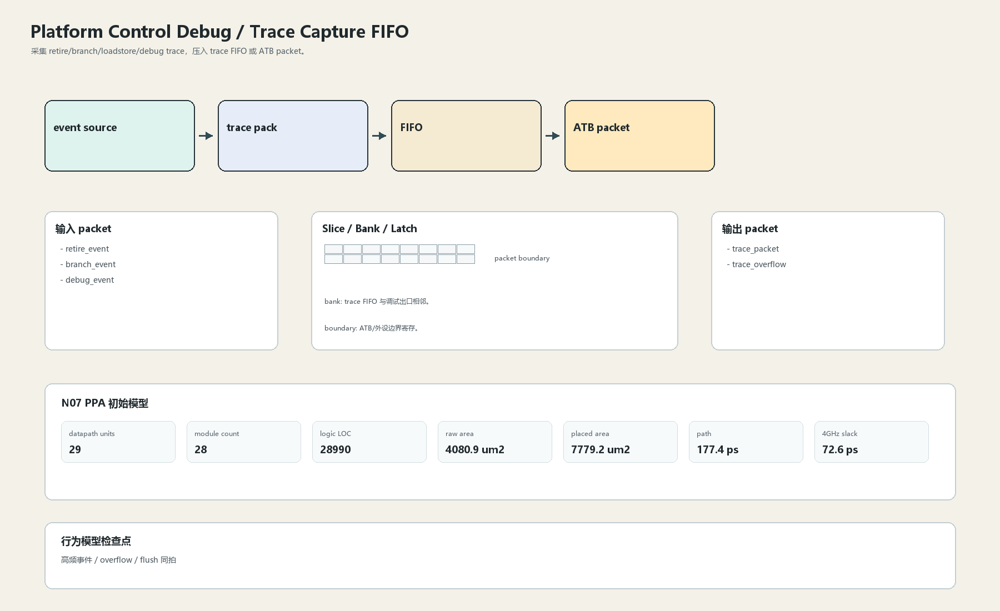

# Trace Capture FIFO

## 1. 职责

采集 retire/branch/loadstore/debug trace，压入 trace FIFO 或 ATB packet。

本文定义朱雀目标结构中的数据面边界、slice/bank 组织、时序边界和行为模型接口。

## 2. 结构规模摘要

| 项 | 数值 |
|---|---:|
| datapath units | `29` |
| module count | `28` |
| logic LOC | `28990` |
| assign count | `2881` |
| always count | `1421` |
| port declarations | `1818` |

高频数据面 token：`addr`=4076, `data`=1569, `way`=1426, `l1`=1167, `l2`=833, `fifo`=598, `mask`=579, `valid`=573。

## 3. 数据结构




## 4. 输入接口

| 输入 | 说明 |
| --- | --- |
| `retire_event` | 进入本分区的数据 packet 或局部字段 |
| `branch_event` | 进入本分区的数据 packet 或局部字段 |
| `debug_event` | 进入本分区的数据 packet 或局部字段 |

## 5. 输出接口

| 输出 | 说明 |
| --- | --- |
| `trace_packet` | 离开本分区的数据 packet 或局部字段 |
| `trace_overflow` | 离开本分区的数据 packet 或局部字段 |

## 6. Slice / Bank / Latch

| 类别 | 规则 |
|---|---|
| width | `按域内 packet / slice 参数化` |
| slice | trace 数据按 packet slice，不回灌主数据通路。 |
| bank | trace FIFO 与调试出口相邻。 |
| latch / register | ATB/外设边界寄存。 |

## 7. N07 PPA 初始模型

| 项 | 数值 |
|---|---:|
| raw area estimate | `4080.910 um2` |
| placed area estimate | `7779.234 um2` |
| logic depth | `10 FO4` |
| mux penalty | `18.000 ps` |
| wire budget | `16.000 ps` |
| margin | `45.000 ps` |
| estimated path | `177.390 ps` |
| 4GHz slack | `72.610 ps` |

估算公式：

```text
path_ps = DFF_CP_Q + FO4 * logic_depth + mux_penalty + wire_budget + margin
area_um2 = code_metric_units * INV_D1_area * mix_factor + macro_area
```

## 8. 行为模型契约

行为模型必须覆盖：

- trace capture
- FIFO push/pop
- overflow
- packet format

最小接口：

```python
class PlatformControlDebugTraceCapture:
    def reset(self, config): ...
    def accept(self, packet, cycle): ...
    def step(self, cycle): ...
    def flush(self, token): ...
    def peek_outputs(self): ...
    def area_estimate(self): ...
    def delay_estimate(self): ...
```

## 9. RTL 落点

RTL 第一版只实现 payload、slice、bank、register/latch boundary 和 minimal ready/valid。控制状态机后续覆盖在这些接口之上。

建议 RTL 单元：

- `platform_control_debug_trace_capture_packet`
- `platform_control_debug_trace_capture_slice`
- `platform_control_debug_trace_capture_pipe`
- `platform_control_debug_trace_capture_top`

## 10. 检查点

- 高频事件
- overflow
- flush 同拍

