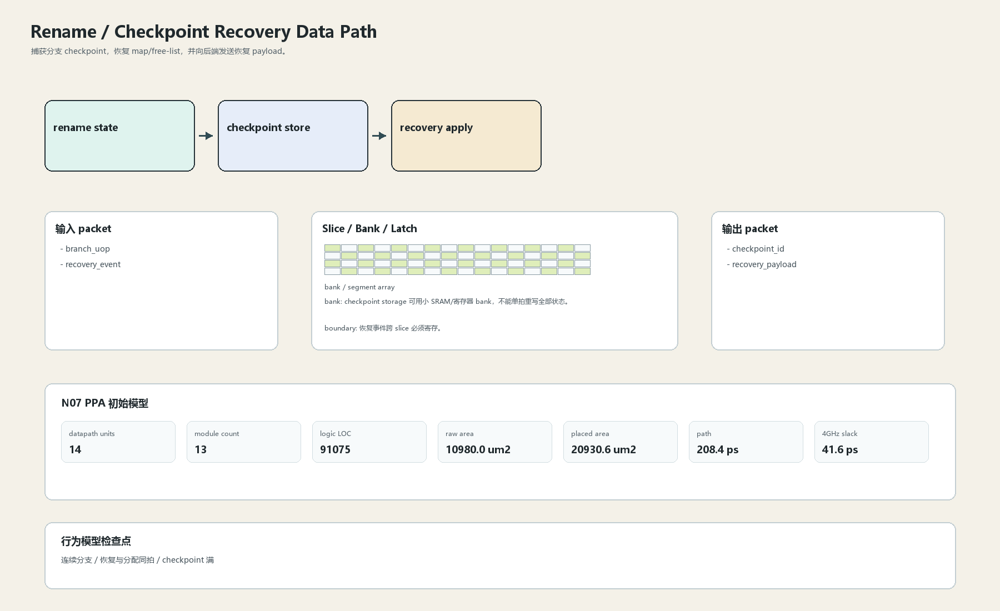

# Checkpoint Recovery Data Path

## 1. 职责

捕获分支 checkpoint，恢复 map/free-list，并向后端发送恢复 payload。

本文定义朱雀目标结构中的数据面边界、slice/bank 组织、时序边界和行为模型接口。

## 2. 结构规模摘要

| 项 | 数值 |
|---|---:|
| datapath units | `14` |
| module count | `13` |
| logic LOC | `91075` |
| assign count | `17803` |
| always count | `1603` |
| port declarations | `4395` |

高频数据面 token：`decode`=13266, `valid`=8013, `tag`=6628, `mask`=3837, `data`=3260, `ready`=1688, `way`=1620, `cache`=1173。

## 3. 数据结构




## 4. 输入接口

| 输入 | 说明 |
| --- | --- |
| `branch_uop` | 进入本分区的数据 packet 或局部字段 |
| `recovery_event` | 进入本分区的数据 packet 或局部字段 |

## 5. 输出接口

| 输出 | 说明 |
| --- | --- |
| `checkpoint_id` | 离开本分区的数据 packet 或局部字段 |
| `recovery_payload` | 离开本分区的数据 packet 或局部字段 |

## 6. Slice / Bank / Latch

| 类别 | 规则 |
|---|---|
| width | `按域内 packet / slice 参数化` |
| slice | checkpoint payload 按 slice 存储，恢复按分段回写。 |
| bank | checkpoint storage 可用小 SRAM/寄存器 bank，不能单拍重写全部状态。 |
| latch / register | 恢复事件跨 slice 必须寄存。 |

## 7. N07 PPA 初始模型

| 项 | 数值 |
|---|---:|
| raw area estimate | `10980.000 um2` |
| placed area estimate | `20930.624 um2` |
| logic depth | `14 FO4` |
| mux penalty | `20.000 ps` |
| wire budget | `16.000 ps` |
| margin | `45.000 ps` |
| estimated path | `208.398 ps` |
| 4GHz slack | `41.602 ps` |

估算公式：

```text
path_ps = DFF_CP_Q + FO4 * logic_depth + mux_penalty + wire_budget + margin
area_um2 = code_metric_units * INV_D1_area * mix_factor + macro_area
```

## 8. 行为模型契约

行为模型必须覆盖：

- checkpoint 建立
- rollback
- younger kill
- reclaim 修正

最小接口：

```python
class RenameCheckpointRecovery:
    def reset(self, config): ...
    def accept(self, packet, cycle): ...
    def step(self, cycle): ...
    def flush(self, token): ...
    def peek_outputs(self): ...
    def area_estimate(self): ...
    def delay_estimate(self): ...
```

## 9. RTL 落点

RTL 第一版只实现 payload、slice、bank、register/latch boundary 和 minimal ready/valid。控制状态机后续覆盖在这些接口之上。

建议 RTL 单元：

- `rename_checkpoint_recovery_packet`
- `rename_checkpoint_recovery_slice`
- `rename_checkpoint_recovery_pipe`
- `rename_checkpoint_recovery_top`

## 10. 检查点

- 连续分支
- 恢复与分配同拍
- checkpoint 满

