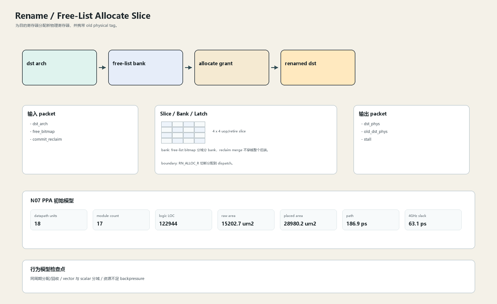
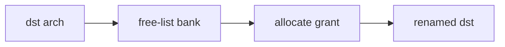

# Free-List Allocate Slice

## 1. 职责

为目的寄存器分配新物理寄存器，并携带 old physical tag。

本文定义朱雀目标结构中的数据面边界、slice/bank 组织、时序边界和行为模型接口。

## 2. 结构规模摘要

| 项 | 数值 |
|---|---:|
| datapath units | `18` |
| module count | `17` |
| logic LOC | `122944` |
| assign count | `23347` |
| always count | `2427` |
| port declarations | `6477` |

高频数据面 token：`decode`=15536, `valid`=10557, `tag`=8058, `data`=4982, `mask`=3837, `way`=2582, `ready`=1797, `cache`=1173。

## 3. 数据结构





## 4. 输入接口

| 输入 | 说明 |
| --- | --- |
| `dst_arch` | 进入本分区的数据 packet 或局部字段 |
| `free_bitmap` | 进入本分区的数据 packet 或局部字段 |
| `commit_reclaim` | 进入本分区的数据 packet 或局部字段 |

## 5. 输出接口

| 输出 | 说明 |
| --- | --- |
| `dst_phys` | 离开本分区的数据 packet 或局部字段 |
| `old_dst_phys` | 离开本分区的数据 packet 或局部字段 |
| `stall` | 离开本分区的数据 packet 或局部字段 |

## 6. Slice / Bank / Latch

| 类别 | 规则 |
|---|---|
| width | `按域内 packet / slice 参数化` |
| slice | 16 路目的分配拆成 4 个 slice，每 slice 本地 pick。 |
| bank | free-list bitmap 分域分 bank，reclaim merge 不穿越整个后端。 |
| latch / register | RN_ALLOC_R 切断分配到 dispatch。 |

## 7. N07 PPA 初始模型

| 项 | 数值 |
|---|---:|
| raw area estimate | `15202.747 um2` |
| placed area estimate | `28980.236 um2` |
| logic depth | `12 FO4` |
| mux penalty | `18.000 ps` |
| wire budget | `16.000 ps` |
| margin | `40.000 ps` |
| estimated path | `186.894 ps` |
| 4GHz slack | `63.106 ps` |

估算公式：

```text
path_ps = DFF_CP_Q + FO4 * logic_depth + mux_penalty + wire_budget + margin
area_um2 = code_metric_units * INV_D1_area * mix_factor + macro_area
```

## 8. 行为模型契约

行为模型必须覆盖：

- 正常分配
- free-list 空
- old tag 捕获
- reclaim 合并

最小接口：

```python
class RenameFreeAllocate:
    def reset(self, config): ...
    def accept(self, packet, cycle): ...
    def step(self, cycle): ...
    def flush(self, token): ...
    def peek_outputs(self): ...
    def area_estimate(self): ...
    def delay_estimate(self): ...
```

## 9. RTL 落点

RTL 第一版只实现 payload、slice、bank、register/latch boundary 和 minimal ready/valid。控制状态机后续覆盖在这些接口之上。

建议 RTL 单元：

- `rename_free_allocate_packet`
- `rename_free_allocate_slice`
- `rename_free_allocate_pipe`
- `rename_free_allocate_top`

## 10. 检查点

- 同周期分配/回收
- vector 与 scalar 分域
- 资源不足 backpressure

