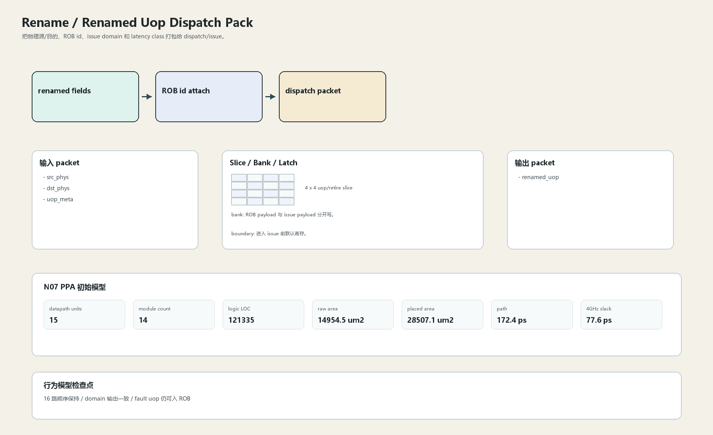

# Renamed Uop Dispatch Pack

## 1. 职责

把物理源/目的、ROB id、issue domain 和 latency class 打包给 dispatch/issue。

本文定义朱雀目标结构中的数据面边界、slice/bank 组织、时序边界和行为模型接口。

## 2. 结构规模摘要

| 项 | 数值 |
|---|---:|
| datapath units | `15` |
| module count | `14` |
| logic LOC | `121335` |
| assign count | `23024` |
| always count | `2410` |
| port declarations | `6149` |

高频数据面 token：`decode`=15536, `valid`=10557, `tag`=8058, `data`=4982, `mask`=3782, `way`=2565, `ready`=1789, `cache`=1173。

## 3. 数据结构




## 4. 输入接口

| 输入 | 说明 |
| --- | --- |
| `src_phys` | 进入本分区的数据 packet 或局部字段 |
| `dst_phys` | 进入本分区的数据 packet 或局部字段 |
| `uop_meta` | 进入本分区的数据 packet 或局部字段 |

## 5. 输出接口

| 输出 | 说明 |
| --- | --- |
| `renamed_uop` | 离开本分区的数据 packet 或局部字段 |

## 6. Slice / Bank / Latch

| 类别 | 规则 |
|---|---|
| width | `按域内 packet / slice 参数化` |
| slice | renamed uop 维持 `4 x 4` slice 输出。 |
| bank | ROB payload 与 issue payload 分开写。 |
| latch / register | 进入 issue 前默认寄存。 |

## 7. N07 PPA 初始模型

| 项 | 数值 |
|---|---:|
| raw area estimate | `14954.539 um2` |
| placed area estimate | `28507.090 um2` |
| logic depth | `10 FO4` |
| mux penalty | `18.000 ps` |
| wire budget | `16.000 ps` |
| margin | `40.000 ps` |
| estimated path | `172.390 ps` |
| 4GHz slack | `77.610 ps` |

估算公式：

```text
path_ps = DFF_CP_Q + FO4 * logic_depth + mux_penalty + wire_budget + margin
area_um2 = code_metric_units * INV_D1_area * mix_factor + macro_area
```

## 8. 行为模型契约

行为模型必须覆盖：

- uop 打包
- ROB id 对齐
- issue domain 形成
- stall 透传

最小接口：

```python
class RenameRenamedDispatch:
    def reset(self, config): ...
    def accept(self, packet, cycle): ...
    def step(self, cycle): ...
    def flush(self, token): ...
    def peek_outputs(self): ...
    def area_estimate(self): ...
    def delay_estimate(self): ...
```

## 9. RTL 落点

RTL 第一版只实现 payload、slice、bank、register/latch boundary 和 minimal ready/valid。控制状态机后续覆盖在这些接口之上。

建议 RTL 单元：

- `rename_renamed_dispatch_packet`
- `rename_renamed_dispatch_slice`
- `rename_renamed_dispatch_pipe`
- `rename_renamed_dispatch_top`

## 10. 检查点

- 16 路顺序保持
- domain 输出一致
- fault uop 仍可入 ROB

