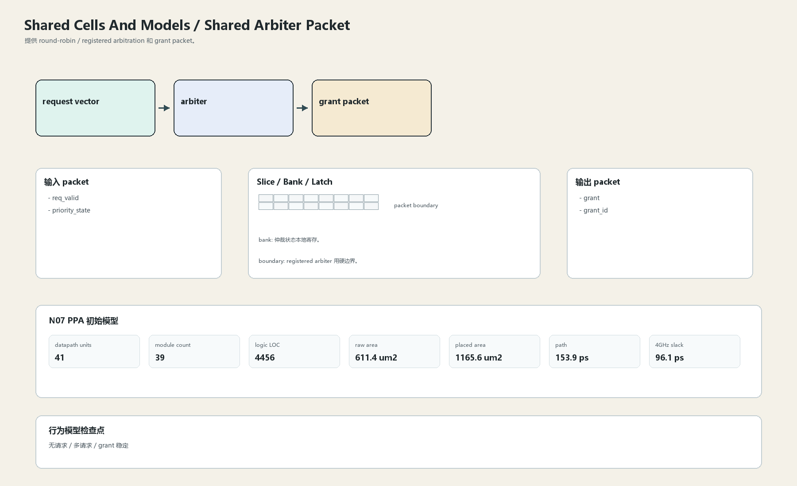

# Shared Arbiter Packet

## 1. 职责

提供 round-robin / registered arbitration 和 grant packet。

本文定义朱雀目标结构中的数据面边界、slice/bank 组织、时序边界和行为模型接口。

## 2. 结构规模摘要

| 项 | 数值 |
|---|---:|
| datapath units | `41` |
| module count | `39` |
| logic LOC | `4456` |
| assign count | `414` |
| always count | `90` |
| port declarations | `450` |

高频数据面 token：`data`=599, `fifo`=280, `l2`=267, `ecc`=148, `addr`=109, `way`=100, `mask`=98, `valid`=97。

## 3. 数据结构




## 4. 输入接口

| 输入 | 说明 |
| --- | --- |
| `req_valid` | 进入本分区的数据 packet 或局部字段 |
| `priority_state` | 进入本分区的数据 packet 或局部字段 |

## 5. 输出接口

| 输出 | 说明 |
| --- | --- |
| `grant` | 离开本分区的数据 packet 或局部字段 |
| `grant_id` | 离开本分区的数据 packet 或局部字段 |

## 6. Slice / Bank / Latch

| 类别 | 规则 |
|---|---|
| width | `按域内 packet / slice 参数化` |
| slice | request bitset 分层，不形成超宽单点组合。 |
| bank | 仲裁状态本地寄存。 |
| latch / register | registered arbiter 用硬边界。 |

## 7. N07 PPA 初始模型

| 项 | 数值 |
|---|---:|
| raw area estimate | `611.445 um2` |
| placed area estimate | `1165.566 um2` |
| logic depth | `8 FO4` |
| mux penalty | `14.000 ps` |
| wire budget | `16.000 ps` |
| margin | `40.000 ps` |
| estimated path | `153.886 ps` |
| 4GHz slack | `96.114 ps` |

估算公式：

```text
path_ps = DFF_CP_Q + FO4 * logic_depth + mux_penalty + wire_budget + margin
area_um2 = code_metric_units * INV_D1_area * mix_factor + macro_area
```

## 8. 行为模型契约

行为模型必须覆盖：

- round-robin
- priority
- grant hold
- clear

最小接口：

```python
class SharedCellsAndModelsArbiterPacket:
    def reset(self, config): ...
    def accept(self, packet, cycle): ...
    def step(self, cycle): ...
    def flush(self, token): ...
    def peek_outputs(self): ...
    def area_estimate(self): ...
    def delay_estimate(self): ...
```

## 9. RTL 落点

RTL 第一版只实现 payload、slice、bank、register/latch boundary 和 minimal ready/valid。控制状态机后续覆盖在这些接口之上。

建议 RTL 单元：

- `shared_cells_and_models_arbiter_packet_packet`
- `shared_cells_and_models_arbiter_packet_slice`
- `shared_cells_and_models_arbiter_packet_pipe`
- `shared_cells_and_models_arbiter_packet_top`

## 10. 检查点

- 无请求
- 多请求
- grant 稳定

