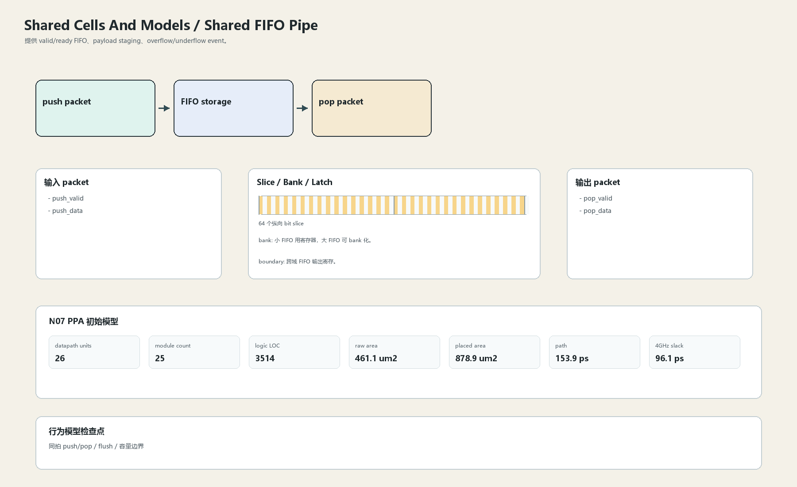

# Shared FIFO Pipe

## 1. 职责

提供 valid/ready FIFO、payload staging、overflow/underflow event。

本文定义朱雀目标结构中的数据面边界、slice/bank 组织、时序边界和行为模型接口。

## 2. 结构规模摘要

| 项 | 数值 |
|---|---:|
| datapath units | `26` |
| module count | `25` |
| logic LOC | `3514` |
| assign count | `357` |
| always count | `72` |
| port declarations | `352` |

高频数据面 token：`data`=647, `fifo`=280, `l2`=267, `ecc`=233, `addr`=108, `valid`=97, `way`=82, `mask`=58。

## 3. 数据结构




## 4. 输入接口

| 输入 | 说明 |
| --- | --- |
| `push_valid` | 进入本分区的数据 packet 或局部字段 |
| `push_data` | 进入本分区的数据 packet 或局部字段 |

## 5. 输出接口

| 输出 | 说明 |
| --- | --- |
| `pop_valid` | 离开本分区的数据 packet 或局部字段 |
| `pop_data` | 离开本分区的数据 packet 或局部字段 |

## 6. Slice / Bank / Latch

| 类别 | 规则 |
|---|---|
| width | `按域内 packet / slice 参数化` |
| slice | payload width 参数化，64-bit 数据仍可按 slice。 |
| bank | 小 FIFO 用寄存器，大 FIFO 可 bank 化。 |
| latch / register | 跨域 FIFO 输出寄存。 |

## 7. N07 PPA 初始模型

| 项 | 数值 |
|---|---:|
| raw area estimate | `461.068 um2` |
| placed area estimate | `878.911 um2` |
| logic depth | `8 FO4` |
| mux penalty | `14.000 ps` |
| wire budget | `16.000 ps` |
| margin | `40.000 ps` |
| estimated path | `153.886 ps` |
| 4GHz slack | `96.114 ps` |

估算公式：

```text
path_ps = DFF_CP_Q + FO4 * logic_depth + mux_penalty + wire_budget + margin
area_um2 = code_metric_units * INV_D1_area * mix_factor + macro_area
```

## 8. 行为模型契约

行为模型必须覆盖：

- push/pop
- full/empty
- flush
- overflow

最小接口：

```python
class SharedCellsAndModelsFifoPipe:
    def reset(self, config): ...
    def accept(self, packet, cycle): ...
    def step(self, cycle): ...
    def flush(self, token): ...
    def peek_outputs(self): ...
    def area_estimate(self): ...
    def delay_estimate(self): ...
```

## 9. RTL 落点

RTL 第一版只实现 payload、slice、bank、register/latch boundary 和 minimal ready/valid。控制状态机后续覆盖在这些接口之上。

建议 RTL 单元：

- `shared_cells_and_models_fifo_pipe_packet`
- `shared_cells_and_models_fifo_pipe_slice`
- `shared_cells_and_models_fifo_pipe_pipe`
- `shared_cells_and_models_fifo_pipe_top`

## 10. 检查点

- 同拍 push/pop
- flush
- 容量边界

