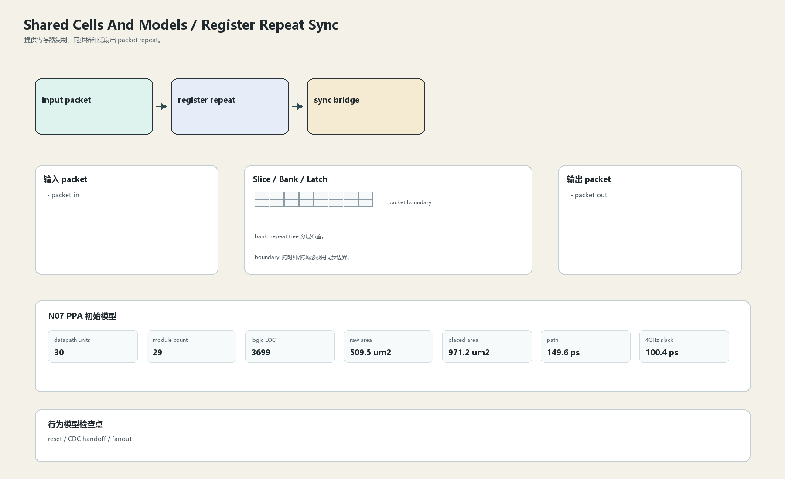
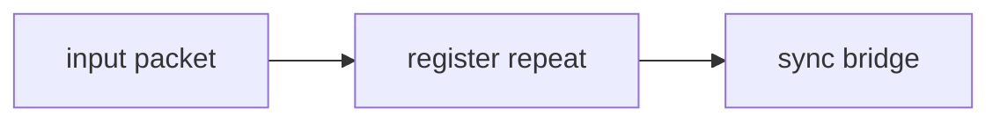

# Register Repeat Sync

## 1. 职责

提供寄存器复制、同步桥和低扇出 packet repeat。

本文定义朱雀目标结构中的数据面边界、slice/bank 组织、时序边界和行为模型接口。

## 2. 结构规模摘要

| 项 | 数值 |
|---|---:|
| datapath units | `30` |
| module count | `29` |
| logic LOC | `3699` |
| assign count | `354` |
| always count | `85` |
| port declarations | `373` |

高频数据面 token：`data`=647, `fifo`=280, `l2`=267, `ecc`=233, `addr`=108, `way`=95, `valid`=84, `mask`=58。

## 3. 数据结构





## 4. 输入接口

| 输入 | 说明 |
| --- | --- |
| `packet_in` | 进入本分区的数据 packet 或局部字段 |

## 5. 输出接口

| 输出 | 说明 |
| --- | --- |
| `packet_out` | 离开本分区的数据 packet 或局部字段 |

## 6. Slice / Bank / Latch

| 类别 | 规则 |
|---|---|
| width | `按域内 packet / slice 参数化` |
| slice | 只复制必要 metadata，不复制大数据到无关域。 |
| bank | repeat tree 分层布置。 |
| latch / register | 跨时钟/跨域必须用同步边界。 |

## 7. N07 PPA 初始模型

| 项 | 数值 |
|---|---:|
| raw area estimate | `509.507 um2` |
| placed area estimate | `971.249 um2` |
| logic depth | `7 FO4` |
| mux penalty | `12.000 ps` |
| wire budget | `16.000 ps` |
| margin | `45.000 ps` |
| estimated path | `149.634 ps` |
| 4GHz slack | `100.366 ps` |

估算公式：

```text
path_ps = DFF_CP_Q + FO4 * logic_depth + mux_penalty + wire_budget + margin
area_um2 = code_metric_units * INV_D1_area * mix_factor + macro_area
```

## 8. 行为模型契约

行为模型必须覆盖：

- register repeat
- sync handoff
- reset init

最小接口：

```python
class SharedCellsAndModelsRegisterRepeatSync:
    def reset(self, config): ...
    def accept(self, packet, cycle): ...
    def step(self, cycle): ...
    def flush(self, token): ...
    def peek_outputs(self): ...
    def area_estimate(self): ...
    def delay_estimate(self): ...
```

## 9. RTL 落点

RTL 第一版只实现 payload、slice、bank、register/latch boundary 和 minimal ready/valid。控制状态机后续覆盖在这些接口之上。

建议 RTL 单元：

- `shared_cells_and_models_register_repeat_sync_packet`
- `shared_cells_and_models_register_repeat_sync_slice`
- `shared_cells_and_models_register_repeat_sync_pipe`
- `shared_cells_and_models_register_repeat_sync_top`

## 10. 检查点

- reset
- CDC handoff
- fanout

