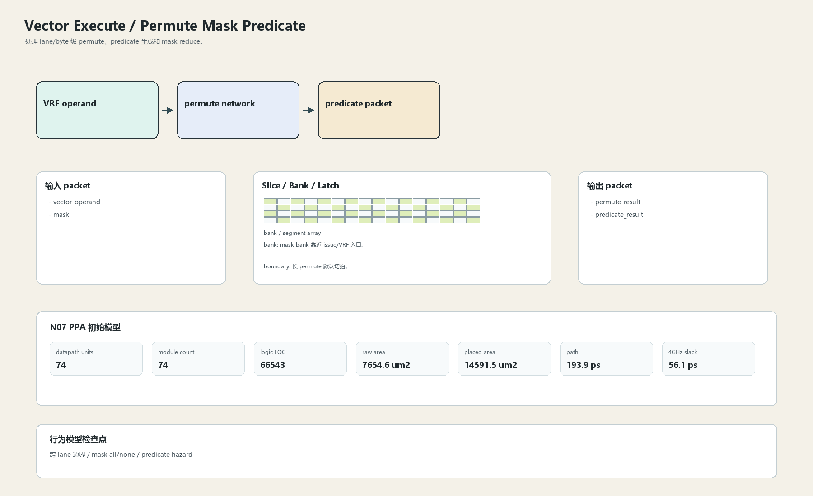
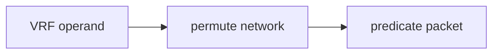

# Permute Mask Predicate

## 1. 职责

处理 lane/byte 级 permute、predicate 生成和 mask reduce。

本文定义朱雀目标结构中的数据面边界、slice/bank 组织、时序边界和行为模型接口。

## 2. 结构规模摘要

| 项 | 数值 |
|---|---:|
| datapath units | `74` |
| module count | `74` |
| logic LOC | `66543` |
| assign count | `13103` |
| always count | `1036` |
| port declarations | `2599` |

高频数据面 token：`data`=6120, `mask`=3418, `bank`=2218, `l1`=2088, `way`=1054, `l2`=1027, `valid`=258, `fault`=230。

## 3. 数据结构





## 4. 输入接口

| 输入 | 说明 |
| --- | --- |
| `vector_operand` | 进入本分区的数据 packet 或局部字段 |
| `mask` | 进入本分区的数据 packet 或局部字段 |

## 5. 输出接口

| 输出 | 说明 |
| --- | --- |
| `permute_result` | 离开本分区的数据 packet 或局部字段 |
| `predicate_result` | 离开本分区的数据 packet 或局部字段 |

## 6. Slice / Bank / Latch

| 类别 | 规则 |
|---|---|
| width | `按域内 packet / slice 参数化` |
| slice | permute 只跨必要 lane group，不形成全局中心 crossbar。 |
| bank | mask bank 靠近 issue/VRF 入口。 |
| latch / register | 长 permute 默认切拍。 |

## 7. N07 PPA 初始模型

| 项 | 数值 |
|---|---:|
| raw area estimate | `7654.574 um2` |
| placed area estimate | `14591.531 um2` |
| logic depth | `12 FO4` |
| mux penalty | `20.000 ps` |
| wire budget | `16.000 ps` |
| margin | `45.000 ps` |
| estimated path | `193.894 ps` |
| 4GHz slack | `56.106 ps` |

估算公式：

```text
path_ps = DFF_CP_Q + FO4 * logic_depth + mux_penalty + wire_budget + margin
area_um2 = code_metric_units * INV_D1_area * mix_factor + macro_area
```

## 8. 行为模型契约

行为模型必须覆盖：

- permute
- mask reduce
- predicate update
- lane select

最小接口：

```python
class VectorExecutePermuteMask:
    def reset(self, config): ...
    def accept(self, packet, cycle): ...
    def step(self, cycle): ...
    def flush(self, token): ...
    def peek_outputs(self): ...
    def area_estimate(self): ...
    def delay_estimate(self): ...
```

## 9. RTL 落点

RTL 第一版只实现 payload、slice、bank、register/latch boundary 和 minimal ready/valid。控制状态机后续覆盖在这些接口之上。

建议 RTL 单元：

- `vector_execute_permute_mask_packet`
- `vector_execute_permute_mask_slice`
- `vector_execute_permute_mask_pipe`
- `vector_execute_permute_mask_top`

## 10. 检查点

- 跨 lane 边界
- mask all/none
- predicate hazard

