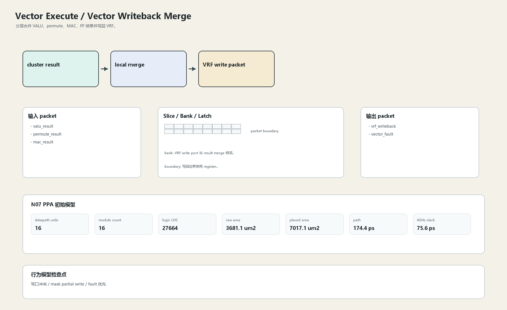

# Vector Writeback Merge

## 1. 职责

分层合并 VALU、permute、MAC、FP 结果并写回 VRF。

本文定义朱雀目标结构中的数据面边界、slice/bank 组织、时序边界和行为模型接口。

## 2. 结构规模摘要

| 项 | 数值 |
|---|---:|
| datapath units | `16` |
| module count | `16` |
| logic LOC | `27664` |
| assign count | `5302` |
| always count | `617` |
| port declarations | `2234` |

高频数据面 token：`data`=4848, `bank`=1105, `mask`=813, `addr`=760, `way`=617, `fault`=455, `tag`=317, `valid`=288。

## 3. 数据结构




## 4. 输入接口

| 输入 | 说明 |
| --- | --- |
| `valu_result` | 进入本分区的数据 packet 或局部字段 |
| `permute_result` | 进入本分区的数据 packet 或局部字段 |
| `mac_result` | 进入本分区的数据 packet 或局部字段 |

## 5. 输出接口

| 输出 | 说明 |
| --- | --- |
| `vrf_writeback` | 离开本分区的数据 packet 或局部字段 |
| `vector_fault` | 离开本分区的数据 packet 或局部字段 |

## 6. Slice / Bank / Latch

| 类别 | 规则 |
|---|---|
| width | `按域内 packet / slice 参数化` |
| slice | 先簇内 merge，再 bank write，不做单点全输入 mux。 |
| bank | VRF write port 与 result merge 相邻。 |
| latch / register | 写回边界使用 register。 |

## 7. N07 PPA 初始模型

| 项 | 数值 |
|---|---:|
| raw area estimate | `3681.076 um2` |
| placed area estimate | `7017.050 um2` |
| logic depth | `10 FO4` |
| mux penalty | `20.000 ps` |
| wire budget | `16.000 ps` |
| margin | `40.000 ps` |
| estimated path | `174.390 ps` |
| 4GHz slack | `75.610 ps` |

估算公式：

```text
path_ps = DFF_CP_Q + FO4 * logic_depth + mux_penalty + wire_budget + margin
area_um2 = code_metric_units * INV_D1_area * mix_factor + macro_area
```

## 8. 行为模型契约

行为模型必须覆盖：

- writeback arbitration
- fault/replay
- mask write
- bank conflict

最小接口：

```python
class VectorExecuteVectorWriteback:
    def reset(self, config): ...
    def accept(self, packet, cycle): ...
    def step(self, cycle): ...
    def flush(self, token): ...
    def peek_outputs(self): ...
    def area_estimate(self): ...
    def delay_estimate(self): ...
```

## 9. RTL 落点

RTL 第一版只实现 payload、slice、bank、register/latch boundary 和 minimal ready/valid。控制状态机后续覆盖在这些接口之上。

建议 RTL 单元：

- `vector_execute_vector_writeback_packet`
- `vector_execute_vector_writeback_slice`
- `vector_execute_vector_writeback_pipe`
- `vector_execute_vector_writeback_top`

## 10. 检查点

- 写口冲突
- mask partial write
- fault 优先

