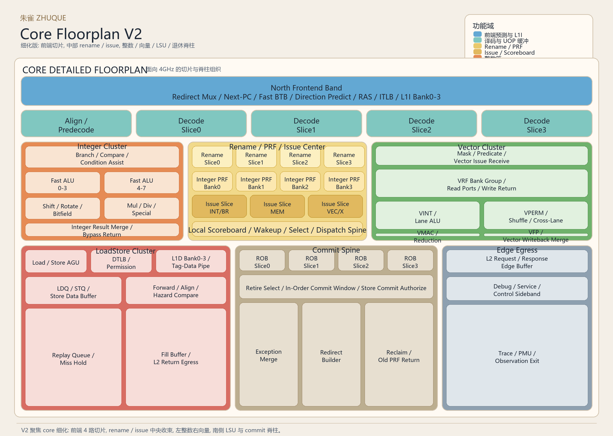
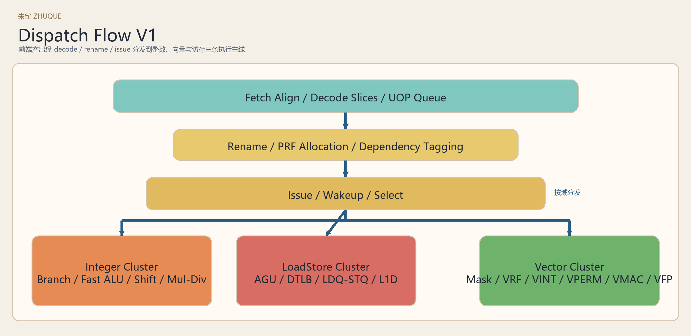
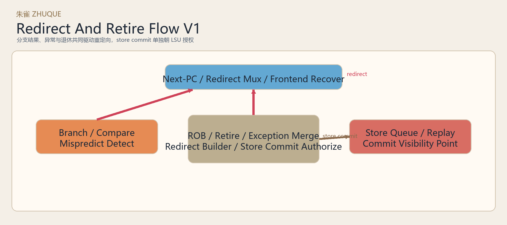
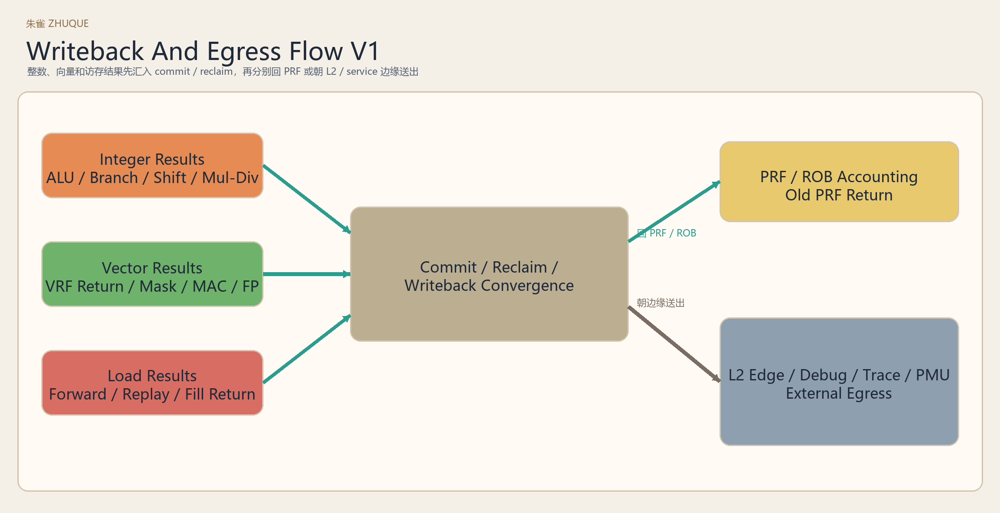

# 朱雀 Core Floorplan V2

## 1. 用途

这张图用于固定 `core` 级的细化物理分区，作为后续 `ifetch / decode / rename / issue / integer_execute / vector_execute / loadstore_and_mmu / commit_and_retire` 继续下钻时的默认版型。

## 2. 本版重点

- 前端按 `4` 路 decode slice 展开
- 中央区明确分出 `rename / PRF / issue / scoreboard`
- 左侧固定为整数簇
- 右侧固定为向量簇
- 下侧固定为 `LSU + commit spine + edge egress`

## 3. 数据流分图

### 3.1 Dispatch

### 3.2 Redirect And Retire

### 3.3 Writeback And Egress

