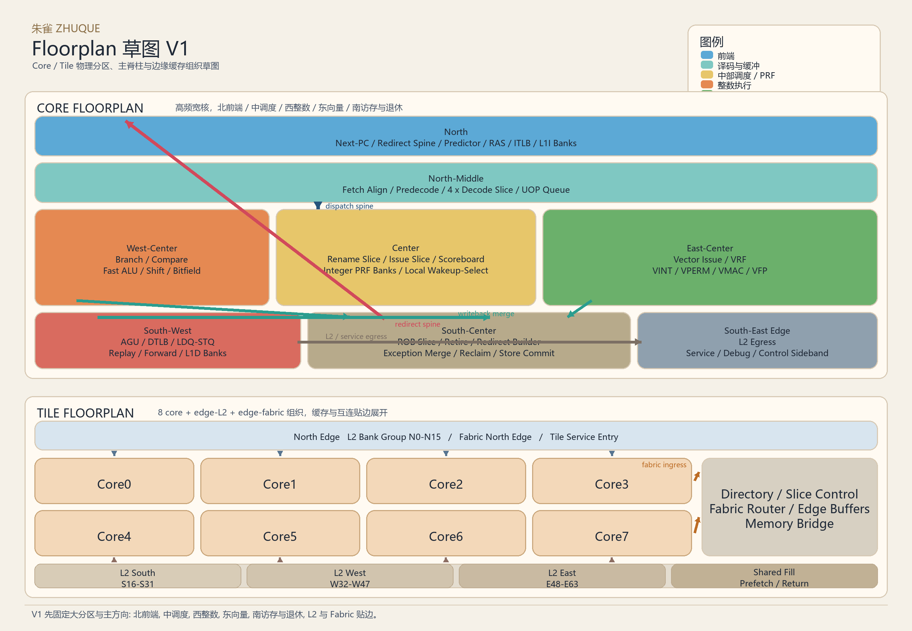
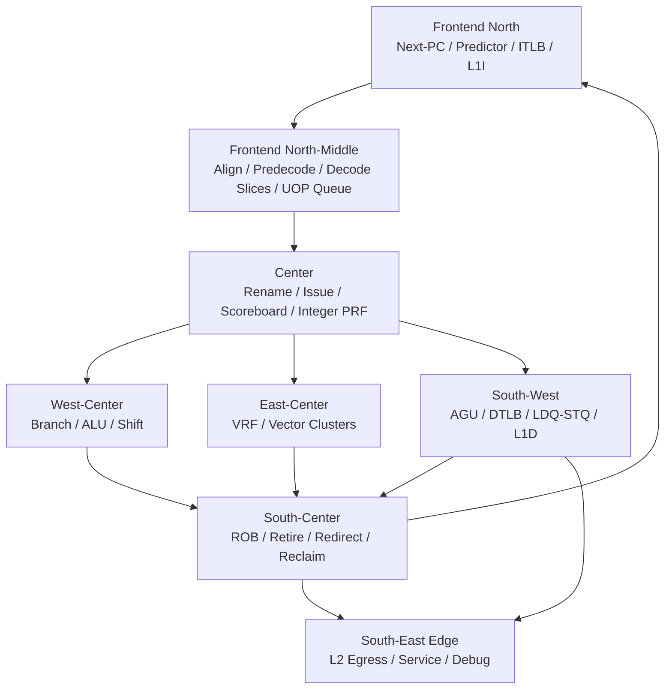
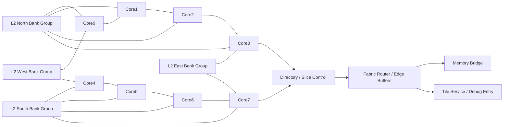

# 朱雀 Floorplan 草图 V1

## 1. 定位

这是一版面向架构阶段的 floorplan 草图，用来固定朱雀在 `core`、`tile` 两级上的物理分区、主通路方向和关键脊柱位置。它不是最终物理实现图，但后续行为模型、RTL 切分和接口定义都以这张草图为默认版型。



## 2. Core 草图

### 2.1 平面草图

```text
+------------------------------------------------------------------------------------------------------+
| North                                                                                                |
|  Next-PC / Redirect Spine / Fast Target Predict / Direction Predict / RAS / ITLB / L1I Bank Group  |
+------------------------------------------------------------------------------------------------------+
| North-Middle                                                                                         |
|  Fetch Align / Predecode / Decode Slice0 / Decode Slice1 / Decode Slice2 / Decode Slice3 / UOP Q   |
+------------------------------------------------------------------------------------------------------+
| West-Center                      | Center                                     | East-Center          |
|  Branch / Compare               |  Rename Slice / Issue Slice / Scoreboard   |  Vector Issue        |
|  Fast ALU / Shift / Bitfield    |  Integer PRF Banks / Local Wakeup Select   |  VRF / VINT / VPERM  |
|                                 |                                             |  VMAC / VFP          |
+------------------------------------------------------------------------------------------------------+
| South-West                       | South-Center                               | South-East           |
|  AGU / DTLB / LDQ / STQ         |  ROB Slice / Retire / Redirect Builder     |  L2 Egress           |
|  Replay / Forward / L1D Banks   |  Exception Merge / Reclaim / Store Commit  |  Service / Debug     |
+------------------------------------------------------------------------------------------------------+
```

### 2.2 主脊柱

- `redirect spine` 从 `retire / branch` 直返前端北侧，优先级高于训练和统计更新。
- `dispatch spine` 从 decode / uop queue 向中央 rename / issue 区推进，不跨执行簇做大规模重排。
- `writeback spine` 先在整数簇、向量簇、LSU 局部合并，再向 `PRF / ROB / retire` 汇入。
- `service spine` 贴着 core 边缘走，不穿过前端和执行热区。

### 2.3 关键约束

- 前端按 `banked fetch + sliced decode` 组织，不允许单体 `192B/cycle` 超宽总线横贯核心。
- 中央区优先容纳 rename、issue、scoreboard 和 `PRF`，因为它们同时服务整数、向量和访存三条主线。
- 快整数与 branch 贴近前端返回路径，确保 `issue -> execute -> redirect` 闭环最短。
- `LSU` 贴近 `L1D` 与 `L2` 出口，向量区贴近 `VRF`，两侧各自形成相对独立的热区。
- `ROB / retire / reclaim / store commit` 位于南侧中央，便于同时回指前端、rename 和 `LSU`。

## 3. Core 连线草图



## 4. Tile 草图

### 4.1 平面草图

```text
+------------------------------------------------------------------------------------------------------+
| North Edge                                                                                            |
|  L2 Bank Group N0-N15 / Fabric North Edge / Tile Service Entry                                       |
+------------------------------------------------------------------------------------------------------+
|  Core0  |  Core1  |  Core2  |  Core3                                                                |
|---------+---------+---------+---------+--------------------------------------------------------------|
|  Core4  |  Core5  |  Core6  |  Core7  |  Directory / Slice Control / Fabric Router / Memory Bridge |
+------------------------------------------------------------------------------------------------------+
| South Edge                                                                                            |
|  L2 Bank Group S16-S31 / L2 Bank Group W32-W47 / L2 Bank Group E48-E63 / Shared Fill / Prefetch    |
+------------------------------------------------------------------------------------------------------+
```

### 4.2 Tile 组织原则

- `8` 个 core 以 `2 x 4` 阵列组织，中央尽量留给 core 本地连线，`L2` 和 fabric 贴边展开。
- `L2 64 banks` 不做中心单岛，按 north / south / west / east 边缘 bank group 分散放置。
- fabric router、directory、memory bridge 靠 tile 外缘，承接更长链路与更松的周期边界。
- tile service 与 debug 入口跟着 fabric 边界走，不压进 core 群中央。

## 5. Tile 连线草图



## 6. 第一版落地结论

- `core` 级实现先按北前端、中调度、西整数、东向量、南访存与退休的版型推进。
- `tile` 级实现先按 `8 core + edge-L2 + edge-fabric` 的版型推进。
- 所有后续 `L2 / L3` 模块文档，都要显式说明自己位于哪一块物理区、靠近哪条脊柱、默认朝哪个方向出入口。
- 后续行为模型要把 `bank`、`slice`、局部合并和边界切拍当成默认结构，而不是可选优化。
